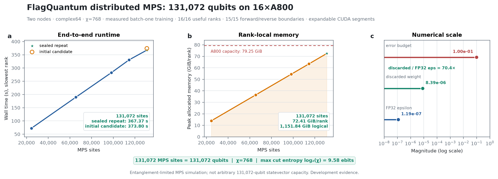

<div align="center">
  

<h1>Make quantum systems learn, scale, and discover.</h1>

<p><strong>FlagQuantum is an open-source distributed differentiable runtime for AI-native quantum science. FlagOS is its target unified backend for heterogeneous accelerators and multi-chip systems.</strong></p>

<p><strong>FlagQuantum makes quantum systems trainable. FlagOS is designed to make their execution portable across accelerators.</strong></p>

<p>Build one trainable PyTorch model, keep one FlagQuantum IR from local development to multi-chip execution, and package the trained program for supported quantum hardware.</p>

[Quick Start](#quick-start) ·
[FlagQuantum × FlagOS](#flagquantum-and-flagos) ·
[Why FlagQuantum](#why-flagquantum) ·
[Scientific Workloads](#scientific-workloads) ·
[Verified Results](#verified-results) ·
[Capabilities](docs/generated/CAPABILITIES.md) ·
[Documentation](docs/reference/API.md)

[](https://pytorch.org/)
[](https://python.org/)
[](https://github.com/FlagQuantum/FlagQuantum/actions/workflows/ci.yml)
[](LICENSE)

</div>

## Quick start

Install FlagQuantum and run the maintained one-minute quantum AI example:

```console
pip install -e .
python examples/quick_start.py --mode sv
```

The example trains a classical `torch.nn.Linear` layer and an `fq.Module`
quantum layer in one PyTorch optimizer loop, then checks the result against an
analytical reference. Change only the execution representation:

```console
python examples/quick_start.py --mode mps
python examples/quick_start.py --mode tn
```

At the API level, one program can be trained, executed, and packaged without
changing representations:

```python
import flagquantum as fq
import torch

def build_program(parameters, inputs=None):
    return fq.Circuit(n_qubits=2).ry(0, parameters[0]).cx(0, 1)

model = fq.Module(build_program, n_parameters=1)
optimizer = torch.optim.Adam(model.parameters(), lr=0.05)
training = fq.train(
    model,
    optimizer=optimizer,
    objective=lambda value: value.mean(),
    steps=10,
)
trained_program = build_program(next(model.parameters()).detach())
result = fq.run(trained_program)
package = fq.create_deployment_package(trained_program, shots=128)
```

Start with the [annotated quick start](examples/quick_start.py), continue to
the [single-machine quantum AI examples](examples/single_machine_quantum_ai/README.md),
or inspect the stable [`fq.ExecutionResult` contract](docs/reference/RUNTIME_RESULT_CONTRACT.md).

## Beyond single-chip capacity

<p align="center">
  <a href="benchmarks/results/comparison/statevector_training_science_35q_capacity_report_v12.json">
    
  </a>
</p>

A matched 35-qubit differentiable workload failed on one NVIDIA A800 while
attempting a 256 GiB state allocation. FlagQuantum completed the full
value-and-gradient step on sixteen A800 GPUs across two nodes:

- one logical statevector was amplitude-sharded across ranks;
- forward and backward execution remained sharded;
- no rank materialized the full state;
- the complete value-and-gradient step took 114.32 seconds;
- peak allocated memory was 64.61 GiB per rank.

This is measured development evidence for this exact workload, hardware, and
software configuration—not a release-certified general scalability claim.
Inspect the
[machine-readable report](benchmarks/results/comparison/statevector_training_science_35q_capacity_report_v12.json)
or [regenerate the figure](benchmarks/research/plot_readme_capacity_expansion.py)
from the checked-in evidence.

## Why FlagQuantum

### Quantum systems as trainable models

Circuits, measurements, hybrid models, losses, and optimizers participate in
ordinary PyTorch workflows. FlagQuantum treats a quantum program as a model to
differentiate and learn with—not only as a circuit to submit.

### One IR, multiple representations

The same versioned FlagQuantum IR can target an exact statevector, a
low-entanglement MPS, a sliced tensor-network path, or a supported provider.
Runtime planning makes memory, gradient, communication, and fallback
constraints visible before execution.

### Verifiable distributed training

FlagQuantum distinguishes one-workload sharding from replicated throughput.
State, gradient, optimizer, memory, communication, and rank ownership are
reported explicitly. A distributed claim is not inferred from process count.

### From classical accelerators to quantum hardware

Training and deployment preserve the program, parameter, and result contracts.
The goal is one scientific workflow across local development, heterogeneous
multi-chip execution through FlagOS, and supported quantum providers.

## FlagQuantum and FlagOS

**One quantum program across heterogeneous accelerators.**

FlagQuantum and FlagOS form two layers of one quantum scientific computing
stack:

| FlagQuantum defines | FlagOS maps and executes |
| --- | --- |
| `fq.Circuit`, `fq.Module`, and scientific objectives | devices, streams, and memory |
| versioned quantum program semantics | accelerator kernels and compilation |
| PyTorch autograd and quantum gradients | collective communication |
| statevector, MPS, and tensor-network planning | multi-chip topology and placement |
| state, gradient, and optimizer ownership | heterogeneous accelerator adaptation |
| auditable scientific results and deployment packages | execution diagnostics and fallback detection |

The boundary is deliberate: FlagQuantum defines **what** quantum scientific
computation means; FlagOS determines **where and how** it executes efficiently.
The same FlagQuantum program should move from local development to supported
NVIDIA and domestic accelerators without rewriting the scientific model.

FlagOS is a strategic backend, not a prerequisite for getting started. CPU and
single-device paths remain first-class fast paths:

```text
FlagQuantum
    ├── local PyTorch fast path
    ├── optional JAX quantum kernels
    ├── FlagOS heterogeneous multi-chip path
    └── quantum hardware deployment path
```

The stable end-to-end `flagquantum.backends.flagos` integration is under active
development. Cross-accelerator claims are promoted only after native operator
coverage, numerical and gradient parity, hidden-fallback checks, distributed
ownership, and reproducible hardware evidence pass their release gates. See
the [FlagOS-aligned release train](docs/roadmap/FLAGOS_ALIGNED_RELEASE_TRAIN.md).

## Scientific workloads

FlagQuantum connects scientific data, differentiable quantum models, classical
AI optimizers, scalable execution, and quantum hardware through one program
contract.

| Scientific goal | Maintained path |
| --- | --- |
| Ground-state discovery and VQE | [Statevector VQE](examples/single_machine_quantum_ai/01_vqe_statevector.py) and [Heisenberg hybrid VQE](examples/single_machine_quantum_ai/06_heisenberg_hybrid_vqe.py) |
| Hamiltonian identification | [Differentiable MPS workflow](examples/mps_hamiltonian_identification/README.md) |
| Large low-entanglement systems | [1,000-qubit MPS training](examples/single_machine_quantum_ai/05_mps_1000q_dimer_training.py) |
| Representation-aware experiments | [Switch one VQE program across SV, MPS, and TN](examples/vqe_switch_sv_mps_tn.py) |
| Hybrid classical-quantum learning | [Quantum classifier and hybrid examples](examples/single_machine_quantum_ai/README.md) |
| Training-to-hardware workflow | [Parameterized circuit deployment](examples/train_parameterized_circuit_then_deploy.py) |

The long-term direction is quantum scientific intelligence: use gradients and
scientific observations not only to simulate a known quantum system, but to
infer Hamiltonians, optimize quantum dynamics, and discover testable structure.
Current support boundaries remain capability-specific and are listed below.

## How it works

<p align="center">
  <a href="assets/readme/FlagQuantum.png">
    
  </a>
</p>

```text
fq.Circuit / fq.Module
        │
        ▼
versioned FlagQuantum IR
        │
        ▼
differentiable runtime planning
        │
        ├── classical execution
        │     ├── local
        │     │     └── statevector / MPS / tensor network
        │     └── distributed
        │           └── sharded statevector / sharded MPS / sliced TN
        │
        └── quantum execution
              └── provider deployment package
```

FlagQuantum owns program semantics, differentiation, representation selection,
partitioning, and auditable execution results. FlagOS maps those plans onto
heterogeneous accelerators and multi-chip systems. Quantum providers form a
parallel deployment path for trained programs.

Local and distributed classical execution use supported PyTorch, JAX, and
FlagOS paths according to their documented maturity. Here, `distributed` is an
architecture category rather than a blanket support claim: sharded
statevector, sharded MPS, and sliced tensor-network execution have distinct
maturity levels in the capability matrix.

The complete stable `flagquantum.backends.flagos` backend and deeper FlagOS
kernel and collective integration are under active development. Existing
accelerator paths remain supported according to their documented maturity.

## Train and plan

`fq.Module` connects a parameterized quantum program to an ordinary PyTorch
optimizer:

```python
import flagquantum as fq
import torch

def build_program(parameters, inputs=None):
    return (
        fq.Circuit(n_qubits=2)
        .ry(0, theta=parameters[0])
        .cx(0, 1)
        .ry(1, theta=parameters[1])
    )

model = fq.Module(
    build_program,
    n_parameters=2,
    policy=fq.RuntimePolicy(observable_wires=(1,)),
)
optimizer = torch.optim.Adam(model.parameters(), lr=0.01)

training = fq.train(
    model,
    optimizer=optimizer,
    objective=lambda value: value.mean(),
    steps=100,
)
trained_program = build_program(next(model.parameters()).detach())
```

Execution policy remains separate from scientific intent:

```python
program = build_program(torch.tensor([0.3, -0.2], requires_grad=True))
plan = program.runtime_plan(
    prefer_jax=True,
    state_mode="auto",
    require_gradients=True,
)

summary = plan.summary()
print(summary["recommended_mode"])
print(summary["recommended_candidate"]["distribution_semantics"])
```

A production distributed path must preserve its semantics through the complete
training lifecycle:

```text
forward → loss → backward → optimizer update → checkpoint → restart
```

Read the
[distributed quantum AI principles](docs/concepts/DISTRIBUTED_QUANTUM_AI_PRINCIPLES.md)
and [scalability principles](docs/concepts/DISTRIBUTED_SCALABILITY_PRINCIPLES.md)
for the binding execution and evidence rules.

## Deploy to quantum hardware

Package a trained circuit, parameters, shots, provider target, and serialized
program without rebuilding the circuit in another framework:

```python
import flagquantum as fq

program = fq.Circuit(n_qubits=2).h(0).cx(0, 1)
package = fq.create_deployment_package(program, shots=1024)

print(package.backend.provider)
print(package.qasm[:80])
```

Provider availability, credentials, operations, and hardware evidence vary by
target. Deployment is currently development evidence; no provider is release
certified. See the [API reference](docs/reference/API.md) and
[known limitations](docs/reference/KNOWN_LIMITATIONS.md).

## What is ready today

Maturity applies to each capability—not to the package as a whole.

| Capability | Maturity | Current boundary |
| --- | --- | --- |
| Unified circuit API and FlagQuantum IR | `release_certified` | IR v1 changes require an explicit migration |
| Local statevector training | `production_supported` | Capacity is bounded by one device |
| Sharded statevector training | `production_supported` | Multi-node release certification still requires promoted evidence |
| Sharded MPS training | `development_evidence` | Two independent two-node 16×A800 runs complete 131,072 sites at χ768 (1151.84 GiB logical state) in 373.80 s and 367.37 s with 72.41 GiB peak allocation/rank; all 16 ranks, 15 boundaries, error checks, and cleanup checks pass. The repeated artifact is sealed and records `PYTORCH_CUDA_ALLOC_CONF=expandable_segments:True`, which eliminates the preceding fragmentation OOM. Capacity multi-step soak, sealed fault-matrix, clean/signable source, and release evidence remain incomplete. |
| Tensor-network training | `experimental` | General reverse contraction and production transport are not certified |
| Cloud and quantum hardware deployment | `development_evidence` | No provider is release certified |
| Dynamic circuits | `experimental` | Local and provider-preflight scope; no verified QPU execution |
| Extension SDK | `experimental` | Compatibility is not yet guaranteed |

The machine-validated [capability matrix](capability-maturity.toml) is the
authority. The generated [capability catalog](docs/generated/CAPABILITIES.md)
maps user goals to APIs, runtime modes, gradient support, evidence, examples,
and known boundaries.

## Verified results

### 131,072-qubit distributed MPS capacity

<p align="center">
  <a href="benchmarks/results/local/mps_capacity_131072q_chi768_16xa800_repeat_complete_20260806.json">
    
  </a>
</p>

FlagQuantum completed independently repeated, batch-one training of a
131,072-qubit complex64 MPS with χ=768 on two nodes and sixteen NVIDIA A800
GPUs. The run represents 1.15 TiB of logical MPS tensors, keeps the state
sharded across all sixteen ranks, and executes forward and reverse propagation
across all fifteen rank boundaries. The sealed repeat completed in 367.37
seconds with 72.41 GiB peak allocation per rank and cumulative discarded
weight of 8.39e-6.

This is a full-width MPS capacity workload with sparse all-rank and all-boundary
gate coverage. It is an entanglement-limited MPS simulation, not an arbitrary
131,072-qubit statevector simulation or a dense full-width circuit benchmark.

The independently attributable workload is
[`general_mps_capacity_131072.py`](benchmarks/internal/evidence/general_mps_capacity_131072.py).
Its circuit deliberately activates every rank and every adjacent rank boundary:

```python
def workload(theta, phi):
    circuit = fq.Circuit(131_072, device=theta.device)
    for rank in range(16):
        wire = (2 * rank + 1) * 131_072 // (2 * 16)
        circuit.ry(wire, theta if rank % 2 == 0 else phi)
    for index, left in enumerate(
        (rank + 1) * 131_072 // 16 - 1 for rank in range(15)
    ):
        circuit.rxx(left, left + 1, phi if index % 2 == 0 else theta)
    return circuit
```

#### Reproduce the 131,072-qubit capacity run

Reproduction requires two nodes with eight 80 GiB NVIDIA A800 GPUs each, a
synchronized checkout on both nodes, a working NCCL interface, PyTorch with
CUDA support, and the FlagQuantum development environment. First create the
matched single-GPU OOM baseline on node 0:

```bash
cd /path/to/FlagQuantum
export PYTHONPATH="$PWD"
export CUDA_VISIBLE_DEVICES=0

torchrun --standalone --nproc-per-node=1 \
  benchmarks/internal/evidence/general_mps_capacity_131072.py \
  --output benchmarks/results/local/mps_capacity_131072q_chi768_1gpu_oom_raw.json
```

Then set the same rendezvous address, port, repository revision, and artifact
layout on both nodes. Set `NODE_RANK=0` on the rendezvous host and
`NODE_RANK=1` on the second host:

```bash
cd /path/to/FlagQuantum
export PYTHONPATH="$PWD"
export MASTER_ADDR=10.0.0.10       # reachable address of node 0
export MASTER_PORT=29720
export NODE_RANK=0                 # use 1 on the second node
export NCCL_SOCKET_IFNAME=eth0     # replace with the cluster interface
export PYTORCH_CUDA_ALLOC_CONF=expandable_segments:True
unset CUDA_VISIBLE_DEVICES

export RUN_DIR="$PWD/benchmarks/results/local/mps_capacity_131072_reproduction"
mkdir -p "$RUN_DIR"
export RAW_LOG="$RUN_DIR/rank${NODE_RANK}.log"
export GPU_SAMPLES="$RUN_DIR/gpu_rank${NODE_RANK}.csv"
export OUTPUT="$RUN_DIR/result.json"
export BASELINE="$PWD/benchmarks/results/local/mps_capacity_131072q_chi768_1gpu_oom_raw.json"

nvidia-smi \
  --query-gpu=timestamp,index,power.draw,utilization.gpu,memory.used \
  --format=csv -lms 100 > "$GPU_SAMPLES" &
MONITOR_PID=$!

torchrun \
  --nnodes=2 \
  --nproc-per-node=8 \
  --node-rank="$NODE_RANK" \
  --master-addr="$MASTER_ADDR" \
  --master-port="$MASTER_PORT" \
  benchmarks/internal/evidence/general_mps_capacity_131072.py \
  --output "$OUTPUT" \
  --single-gpu-artifact "$BASELINE" \
  --raw-log "$RAW_LOG" \
  --gpu-samples "$GPU_SAMPLES" \
  > "$RAW_LOG" 2>&1
RUN_STATUS=$?

kill "$MONITOR_PID"
wait "$MONITOR_PID" 2>/dev/null || true
if [ "$RUN_STATUS" -ne 0 ]; then
  exit "$RUN_STATUS"
fi
```

After both launchers stop, run the following on node 0 to copy the evidence
into sealed destinations, recompute hashes after collection has stopped,
and validate the capacity and source-integrity contracts:

```bash
python benchmarks/internal/evidence/finalize_mps_capacity.py \
  "$RUN_DIR/result.json" \
  --output "$RUN_DIR/sealed.json" \
  --single-gpu-destination "$RUN_DIR/single_gpu_oom.json" \
  --raw-log-destination "$RUN_DIR/rank0_sealed.log" \
  --gpu-samples-destination "$RUN_DIR/gpu_rank0_sealed.csv" \
  --cuda-allocator-policy expandable_segments:True

python - <<'PY'
import json
from pathlib import Path

from flagquantum.testing.mps_capacity_certification import (
    require_capacity_source_integrity,
    require_general_mps_capacity,
)

artifact = Path(
    "benchmarks/results/local/mps_capacity_131072_reproduction/sealed.json"
)
payload = json.loads(artifact.read_text())
require_general_mps_capacity(payload)
require_capacity_source_integrity(payload, base_dir=Path.cwd())
print("131,072-qubit MPS capacity and source integrity: passed")
PY
```

For an attributable reproduction, record `git rev-parse HEAD`, retain the
sealed JSON/log/telemetry files together, and do not modify either workload
source between execution and finalization. The checked-in sealed development
artifact is
[`mps_capacity_131072q_chi768_16xa800_repeat_complete_20260806.json`](benchmarks/results/local/mps_capacity_131072q_chi768_16xa800_repeat_complete_20260806.json).

### Differentiable statevector strong scaling

<p align="center">
  <a href="benchmarks/results/statevector_mlsys_current/TECHNICAL_REPORT.md">
    
  </a>
</p>

On a matched 31-qubit, 248-parameter workload, complete value-and-gradient time
decreased from 28.84 seconds on one NVIDIA A800 to 5.37 seconds on eight A800
GPUs and 4.31 seconds on sixteen GPUs across two nodes. Forward and backward
execution remained amplitude-sharded. These results are development evidence
for the exact measured workload, not a general release-certified claim.

### Matched external comparison

<p align="center">
  <a href="benchmarks/results/statevector_mlsys_current/TECHNICAL_REPORT.md">
    
  </a>
</p>

The comparison uses the same fixed workload and measurement protocol. External
measurements, variability, precision, warm-up, gradient method, and execution
semantics are retained rather than normalized away. Read the
[technical report](benchmarks/results/statevector_mlsys_current/TECHNICAL_REPORT.md)
or inspect the
[comparison plotting source](benchmarks/research/plot_readme_external_comparison.py).

The stable benchmark interface records structured results:

```console
flagquantum-benchmark list
flagquantum-benchmark info statevector_local
flagquantum-benchmark run environment_probe \
  --json-output benchmarks/results/local/environment.json
```

See [benchmarks/README.md](benchmarks/README.md) for reproducible local,
distributed, and release-evidence workflows.

## Installation

FlagQuantum supports Python 3.10–3.12 and uses PyTorch as its primary training
interface:

```console
pip install -e .
```

Optional environments are installed only when needed:

```console
pip install -e '.[dev]'       # tests, lint, typing, and builds
pip install -e '.[jax]'       # optional JAX quantum kernels
pip install -e '.[cuda]'      # optional Triton kernels
pip install -e '.[examples]'  # model and dataset examples
```

Verify the installation:

```python
import flagquantum as fq

print(fq.__version__)
print(fq.info())
```

## Explore FlagQuantum

| Goal | Start here |
| --- | --- |
| Build, compile, or export a program | [`fq.Circuit` quick start](examples/quick_start.py) |
| Train a quantum or hybrid AI model | [Single-machine quantum AI](examples/single_machine_quantum_ai/README.md) |
| Train a large low-entanglement system | [Differentiable MPS](examples/mps_hamiltonian_identification/README.md) |
| Partition one workload across devices | [Distributed statevector](examples/distributed_statevector_topologies/README.md) and [distributed MPS](examples/distributed_mps/README.md) |
| Package a trained program for hardware | [Training-to-deployment example](examples/train_parameterized_circuit_then_deploy.py) |
| Understand runtime architecture | [Architecture](ARCHITECTURE.md) |
| Follow FlagOS integration | [FlagOS-aligned release train](docs/roadmap/FLAGOS_ALIGNED_RELEASE_TRAIN.md) |
| Inspect limitations and evidence | [Known limitations](docs/reference/KNOWN_LIMITATIONS.md) and [capability maturity](docs/roadmap/CAPABILITY_MATURITY.md) |

## Development

Run the smallest meaningful test tier first:

```console
python tools/ci_tier.py pr-default
```

Runtime, distributed, accelerator, and release changes use progressively
stronger tiers documented in the [testing manual](docs/development/TESTING.md).
Before contributing, read [AGENTS.md](AGENTS.md) and
[ARCHITECTURE.md](ARCHITECTURE.md).

## From quantum simulation to quantum scientific intelligence

FlagQuantum is built around a simple idea: quantum systems should become
trainable and scalable components of scientific AI workflows.

Today, that means differentiable programs, representation-aware execution,
verifiable sharded training, and deployment contracts. The long-term goal is a
runtime where scientific data, classical AI, quantum simulation, and quantum
hardware participate in one auditable learning and discovery loop.

## License

FlagQuantum is licensed under the [Apache License 2.0](LICENSE).
