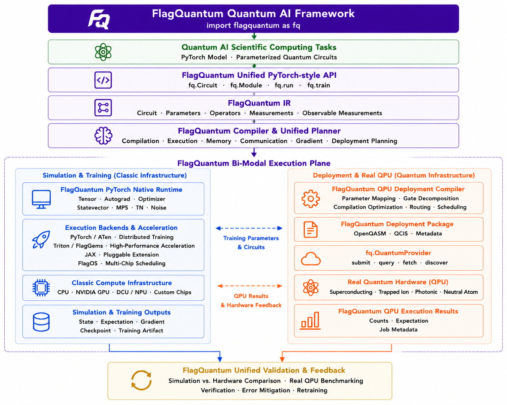
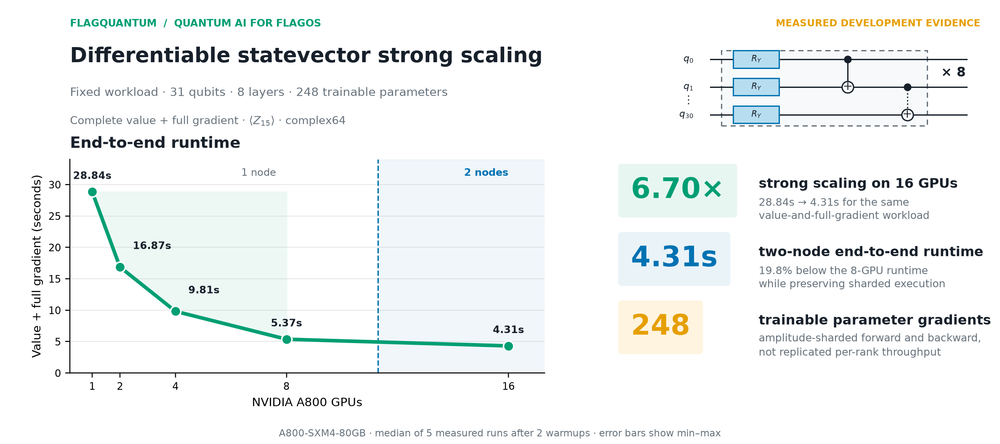
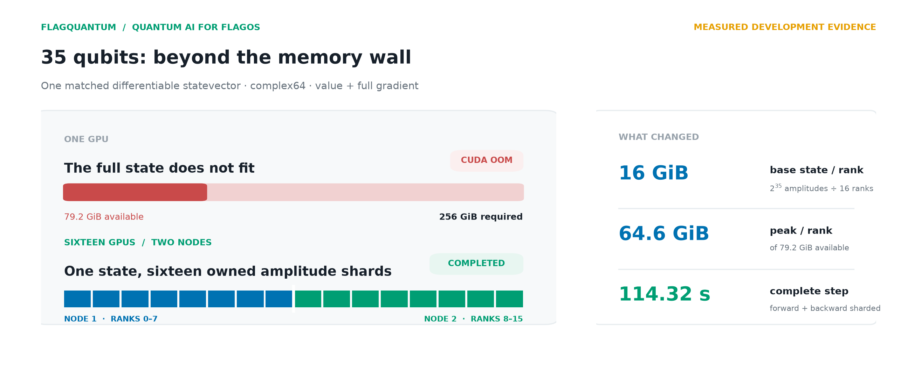
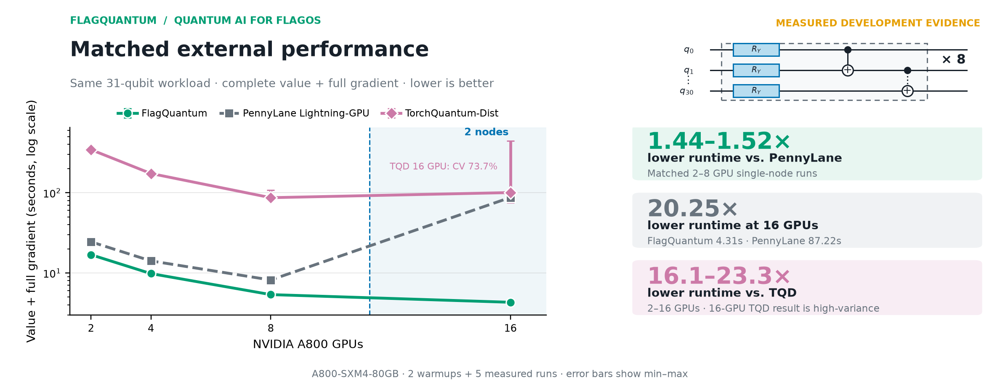

<div align="center">
  

<h2>Build, train, and scale quantum AI everywhere</h2>
<p><em>Designed for the FlagOS unified multi-chip backend</em></p>

[Quick Start](#quick-start) ·
[Documentation](docs/README.md) ·
[Capabilities](docs/generated/CAPABILITIES.md) ·
[Examples](examples/README.md) ·
[API Reference](docs/reference/API.md) ·
[Architecture](ARCHITECTURE.md) ·
[Roadmap](docs/roadmap/FLAGOS_ALIGNED_RELEASE_TRAIN.md)

[](https://pytorch.org/)
[](https://python.org/)
[](https://github.com/FlagQuantum/FlagQuantum/actions/workflows/ci.yml)
[](LICENSE)

</div>

## One quantum AI program, every execution scale

Write the quantum program once. Differentiate it with PyTorch, inspect how it
should run, execute it through one stable result contract, and package the
trained program for quantum hardware:

```python
import flagquantum as fq
import torch

def build_program(parameters, inputs=None):
    return (
        fq.Circuit(n_qubits=2)
        .ry(0, parameters[0])
        .cx(0, 1)
        .ry(1, parameters[1])
    )

model = fq.Module(
    build_program,
    n_parameters=2,
    init=torch.tensor([0.3, -0.2]),
    policy=fq.RuntimePolicy(observable_wires=(1,)),
)
optimizer = torch.optim.Adam(model.parameters(), lr=0.05)
training = fq.train(
    model,
    optimizer=optimizer,
    objective=lambda value: value.mean(),
    steps=10,
)

# Bind the optimized parameters into the same program for execution and deployment.
trained_program = build_program(next(model.parameters()).detach())
plan = trained_program.runtime_plan()
result = fq.run(trained_program, mode="auto")
package = fq.create_deployment_package(trained_program, shots=1024)

print(training.losses[-1])
print(plan.summary()["usability_contract"])
print(result.plan.state_mode)
print(package.backend.provider)
```

The public abstraction stays the same from a local experiment to a
representation-aware or multi-chip execution plan:

```text
fq.Circuit / fq.Module
        → FlagQuantum IR
        → plan representation, memory, communication, and gradients
        → execute locally or shard one workload across FlagOS-managed chips
        → package the trained program for quantum hardware
```

FlagQuantum is built around four durable ideas:

- **Programmable quantum AI:** circuits, hybrid models, measurements, and
  training share one FlagQuantum-native IR and PyTorch-facing interface.
- **Representation-aware execution:** the same program can use an exact
  statevector, a low-entanglement MPS, a tensor-network path, or a provider
  target according to its workload and constraints.
- **Verifiable multi-chip scale:** state, gradient, optimizer, memory, and
  communication ownership are explicit rather than inferred from process
  count.
- **Classical-to-quantum portability:** training and deployment preserve the
  program, parameter, and result contracts across classical accelerators and
  quantum hardware.

## Quick start

Install FlagQuantum and run the maintained one-minute hybrid quantum AI
example:

```console
pip install -e .
python examples/quick_start.py --mode sv
```

The example trains an ordinary `torch.nn.Linear` layer and an `fq.Module`
quantum layer in one PyTorch optimizer loop, then checks the trained model
against an analytical reference. Change only the execution representation:

```console
python examples/quick_start.py --mode mps
python examples/quick_start.py --mode tn
```

Start with the [annotated source](examples/quick_start.py), continue to the
[single-machine quantum AI examples](examples/single_machine_quantum_ai/README.md),
or inspect the stable [`fq.ExecutionResult` contract](docs/reference/RUNTIME_RESULT_CONTRACT.md).

## How it works

<p align="center">
  <a href="assets/readme/FlagQuantum.png">
    
  </a>
</p>

FlagQuantum owns quantum program semantics, differentiable training,
representation selection, partitioning, and auditable execution results.
FlagOS is the target unified backend for mapping those plans onto heterogeneous
and multi-chip systems. Quantum providers form a parallel deployment path for
trained programs.

The complete stable `flagquantum.backends.flagos` backend and deeper FlagOS
kernel and collective integration are under active development. Existing
accelerator paths remain supported according to their documented maturity;
the [product roadmap](docs/roadmap/FLAGOS_ALIGNED_RELEASE_TRAIN.md)
defines when unified backend claims may be promoted. The diagram is the target
product architecture; the
[machine-validated capability matrix](capability-maturity.toml) remains the
authority for what is currently experimental, supported, or release certified.

## Measured strong scaling

<p align="center">
  <a href="benchmarks/results/statevector_mlsys_current/TECHNICAL_REPORT.md">
    
  </a>
</p>

On one matched 31-qubit, 248-parameter workload, FlagQuantum reduced complete
value-and-gradient time from 28.84 seconds on one NVIDIA A800 to 5.37 seconds
on eight A800 GPUs and 4.31 seconds on sixteen GPUs across two nodes, while
preserving amplitude-sharded forward and backward execution.

These measurements are development evidence for this exact workload, not a
release-certified general scalability claim. Read the
[methodology and evidence](benchmarks/results/statevector_mlsys_current/TECHNICAL_REPORT.md),
inspect the
[full matched comparison](benchmarks/results/statevector_mlsys_current/fig0_final_scaling_with_tqd.png),
or [regenerate the README figure](benchmarks/research/plot_readme_statevector_scaling.py)
from the checked-in result artifacts.

### Capacity beyond one GPU

<p align="center">
  <a href="benchmarks/results/comparison/statevector_training_science_35q_capacity_report_v12.json">
    
  </a>
</p>

For the same 35-qubit differentiable workload, the single-A800 path failed
while attempting a 256 GiB state allocation. The two-node, sixteen-GPU path
completed the full value-and-gradient step in 114.32 seconds with distinct
amplitude shards, sharded forward and backward execution, no full-state
materialization, and 64.61 GiB peak allocated memory per rank.

This is measured development capacity evidence for the matched workload, not a
release-certified general capacity claim. Inspect the
[machine-readable capacity report](benchmarks/results/comparison/statevector_training_science_35q_capacity_report_v12.json)
or [regenerate the figure](benchmarks/research/plot_readme_capacity_expansion.py)
from the checked-in single-GPU and distributed artifacts.

### Matched external comparison

<p align="center">
  <a href="benchmarks/results/statevector_mlsys_current/TECHNICAL_REPORT.md">
    
  </a>
</p>

External framework timings reuse the same fixed workload and measurement
protocol. The sixteen-GPU ratios use the latest 4.31-second FlagQuantum rerun;
external measurements are unchanged. TorchQuantum-Dist's sixteen-GPU result
has a 73.7% coefficient of variation, which is retained in the figure rather
than hidden by its median. The
[comparison plotting script](benchmarks/research/plot_readme_external_comparison.py)
loads every value from the checked-in artifacts.

## Train quantum AI models

`fq.Module` connects parameterized quantum programs to ordinary PyTorch
optimizers:

```python
import flagquantum as fq
import torch

def build_circuit(parameters, inputs=None):
    return (
        fq.Circuit(n_qubits=2)
        .ry(0, theta=parameters[0])
        .cx(0, 1)
        .ry(1, theta=parameters[1])
    )

module = fq.Module(
    build_circuit,
    n_parameters=2,
    policy=fq.RuntimePolicy(observable_wires=(1,)),
)
optimizer = torch.optim.Adam(module.parameters(), lr=0.01)

training = fq.train(
    module,
    optimizer=optimizer,
    objective=lambda value: value.mean(),
    steps=100,
    log_interval=10,
)
```

The same model abstraction supports local quantum AI experiments, hybrid
classical-quantum models, VQE workflows, and distributed training paths.
`fq.run(...)` executes without updating parameters; `fq.train(...)` owns the
optimizer loop and returns `fq.TrainingResult`.

Start with the
[single-machine quantum AI examples](examples/single_machine_quantum_ai/README.md)
or the [tutorial notebooks](examples/tutorials/README.md).

## Plan and scale execution

FlagQuantum keeps execution policy separate from program intent:

```python
plan = program.runtime_plan(
    prefer_jax=True,
    state_mode="auto",
    require_gradients=True,
)

summary = plan.summary()
print(summary["recommended_mode"])
print(summary["recommended_candidate"]["distribution_semantics"])
```

Execution can remain on the local fast path or select a distributed
representation. A production training path must preserve the distribution
semantics through the complete lifecycle:

```text
forward → loss → backward → optimizer update → checkpoint → restart
```

FlagQuantum distinguishes true one-workload sharding from replicated
throughput:

- `single_device_fast_path` is local CPU or one-device execution.
- `data_parallel_replicated`, `rank_local_replicated_kernel`, and
  `replicated_per_rank` do not expand the capacity of one workload.
- `manual_sliced_tensor_contraction` remains a constrained tensor-network
  execution mode until its training and transport blockers are closed.
- `sharded_across_ranks` means one logical workload has explicit rank
  ownership; release claims still require audited hardware evidence.

See the
[distributed quantum AI principles](docs/concepts/DISTRIBUTED_QUANTUM_AI_PRINCIPLES.md)
and [distributed scalability principles](docs/concepts/DISTRIBUTED_SCALABILITY_PRINCIPLES.md)
for the binding execution and evidence rules.

## Deploy trained programs

The deployment contract packages a trained circuit, its parameters, shots,
provider target, and serialized program:

```python
import flagquantum as fq

program = fq.Circuit(n_qubits=2)
program.h(0).cx(0, 1)

package = fq.create_deployment_package(program, shots=1024)

print(package.backend.provider)
print(package.qasm[:80])
```

Provider availability, credentials, supported operations, and hardware
evidence vary by target. Cloud deployment is currently development evidence,
not a release-certified hardware capability. See the
[API reference](docs/reference/API.md) and [known limitations](docs/reference/KNOWN_LIMITATIONS.md).

## Capability maturity

FlagQuantum assigns maturity to individual capabilities rather than to the
package as a whole:

| Capability | Current level | Current boundary |
| --- | --- | --- |
| Unified circuit API and FlagQuantum IR | `release_certified` | IR v1 changes require an explicit migration |
| Local statevector training | `production_supported` | Capacity is bounded by one device |
| Sharded statevector training | `production_supported` | Multi-node release certification still requires promoted evidence |
| Sharded MPS training | `development_evidence` | Single-node multi-GPU evidence exists; multi-node and release evidence remain incomplete |
| Tensor-network training | `experimental` | General reverse contraction and production transport are not certified |
| Cloud and quantum hardware deployment | `development_evidence` | No provider is release certified |
| Dynamic circuits | `experimental` | Local and provider-preflight scope; no verified QPU execution |
| Extension SDK | `experimental` | Compatibility is not yet guaranteed |

The machine-validated
[capability matrix](capability-maturity.toml) is authoritative. The generated
[capability catalog](docs/generated/CAPABILITIES.md) maps each user goal to its
stable API, runtime mode, gradient support, evidence, examples, and known
boundaries.

## Installation

FlagQuantum supports Python 3.10–3.12 and uses PyTorch as its primary training
interface:

```bash
pip install -e .
```

Install optional environments only when required:

```bash
pip install -e '.[dev]'       # tests, lint, typing, and builds
pip install -e '.[jax]'       # optional JAX quantum kernels
pip install -e '.[cuda]'      # optional Triton kernels
pip install -e '.[examples]'  # model and dataset examples
```

A reproducible Conda environment is also provided:

```bash
conda env create -f environment.yml
conda activate flagquantum-dev
```

Verify the installation:

```python
import flagquantum as fq

print(fq.__version__)
print(fq.info())
```

## Explore FlagQuantum

| Goal | Start here |
| --- | --- |
| Build, compile, or export a program | [`fq.Circuit` quick start](examples/quick_start.py) |
| Train a quantum or hybrid AI model | [Single-machine quantum AI](examples/single_machine_quantum_ai/README.md) |
| Train a large low-entanglement system | [Differentiable MPS](examples/mps_hamiltonian_identification/README.md) |
| Partition one workload across devices | [Distributed statevector](examples/distributed_statevector_topologies/README.md) and [distributed MPS](examples/distributed_mps/README.md) |
| Package a trained program for hardware | [Training-to-deployment example](examples/train_parameterized_circuit_then_deploy.py) |
| Understand the runtime architecture | [Runtime architecture](docs/architecture/RUNTIME_ARCHITECTURE.md) |
| Follow planned product development | [Product roadmap](docs/roadmap/FLAGOS_ALIGNED_RELEASE_TRAIN.md) |
| Inspect limitations and evidence | [Known limitations](docs/reference/KNOWN_LIMITATIONS.md) and [capability maturity](docs/roadmap/CAPABILITY_MATURITY.md) |

## Benchmarks and evidence

The stable benchmark command discovers maintained scenarios and records
structured results:

```bash
flagquantum-benchmark list
flagquantum-benchmark info statevector_local
flagquantum-benchmark run environment_probe \
  --json-output benchmarks/results/local/environment.json
```

Benchmark conclusions separate local performance, replicated throughput,
manual tensor slicing, and true capacity expansion. Scalability claims are
fail-closed unless runtime ownership, memory, communication, topology,
gradient, optimizer, and blocker evidence pass the release gate.

See [benchmarks/README.md](benchmarks/README.md) for reproducible local,
distributed, and release-evidence workflows.

## Development

Run the smallest meaningful test tier first:

```bash
python tools/ci_tier.py pr-default
```

Runtime, distributed, accelerator, and release changes use progressively
stronger tiers documented in the [testing manual](docs/development/TESTING.md).
Contributors can install the versioned commit and CPU pre-push gates with
`pre-commit install`; the complete local gate is also available as
`python tools/pre_push.py`.

Before contributing, read [AGENTS.md](AGENTS.md), the
[capability maturity policy](docs/roadmap/CAPABILITY_MATURITY.md), and the
architecture map in [ARCHITECTURE.md](ARCHITECTURE.md).

## License

FlagQuantum is licensed under the [Apache License 2.0](LICENSE).
