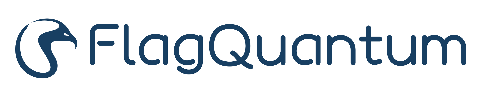

<div align="center">
  

<h1>FlagQuantum</h1>
<p><strong>Quantum computing, built for learning.</strong></p>
<p>A PyTorch-first framework for differentiable quantum computing and quantum AI.</p>

[Quick start](#train-your-first-quantum-model) · [Documentation](docs/README.md) · [Examples](examples/README.md)

</div>

Turn quantum circuits into trainable models. FlagQuantum brings PyTorch learning,
multiple simulation representations, and hardware execution into one workflow.
Its long-term goal is a continuous path from local scientific exploration to
distributed training, device modeling, and fault-tolerant quantum computing research.

- **Train with PyTorch.** Compose quantum and classical layers with autograd and
  familiar optimizers.
- **Choose the representation.** Statevector, matrix product state (MPS), and
  tensor-network simulation for different circuit structures and resource budgets.
- **Connect simulation to hardware.** Keep the circuit and requested observable
  explicit as you move between supported execution targets.

## Train your first quantum model

Requires Python **3.10–3.12**. From the repository root:

```console
python -m pip install -e .
```

Build a two-qubit circuit and learn its rotation angle by minimizing ⟨Z₀⟩. `fq.Module` exposes the quantum model to PyTorch; `outputs` selects what
to measure after training.

```python
import torch
import flagquantum as fq


def circuit(parameters):
    return fq.Circuit(2).ry(0, parameters[0]).cx(0, 1)


model = fq.Module(circuit, n_parameters=1, init=torch.tensor([0.25]))
training = fq.train(
    model,
    optimizer=torch.optim.Adam(model.parameters(), lr=0.05),
    objective=lambda z: z.mean(),
    steps=10,
)

trained_circuit = circuit(next(model.parameters()).detach())
measurement = fq.expectation(fq.Z(0))
result = fq.run(trained_circuit, outputs=measurement)
print(result.expectation())
```

For a complete classical–quantum model, follow the
[hybrid training example](examples/quick_start.py).

## Same circuit. Different execution targets.

Evaluate the same observable on a Jiuding GPU workspace or Quafu quantum
hardware. Configure the [Jiuding workspace and credentials](docs/guides/JIUDING.md)
or the [Quafu token and QSteed plugin](docs/guides/QUAFU_BACKEND.md) before
running the corresponding call.

```python
# GPU simulation in a running Jiuding workspace
jiuding_result = fq.run(
    trained_circuit, target="jiuding:gpu", outputs=measurement,
)

# Quantum hardware: compile, submit, and estimate from measured shots
quafu_result = fq.run(
    trained_circuit, target="quafu:Baihua", compiler="qsteed",
    outputs=measurement, shots=1024,
)
```

Jiuding computes a simulated expectation; Quafu estimates it from hardware
measurements. Training above runs locally.

## Go further

**Connect simulation with device observations.** Use [QPU digital twins](flagquantum/twin/README.md)
to compare calibration-based model predictions with measured counts. See the
experiment guide for task binding and the scope of hardware validation.

**Toward fault-tolerant quantum computing.** Start with a local
[QEC memory experiment](flagquantum/qec/README.md) connecting syndrome extraction,
decoding, and correction. Logical operations and hardware feedback are longer-term
research goals.

[Quantum AI tutorials](examples/single_machine_quantum_ai/README.md) ·
[Distributed statevector](examples/distributed_statevector_topologies/README.md) ·
[Distributed MPS](examples/distributed_mps/README.md) ·
[ARCHITECTURE.md](ARCHITECTURE.md)

<!-- BEGIN GENERATED CAPABILITY_SUMMARY -->
Support varies by execution path. See the [capability catalog](docs/generated/CAPABILITIES.md) for maturity and limitations.
<!-- END GENERATED CAPABILITY_SUMMARY -->

<!-- BEGIN GENERATED PERFORMANCE_CLAIMS -->
[Benchmarks and validated results](docs/generated/CAPABILITIES.md#validated-public-performance-claims)
<!-- END GENERATED PERFORMANCE_CLAIMS -->

---

[Contributing](CONTRIBUTING.md) · [Apache License 2.0](LICENSE)
