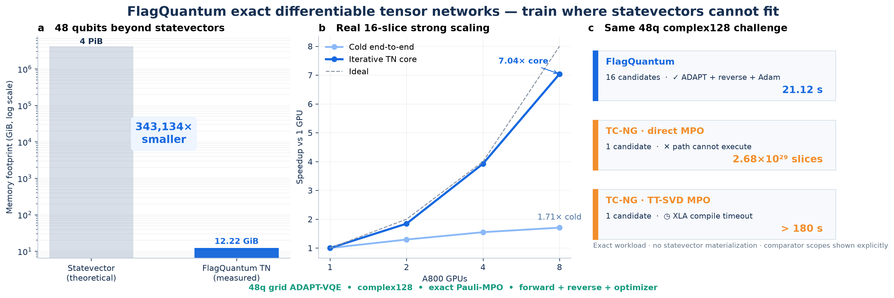
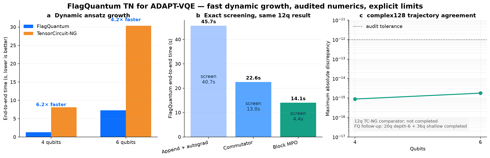

# ADAPT-VQE tensor-network case study

## Archived 48q capacity run (not a promoted accuracy comparison)



The artifact below is a legacy 48-qubit, complex128 grid ADAPT-VQE step with exact
Pauli-MPO expectation values. FlagQuantum screens 16 candidates, selects an
operator, executes explicit reverse mode, and applies an Adam update in
21.12 s on one A800, with 12.22 GiB peak CUDA allocation. A complex128
statevector for the same width would require 4 PiB. No statevector, complete
tape, or collection of all slice intermediates is materialized.

It is not a ground-state convergence result and is no longer the primary
comparison: its initial energy is only `-5.018945985669724`, whereas the
computational-basis product state has energy `-82`. The current benchmark
defaults to a deterministic mean-field product-state warm start with analytic
energy `-85.59209506157765`. New cross-library results must also pass the audit
that requires Cotengra on both implementations with matching path repeats,
objective, intermediate-size budget, initial state, and complete numerical
trajectory. The files in `hero48/` predate that contract and must not be used
as accuracy or framework-level performance evidence.

The 16-slice iterative TN core scales by 7.04× from one to eight A800 GPUs;
cold end-to-end time scales by 1.71× because graph construction, MPO
compression, and path setup remain on the critical path. These are reported
separately rather than presenting kernel-only speedup as application speedup.

The archived TensorCircuit-NG boundary uses the same 48q circuit, complex128 dtype,
commutator screening, one ADAPT iteration, and one optimizer step. It is shown
with only one candidate, a smaller scope than FlagQuantum's 16-candidate run:

- TensorCircuit-NG's direct-sum MPO plans approximately `2.68e29` slices for
  the selected-operator value-and-gradient contraction and exits before
  execution.
- A stronger comparator with exact TT-SVD MPO compression, independently
  checked against the direct MPO to `5.33e-15` on a small instance, does not
  finish XLA compilation within 180 s.

This is a completion-boundary comparison, not a claimed 8.5× library speedup.
The two-node NCCL transport has reached `NET/IB` over mlx5 with GDR, but the
48q two-node forward/reverse/optimizer result is not promoted here until the
post-fix run completes and produces its JSON artifact.

### Corrected mean-field comparison

The corrected 48q workload uses a deterministic mean-field product state with
analytic energy `-85.59209506157765`, a pool containing the correlation-capable
odd-Y generators `YX` and `XY`, and a shared learning rate of `0.02`.
FlagQuantum and TensorCircuit-NG both use complex128, exact TT-SVD/Pauli-MPO
compression semantics, Cotengra with `minimize=write` and four path repeats,
the same 64 GiB intermediate budget, 16 sampled candidates, one ADAPT
iteration, and one Adam update.

Both select candidate 15. The maximum candidate-gradient error is `2.33e-15`;
the initial- and final-energy errors are approximately `1.63e-11`. Therefore
the 48q audit fails the historical absolute `1e-12` gate and passes an explicit
`1e-10` gate. The energy decreases from approximately `-85.5920950616` to
`-85.5930066923`. Raw end-to-end times are 20.61 s for FlagQuantum and 84.57 s
for TensorCircuit-NG on one A800, but the audit does not authorize a speedup
claim because matching Cotengra policy does not prove identical contraction
trees.

After adding a bounded per-rank cache for static compressed Hamiltonian MPO
cores, the same fixed 16-slice artifact was executed at every GPU count. Cold
end-to-end times are 14.02, 9.50, 7.08, and 6.03 seconds on 1, 2, 4, and 8
A800 GPUs, respectively, for a fixed-plan 8-GPU speedup of 2.33×. Every point
finishes at `-85.59300669224483`. This is stronger than the earlier mixed-plan
1.63× observation, but remains development evidence: per-rank graph creation
and the first MPO compression are still replicated, and each rank owns only two
slices at eight GPUs.

### Ground-state reference and optimizer convergence

The eight-GPU optimizer was extended to at most 200 Adam updates and stopped
after 190 updates at the `1e-12` energy-change threshold. Its best one-operator
energy is `-85.59304427565601`, with final gradient magnitude `3.64e-6`.

An independent Quimb DMRG2 reference was first validated against exact
diagonalization on the 2×3 instance to `9.77e-15`. On 6×8, a seeded random
bond-16 MPS converged to `-85.61320789522475`, reached bond dimension 48, and
has measured energy variance `1.73e-7`. This is a high-quality variational
reference, not a closed-form exact theory value. The optimized one-operator
ADAPT result remains `0.02016361957` above it, a relative gap of `2.36e-4`.
The optimizer is therefore converged, but the ansatz is not; further progress
requires additional ADAPT selections rather than more updates of the same
parameter.

A subsequent five-iteration distributed ADAPT run selected sampled-pool
indices `[15, 13, 12, 9, 11]`, jointly optimized all accumulated parameters for
up to 100 Adam steps per iteration, and reached `-85.5941590121169` in 332.11
seconds. This closes 9.78% of the initial gap to the DMRG reference; the
remaining gap is `0.01904888311`. One rank reached 74.25 GiB peak CUDA
allocation during screening, so further iterations are blocked on a stricter
screening memory budget and reusable sliced plans rather than being promoted
as a safe 80-GiB run.

Regenerate the hero figure with:

```bash
MPLCONFIGDIR=/tmp/fq-mpl python \
  benchmarks/development/plot_tn_48q_hero.py \
  --results benchmarks/results/adapt_vqe_tn_20260803/hero48 \
  --output benchmarks/results/adapt_vqe_tn_20260803/hero48/tn_48q_hero.png
```

This directory contains a deterministic, complex128 qubit-ADAPT-VQE comparison
between FlagQuantum and TensorCircuit-NG. It is development evidence, not a
distributed-scalability claim.

## Workload contract

- Hamiltonian: grid TFIM-like model with nearest-neighbor `-ZZ`, `-0.7 X`, and
  staggered `±0.11 Z` terms.
- Operator pool: single-qubit `RY` plus grid-edge `RXX` and `RZZ` rotations.
- Initial circuit: `H`, fixed `RY`, and checkerboard grid-CNOT cycles.
- Parameters: float64; circuit, Hamiltonian, and contraction tensors: complex128.
- Selection: exact zero-angle candidate gradients; Adam uses the PyTorch
  defaults in both implementations.
- Timing: end-to-end, including candidate screening, contraction-path/compiler
  setup, reverse mode, and optimizer steps.

The 4q and 6q comparisons use the same append-and-autograd algorithm on both
implementations. The audit scripts reject workload, selected-operator, energy,
gradient, or optimizer-trajectory mismatches.

## Audited result

| Workload | FlagQuantum | TensorCircuit-NG | FQ speedup | Max audited error |
|---|---:|---:|---:|---:|
| 4q, 1 ADAPT × 5 Adam | 1.305 s | 8.090 s | 6.20× | 2.22e-16 |
| 6q, 2 ADAPT × 10 Adam | 7.295 s | 30.377 s | 4.16× | 1.78e-15 |

For the 12q probe, exact Pauli-commutator screening reduces FlagQuantum from
45.67 s to 22.57 s. Contracting the complete candidate pool as one block MPO
reduces it further to 14.09 s. All three methods select the same operator and
finish at `-5.356037238155021`.

Cotengra planning and exact Pauli-MPO compression extend the same workflow to
capacity-oriented points:

| Workload | Completed operation | Time | Peak CUDA allocation |
|---|---|---:|---:|
| 20q, 6 cycles, 16 candidates | 1 ADAPT + 1 Adam step | 12.365 s | 5.01 GiB |
| 36q, 1 cycle, 16 candidates | exact screening | 3.502 s | 56.9 MiB |
| 36q, 1 cycle, 16 candidates | 1 ADAPT + 1 Adam step | 10.332 s | 67.1 MiB |

The 36q complex128 statevector alone would require 1 TiB. The TN run does not
materialize that statevector. An independent append-and-autograd audit agrees
with the selected commutator gradient to `1.09e-13` absolute error.



## Claim boundary

The memorable result is **fast exact dynamic-ansatz growth on shallow,
high-width circuits**, not arbitrary-depth capacity or multi-GPU scaling. The TensorCircuit-NG 12q commutator comparator
did not produce a result in the measured configuration, so no 12q cross-library
speedup is claimed. Cotengra removes the original native 20q planning blocker,
but depth remains decisive at 36q: the measured cycles=2 point requires 649,440
slices and about `7.58e15` estimated operations, while cycles=4 and cycles=8 are
still less economical. Only the completed cycles=1 result is presented as
36q execution evidence.

Reproduce the numerical audits with:

```bash
python benchmarks/development/audit_adapt_vqe_tn.py \
  benchmarks/results/adapt_vqe_tn_20260803/fq_6q_1gpu.json \
  benchmarks/results/adapt_vqe_tn_20260803/tcng_6q_1gpu.json \
  --output benchmarks/results/adapt_vqe_tn_20260803/audit_6q_append.json
```

Regenerate the figure with:

```bash
MPLCONFIGDIR=/tmp/fq-mpl python \
  benchmarks/development/plot_adapt_vqe_tn_readme.py \
  --results benchmarks/results/adapt_vqe_tn_20260803 \
  --output benchmarks/results/adapt_vqe_tn_20260803/adapt_vqe_tn_readme.png
```
