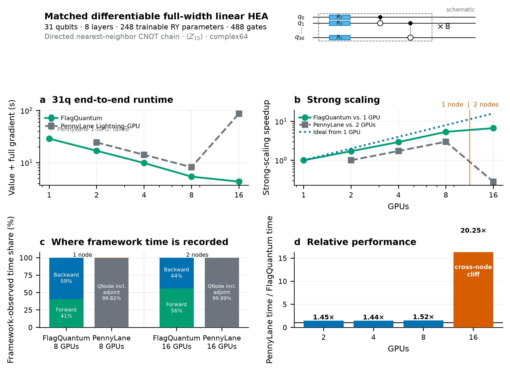
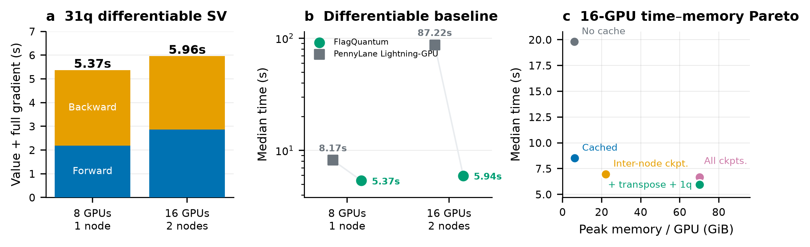
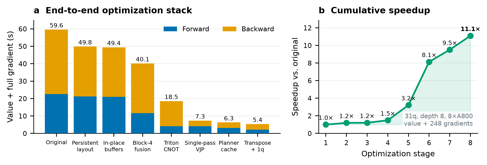
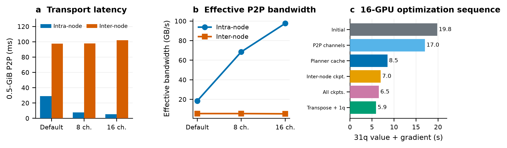

# FlagQuantum 分布式态矢量：从单节点效率到跨节点可训练扩展

> 本文是 `statevector_mlsys_current` 四张投稿图的技术叙事底稿，供后续撰写
> MLSys 论文的摘要、引言、系统设计与实验章节使用。当前结论属于实测开发证据，
> 不是 release payload，也不替代最终 profiler、容量和统计审计。

## 1. 核心问题

参数化量子电路训练要求模拟器同时支持大规模态矢量、完整参数梯度以及优化器可用
的跨设备一致性。仅仅把 forward 分到多张 GPU 上并不够：反向传播可能引入第二份
量级相同的态、逐门通信、参数梯度归约和大量小 kernel，从而使一个“能运行”的
分布式模拟器在训练时失去扩展性。

FlagQuantum 的目标因此不是独立电路的多卡吞吐，而是把**同一个可微态矢量**
按 amplitude 分片，并让 forward、backward 和参数更新保持
`sharded_across_ranks` 语义。当前主实验固定为：

- 31 qubits，complex64 态矢量；
- 8 层 Full-width Linear HEA；
- 每层 31 个可训练 `RY` 和 30 个定向近邻 `CNOT`；
- 共 248 个参数、488 个门；
- 目标为 \(\langle Z_{15}\rangle\) 及其对全部 248 个参数的梯度；
- NVIDIA A800-SXM4-80GB；
- 正式矩阵采用 2 次不计时 warmup 和 5 次 retained measurement。

这组 workload 同时压测状态容量、逐门执行效率、反向重计算和跨节点通信，是当前
四张图的共同主线。

## 2. 一句话结果

FlagQuantum 在同一版本、同一 workload 上从 1 张 A800 的 28.84 s 降到 8 张
A800 的 5.37 s，取得 5.37× strong-scaling speedup；扩展到两节点 16 张 A800
后为 5.94 s，仅比单节点 8 卡慢 10.7%。在 2/4/8 卡上，它比 PennyLane
Lightning-GPU 快 1.44–1.52×；在 16 卡上快 14.68×。从最初实现到最终 8 卡
executor，累计加速为 11.1×。

真正值得强调的系统结论不是某一个绝对时间，而是：

1. 单节点加速来自状态布局、固定缓冲和编译 kernel 的共同作用；
2. 直接把单节点方案扩展到多节点会遇到通信悬崖；
3. 对通信进行测量后，正确的修复方向是减少和隐藏跨节点状态交换，而不是继续微调
   NCCL channel 数；
4. 最终 16 卡结果恢复到接近 8 卡的时间，并保持完整梯度训练语义。

## 3. Figure 0：先证明最终系统“跑得快且扩得动”

Figure 0 应作为论文结果叙事的入口，而不是先展示优化过程。

### 3.1 Panel (a)：端到端时间

FlagQuantum 的正式结果为：

| GPUs | Nodes | Forward (s) | Backward (s) | Value + full gradient (s) |
|---:|---:|---:|---:|---:|
| 1 | 1 | 12.531 | 16.313 | 28.842 |
| 2 | 1 | 7.232 | 9.636 | 16.867 |
| 4 | 1 | 4.218 | 5.590 | 9.813 |
| 8 | 1 | 2.187 | 3.182 | 5.369 |
| 16 | 2 | 2.867 | 3.091 | 5.941 |

PennyLane Lightning-GPU 的 matched 结果为：

| GPUs | Nodes | QNode incl. adjoint (s) | Torch handoff (s) | Value + full gradient (s) |
|---:|---:|---:|---:|---:|
| 1 | 1 | — | — | failed (signal 11) |
| 2 | 1 | 24.415 | 0.011 | 24.427 |
| 4 | 1 | 14.113 | 0.012 | 14.125 |
| 8 | 1 | 8.152 | 0.014 | 8.167 |
| 16 | 2 | 87.210 | 0.014 | 87.223 |

PennyLane 的 adjoint differentiation 在 QNode 调用内部完成，因此这里的
“forward”和 FlagQuantum 显式 executor forward 不是同一算法阶段。论文只能
比较端到端 value-and-full-gradient，不能把约 0.01 s 的 Torch backward handoff
解释成 PennyLane 的完整反向时间。

### 3.2 Panel (b)：strong scaling

FlagQuantum 相对自身单卡的 speedup 为：

- 2 GPU：1.71×；
- 4 GPU：2.94×；
- 8 GPU：5.37×；
- 16 GPU：4.85×。

8 卡是当前 time-to-solution 最优点。16 卡不是为了声称超线性或继续提速，而是证明
执行路径能够跨节点保持接近单节点最优性能。16 卡比 8 卡慢 10.7%，说明跨节点成本
尚未完全隐藏；但它没有出现外部基线的跨节点性能崩塌。

### 3.3 Panel (c)：时间边界，而非伪造 kernel 分解

该 panel 的作用是防止错误解读：

- FlagQuantum 将 forward 和 backward executor 分开计时；
- PennyLane 将 adjoint 工作计入 QNode 调用；
- 两套框架的阶段边界不同，但端到端目标相同。

论文正文应明确写成 “framework-observed phase boundaries”。如果后续获得
Nsight Systems/CUPTI 数据，应另做 kernel/communication breakdown，不能直接把
当前 panel 当作算法级算子占比。

### 3.4 Panel (d)：相对性能与跨节点转折

PennyLane/FlagQuantum 端到端时间比分别为：

- 2 GPU：1.45×；
- 4 GPU：1.44×；
- 8 GPU：1.52×；
- 16 GPU：14.68×。

前三个点说明 FlagQuantum 不只是“跨节点才有优势”；它在同一节点 2–8 卡也持续
领先。16 卡差距突然扩大，则把论文问题自然引向 Figure 3：为什么跨节点行为不同？

## 4. Figure 1：解释当前系统的性能形态

Figure 1 从三个角度回答“最终数字是怎样构成的”。

### 4.1 Panel (a)：8 卡与 16 卡的 forward/backward 平衡

8 卡为 2.19 s forward + 3.18 s backward；16 卡为 2.87 s forward + 3.09 s
backward。跨节点后 backward 没有恶化，主要增量出现在 forward。这与最终
executor 的反向检查点和融合设计一致：反向状态恢复与梯度内积已被控制住，而
forward 仍承担跨节点布局交换。

这给后续优化一个具体方向：不要笼统“优化 backward”，应优先定位 16 卡 forward
中的跨节点交换、同步空洞和未覆盖 kernel。

### 4.2 Panel (b)：单节点优势和跨节点韧性是两件事

8 卡比较证明本地 kernel、布局和融合路径有效；16 卡比较证明 topology-aware
execution 和通信规避有效。论文应把二者分开陈述：

- local efficiency：同节点对 PennyLane 快 1.52×；
- scale-out robustness：16 卡仍为 5.94 s，而 PennyLane 增至 87.22 s。

这样可以避免把全部贡献归因于网络，也避免“FlagQuantum 只在跨节点有优势”的误解。

### 4.3 Panel (c)：时间—显存 Pareto

16 卡优化并不是无成本地减少时间。不同 checkpoint 策略在重新计算、保存状态和
通信次数之间交换资源。最终 “transpose + 1q” 点把时间压到约 5.94 s，但峰值显存
约 70.14 GiB/GPU，已经接近 A800 容量上部。

这一 panel 的正确作用是展示系统选择，而不是单纯宣称显存更低。论文应说明：

- 更低时间可能需要更多持久状态或 checkpoint；
- FlagQuantum 暴露的是一个可选择的 Pareto frontier；
- capacity workload 需要不同于 time-to-solution workload 的内存策略。

后续若版面紧张，可把该 panel 移入 appendix，并在主文用一张 capacity/OOM 图替代。

## 5. Figure 2：把 11.1× 加速还原为一条系统优化链

Figure 2 不是严格的逐变量消融，而是累计工程历程。八个阶段的端到端时间为：

| Stage | Optimization milestone | Time (s) |
|---:|---|---:|
| 1 | Original | 59.60 |
| 2 | Persistent logical→physical layout | 49.84 |
| 3 | In-place/fixed buffers | 49.42 |
| 4 | Block-4 fusion | 40.12 |
| 5 | Triton CNOT | 18.54 |
| 6 | Single-pass reversible RY VJP | 7.33 |
| 7 | Planner cache | 6.27 |
| 8 | Transpose + one-qubit fusion | 5.37 |

这条曲线支持三个设计层次。

### 5.1 减少移动：持久位映射

logical→physical bit permutation 不在每个门后恢复规范顺序，而是让后续门继承当前
布局。它把“为了表示整洁而交换状态”改为“只在执行需要时交换状态”。这是分布式
态矢量最先应解决的问题，因为一次全态交换的代价远高于 planner 中的一次索引更新。

### 5.2 减少物化：固定缓冲池与原位更新

ket、bra、scratch 和 exchange workspace 使用固定池，避免逐门创建状态大小的临时
张量。该阶段单独的时间收益有限，但它降低了 allocator 抖动并为后续融合提供稳定
内存地址，是必要的基础设施。

### 5.3 减少 launch 与遍历：编译 kernel 和融合 VJP

最大的两个台阶来自 Triton CNOT 和 single-pass reversible RY VJP。它们共同说明
瓶颈不只在通信：

- 通用逐门 tensor primitives 会重复遍历完整 shard；
- Python 层逐门调度产生大量 kernel launch；
- 参数化单比特反向若分开执行 bra 更新、生成元作用和梯度内积，会多次读写状态。

FlagQuantum 将这些操作下沉到面向态矢量布局的编译 kernel，并在单次遍历中完成
可合并工作。Planner cache 和 transpose/1q fusion 则收尾消除了控制面与布局转换的
剩余固定成本。

论文措辞必须保留“cumulative optimization history”，不能把相邻柱子的差值当作
严格单因素因果效应。真正的 ablation 应使用同一最终代码版本和显式开关重新测量。

## 6. Figure 3：跨节点悬崖如何被定位和修复

Figure 3 是系统论文最关键的“证据链”图：它把症状、测量和修复连接起来。

### 6.1 Panel (a)：先测 transport，而不是盲调算法

0.5-GiB P2P microbenchmark 将 intra-node 与 inter-node 路径分开。增加 NCCL
channel 数能明显影响节点内传输，但没有对应改善跨节点链路。这排除了“只要继续
增加 channel 就能解决 16 卡问题”的假设。

### 6.2 Panel (b)：跨节点带宽低是正向诊断证据

该 panel 不是证明系统网络“好”，而是证明其差异足以主导算法决策。节点内与节点间
有效带宽之间的落差意味着：高频状态交换必须尽量留在节点内；不得不跨节点的交换
应通过 bit placement、checkpoint 和重计算降低频次。

因此 Figure 3(b) 的正向结论是：**microbenchmark 正确预测了 executor 的优化方向**，
而不是“跨节点通信很小”。

### 6.3 Panel (c)：从调 channel 转向通信规避

16 卡修复序列依次包括：

1. initial optimized executor；
2. P2P channel tuning；
3. planner cache；
4. inter-node checkpointing；
5. all-state checkpointing；
6. transpose + one-qubit fusion。

序列的逻辑是先尝试 transport tuning，再根据 panel (a)/(b) 的结果转向减少数据移动。
最终结果不是某一个 magic kernel，而是 planner、memory policy、topology 和 compiled
execution 的协同。

## 7. 四张图连成的论文故事

推荐正文顺序如下：

1. **Figure 0 — Outcome。** FlagQuantum 在 31q 可微训练上实现单节点 strong
   scaling，并跨两节点保持性能；外部基线在 16 卡出现明显悬崖。
2. **Figure 1 — Anatomy。** 最终 executor 的 forward/backward 构成、同节点与
   跨节点优势，以及时间—显存取舍。
3. **Figure 2 — Mechanism。** 性能不是来自一个 benchmark shortcut，而是从减少
   状态移动、限制临时内存到融合编译 kernel 的完整优化栈。
4. **Figure 3 — Diagnosis。** 多节点问题通过 transport microbenchmark 被定位，
   再通过通信规避和拓扑感知修复。

可压缩为以下论文论证链：

> Differentiable statevector simulation is limited by repeated full-shard
> movement and fine-grained reverse execution. FlagQuantum keeps the logical
> layout persistent, bounds state-sized storage, fuses reversible parameter
> gradients, and makes checkpoint placement topology-aware. These mechanisms
> yield strong single-node scaling and prevent the usual multi-node
> communication cliff.

## 8. TorchQuantum-Dist 应如何加入，而不破坏故事

TorchQuantum-Dist（TQD）适合作为“通用 DTensor 可逆反传”对照，而不是替代
PennyLane。当前已验证：

- 官方源码、`InvertibleUnitary`、真实 DTensor amplitude sharding；
- 8q 小电路相对 PennyLane：期望值误差 1.19e-7、梯度最大误差 5.96e-8；
- 31q 单卡实测 OOM；
- 31q 正式 2+5：2/4/8/16 卡分别为
  343.974/173.563/86.689/100.396 s，对应比 FlagQuantum 慢
  20.4×/17.7×/16.1×/16.9×；
- 16 卡两节点最终完成，但首次结果前约 80 分钟主要消耗在四维 DTensor mesh 的
  sharding-strategy propagation。五个正式端到端样本为
  356.626/441.788/100.396/83.633/74.963 s，CV 73.7%，说明 2 次 warmup
  尚不足以稳定延迟初始化与缓存。

当前 2/4/8/16 卡正式矩阵已经完成。图中：

- Figure 0(a) 增加 TQD 2/4/8/16 卡正式点及 min–max 误差条；
- 1 卡标 `measured OOM`；
- 16 卡标注 100.4 s 中位数、75–442 s 范围、74% CV 与约 80 分钟首次结果延迟；
- Figure 0(b) 使用正式中位数计算 TQD 相对 2 卡的 speedup；
- Figure 0(d) 同时给出 PennyLane/FlagQuantum 与 TQD/FlagQuantum；
- TQD 的完整正确性、接口差异和失败栈放入 appendix 表格。

TQD 的 `measure_allZ` 会计算全部量子位的 Z 期望值，而本实验只使用 \(Z_{15}\)；
FlagQuantum 和 PennyLane 直接计算目标 observable。正文必须披露这一 API 差异，但
它不足以解释 TQD 当前一个到两个数量级的差距；逐门通用 `bmm`、动态 reshard 和
多维 DTensor collective 才是主要结构性成本。

## 9. 当前证据边界

可以据此主张：

- 单一 31q workload 的真实 amplitude sharding；
- 完整 248 参数梯度，而非 forward-only；
- 同机 1/2/4/8 卡的 matched strong scaling；
- 2 节点 16 卡的完成结果和 rank placement；
- 相同 workload、dtype、参数和测量目标下的 PennyLane 比较；
- 从原始 executor 到最终 executor 的累计优化收益；
- transport microbenchmark 与多节点修复方向的一致性。

暂时不应主张：

- 所有电路结构都有相同的 11.1× 收益；
- Figure 2 是严格逐变量消融；
- 当前阶段边界等价于 GPU kernel 时间占比；
- 16 卡比 8 卡更快；
- 当前四图已经构成正式 release payload；
- TQD 16 卡的 2+5 中位数代表协议结果，但不能解释为充分预热后的稳态极限；
- 单凭 31q 结果已经证明超单卡容量扩展。

## 10. 完整论文仍需补齐的实验

### 10.1 2026-07-23 补齐任务状态

- **Ring/Brickwork：正式矩阵已完成。** 三者共享 31q、8-layer、248 参数、
  完整 value+gradient、rank-max 与 2+5 契约。Ring 的 1/2/4/8/16 卡中位数为
  29.241/18.114/9.879/5.352/6.381 s；Brickwork 为
  28.837/18.172/10.742/6.472/25.602 s。Ring 在单节点与 Linear 基本一致，
  Brickwork 在 8 卡慢 20.5%。16 卡不是强扩展收益点：Ring 比 8 卡慢 19.2%，
  Brickwork 还出现随样本推进的 8.723→27.215 s 非稳态退化。
- **科学训练与容量：已有可审计开发证据。** 30q 相同 workload 在单 A800
  为 23.450 s、两节点 16 A800 为 4.324 s，端到端加速 5.42×；35q 在单
  A800 实测 OOM，而两节点 16 A800 完成 warmup + 3 个训练步，中位数
  114.319 s。对应原始文件为
  `statevector_training_science_30q_{1xa800,2node16xa800}_v12.json`、
  `statevector_training_science_35q_{1xa800_oom,2node16xa800}_v12.json`
  和匹配 capacity report。
- **Profiler/通信分析：同版本 8 卡三电路数据已完成。** Profile step 不进入
  2+5 时间样本。Linear/Ring 的 rank-median 逻辑通信量均为 103.1 GB、通信
  kernel 为 304，有效逻辑带宽分别为 46.3/46.7 GB/s；Brickwork 为
  154.6 GB、448 个 kernel 和 46.8 GB/s。因此其单节点损失来自额外通信工作
  （+50% bytes、+47% communication kernels），而不是链路带宽降低。
- **Bootstrap CI：已生成。** `bootstrap_ci_31q_2plus5.json` 对当前三系统
  2/4/8/16 卡样本执行 10,000 次独立非参数 median bootstrap，并为高 CV 或
  单调尾部样本设置 stationarity warning。TQD 16 卡相对 FlagQuantum 的点估计
  为 16.90×，95% CI 为 [12.62×, 74.36×]；宽区间必须保留，不能只展示点估计。

优先级从高到低：

1. **Profiler breakdown：** GPU activity、kernel launches、算子时间、P2P/NCCL
   时间、有效带宽和 compute/communication overlap。
2. **容量证据：** 冻结一个单卡实测 OOM、分布式完成的训练 workload，并报告每
   rank 峰值显存、分片所有权和 optimizer update 一致性。
3. **严格 ablation：** 在同一最终代码版本上分别关闭 persistent permutation、
   fixed buffer、fused 1q VJP、checkpoint 和 topology-aware placement。
4. **电路通用性：** Full-width Linear、Ring、Brickwork 使用相同门数/参数量或
   明确归一化，验证优化不是只匹配一种边结构。
5. **重复统计：** 对关键 8/16 卡点增加样本数并报告 bootstrap 95% CI；当前
   min–max error bar 可保留为原始测量范围。
6. **TQD 多节点边界：** 保留已完成的 2/4/8/16 卡 2+5，将 1 卡 OOM、16 卡
   time-to-first-result、高 CV 和完整样本序列一并披露，并补充 DTensor planning
   profile。
7. **MPS/TN 占位：** 主文架构图预留统一 IR 到 SV/MPS/TN executor 的分支；
   在 MPS/TN 优化完成前，不用 SV 数据替代它们的性能和容量结论。

## 11. 建议的论文章节映射

| Paper section | 主要内容 | 对应图 |
|---|---|---|
| Introduction | 可微态矢量的容量、反向与通信矛盾 | Figure 0 摘要结果 |
| Motivation | 通用逐门执行和跨节点交换为何失效 | Figure 2 stage 1；Figure 3(a,b) |
| System design | persistent mapping、buffer pool、fused VJP、topology-aware checkpoint | Figure 2 |
| Evaluation setup | 31q HEA、A800、2+5、dtype、梯度与基线公平性 | Figure 0 header |
| End-to-end results | strong scaling 与外部比较 | Figure 0 |
| Performance analysis | phase、Pareto、单/多节点差异 | Figure 1 |
| Multi-node study | transport diagnosis 与修复序列 | Figure 3 |
| Generality | Linear/Ring/Brickwork 与强扩展边界 | Figure 4 |
| Root-cause analysis | launch、通信量、带宽和 GPU activity | Figure 5 |
| Scientific training | 30q 加速与 35q 单卡 OOM/分布式完成 | Figure 6 |
| Limitations | 16 卡未快于 8 卡、显存 Pareto、开发证据边界 | Figure 1(c) |

## 12. 数据与复现入口

### 12.1 Brickwork dependency-DAG 调度更新（2026-07-24）

旧 persistent-layout planner 严格按源程序逐门执行。Brickwork 的交替匹配顺序
会把同一后续 CNOT 的两个端点同时逐出 local wire set，导致 8/16 卡每次完整
value+gradient 分别产生 72/96 次 layout swap。

新 dependency-DAG list scheduler 保持每条逻辑 wire 上的门序不变，只在不存在
依赖路径、作用于不相交 wires 的 ready instructions 之间选择执行顺序。选择规则
优先执行当前已驻留的 gate bundle，因此不是针对 `brickwork` 名称或固定边模式的
特例。

正式 2+5 结果：

| GPUs | 优化前中位数 (s) | 优化后中位数 (s) | 优化后 speedup |
|---:|---:|---:|---:|
| 1 | 28.837 | 28.837 | 1.00× |
| 2 | 18.172 | 15.685 | 1.84× |
| 4 | 10.742 | 8.281 | 3.48× |
| 8 | 6.475 | 4.233 | 6.81× |
| 16 | 25.602 | 2.574 | 11.20× |

8 卡 profiler 显示 layout swap 72→3、逻辑通信量 154.6→6.44 GB、通信
kernel 448→34。16 卡五个样本稳定在 2.571–2.589 s，CV 从 31.2% 降到
0.27%，峰值显存从 62.3 降到 8.0 GB/rank。该结果说明旧 16 卡退化来自
依赖顺序与 residency policy 的耦合，而不是 Brickwork 电路本身不可扩展。

### 12.2 Ring：调度与编译执行必须联合优化（2026-07-24）

Ring 上 dependency-DAG 调度把 8 卡 layout swap 从 48 降到 24，逻辑通信量从
103.1 GB 降到 51.5 GB，通信 kernel 从 304 降到 160；但它把原先 16 个连续
RY/CX 段碎片化为 58 个短段，使 kernel launch 总数上升。结果是 DAG-only 的
8 卡端到端时间为 5.365 s，与原版 5.350 s 基本相同：forward 从 2.190 s
退化到 2.751 s，抵消了 backward 从 3.160 s 到 2.613 s 的收益。

因此最终实现不是 Ring 特例，而是两项通用机制组合：dependency-DAG scheduler
仅重排无依赖路径且作用于不相交 wires 的 ready instructions；当 scheduler
改变执行顺序时，runtime 自动启用编译后的 local-CX segment executor，显式环境
变量仍可覆盖该策略。正式 2+5 结果如下：

| GPUs | 优化前中位数 (s) | 优化后中位数 (s) | 端到端提升 |
|---:|---:|---:|---:|
| 1 | 29.241 | 29.241 | 1.00× |
| 2 | 18.114 | 12.079 | 1.50× |
| 4 | 9.879 | 7.525 | 1.31× |
| 8 | 5.350 | 4.516 | 1.18× |

优化后 8 卡五个样本为 4.515–4.521 s，CV 为 0.044%。通信量和通信 kernel
分别保留原版的 50% 和 53%。这组结果证明“少交换”是必要非充分条件：只有同时
控制调度产生的 launch fragmentation，通信收益才转化为端到端收益。16 卡同版本
结果尚未补测，Figure 8 与本文均明确标注 pending，不以旧版本 16 卡点替代。

- 绘图代码：[`plot_statevector_mlsys_current.py`](../../../research/plot_statevector_mlsys_current.py)
- 新证据绘图代码：[`plot_statevector_mlsys_new_evidence.py`](../../../research/plot_statevector_mlsys_new_evidence.py)
- 图注：[`CAPTIONS.md`](CAPTIONS.md)
- 图集清单：[`manifest.json`](manifest.json)
- 原始比较数据：[`comparison`](../../comparison)
- TQD matched runner：[`torchquantum_dist_statevector_training.py`](../../../torchquantum_dist_statevector_training.py)

后续更新图时，应先更新原始 JSON，再由绘图脚本重新生成 PDF/SVG/PNG，最后同步
修订本报告中的数值和 evidence status，避免正文、图注和 artifact 三者漂移。
