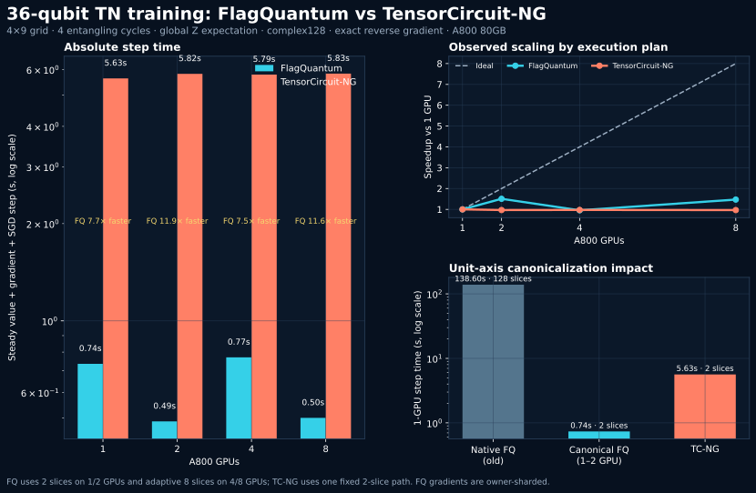

# FlagQuantum vs TensorCircuit-NG: 36q TN training

## Fairness boundary

Both implementations evaluate a 36-qubit 4x9 grid circuit with four
entangling cycles, 36 RY parameters, the global Z expectation, complex128
tensors, an exact reverse-mode gradient, and one SGD update on A800 80GB GPUs.
TensorCircuit-NG 1.8.0 uses JAX `DistributedContractor`, cotengra 0.8.2, and
replicated parameters and gradients. FlagQuantum uses explicit reverse,
rank-owned slices, owner-sharded gradients, and owner update followed by
parameter broadcast.

FlagQuantum uses its minimum-work two-slice path for 1/2 GPUs and an adaptive
eight-slice path for 4/8 GPUs. Thus the FlagQuantum curve includes a path change
and must not be interpreted as fixed-plan strong scaling. TensorCircuit-NG uses
one fixed two-slice path at every point.

## Corrected measured result

| A800 GPUs | FQ slices | FlagQuantum (s) | TC-NG slices | TensorCircuit-NG (s) | FQ advantage |
|---:|---:|---:|---:|---:|---:|
| 1 | 2 | 0.736 | 2 | 5.631 | 7.7x |
| 2 | 2 | 0.488 | 2 | 5.817 | 11.9x |
| 4 | 8 | 0.771 | 2 | 5.786 | 7.5x |
| 8 | 8 | 0.501 | 2 | 5.826 | 11.6x |

All FlagQuantum outputs and gradients were finite, and optimizer parameters
remained consistent across ranks. The full-tape two-slice single-GPU run peaked
at about 1.21 GiB CUDA allocated memory.

## Root cause and correction

The original FlagQuantum lowering retained batch-size-one axes in a scalar
expectation network. It produced 417 nodes and 618 labels, including two
extent-one hyperedges each shared by 73 nodes and a separate `(1, 1)` node.
TensorCircuit-NG presented cotengra with 416 nodes, 616 labels, and scalar
output. Although the extra FlagQuantum axes were mathematically inert, they
badly distorted contraction search.

Differentiable unit-extent canonicalization makes the FlagQuantum topology
416 nodes, 616 labels, and scalar output. Cotengra then finds a two-slice plan.
This changes the one-GPU exact training step from the obsolete 128-slice
138.602-second result to 0.736 seconds, approximately a 188x reduction.

The previous comparison figure and conclusion that TensorCircuit-NG was faster
were invalidated and replaced by the corrected assets in this directory.

## Remaining scaling limitation

The runtime now selects a full-tape fast path whenever the tape fits the stated
checkpoint budget. On this workload that removes 7,776 rematerialized
contractions from the one-GPU step. When the tape does not fit, bounded
checkpoint/rematerialization remains available.

The full-tape forward schedule is also dependency-staged. On the canonical
two-slice tree, 415 pair operations are represented by 18 stages and 139
equation/shape buckets; 312 operations are executed in batched buckets, with a
maximum batch size of 72. A staged reverse implementation is available and
numerically tested, but is not selected by default because its additional
stack/conjugate/scatter traffic made this workload slower than eager explicit
reverse (0.773 versus 0.736 seconds on one GPU).

The minimum-work tree exposes only two tasks. Adaptive reslicing produces eight
tasks but raises planned total work from about 37.4 to 49.0 billion operations.
More importantly, every rank still launches roughly 415 eager pair operations
per slice. Once tensors become small, Python dispatch and GPU kernel-launch
latency dominate, so adding GPUs cannot approach ideal scaling.

The next optimization target is a compiled/fused DAG executor that batches or
captures repeated pair contractions and reduces reverse rematerialization
launches. Increasing slice count without reducing per-slice launch count is not
the right solution.

## README asset

```markdown

```

The SVG is preferred for README use; PNG and PDF variants are also included.
