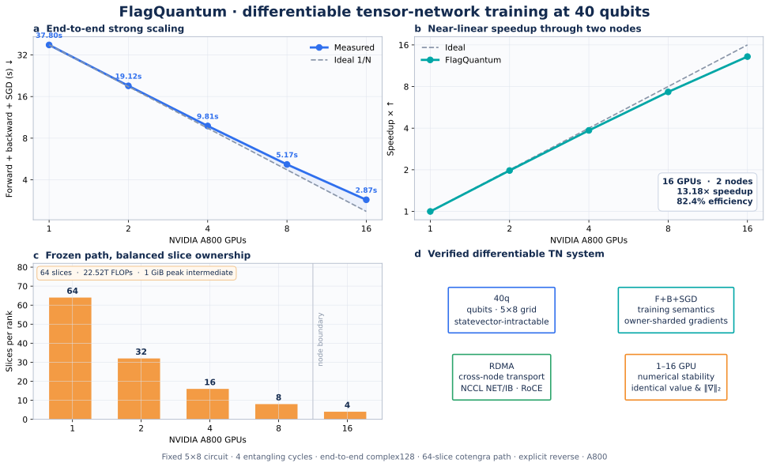
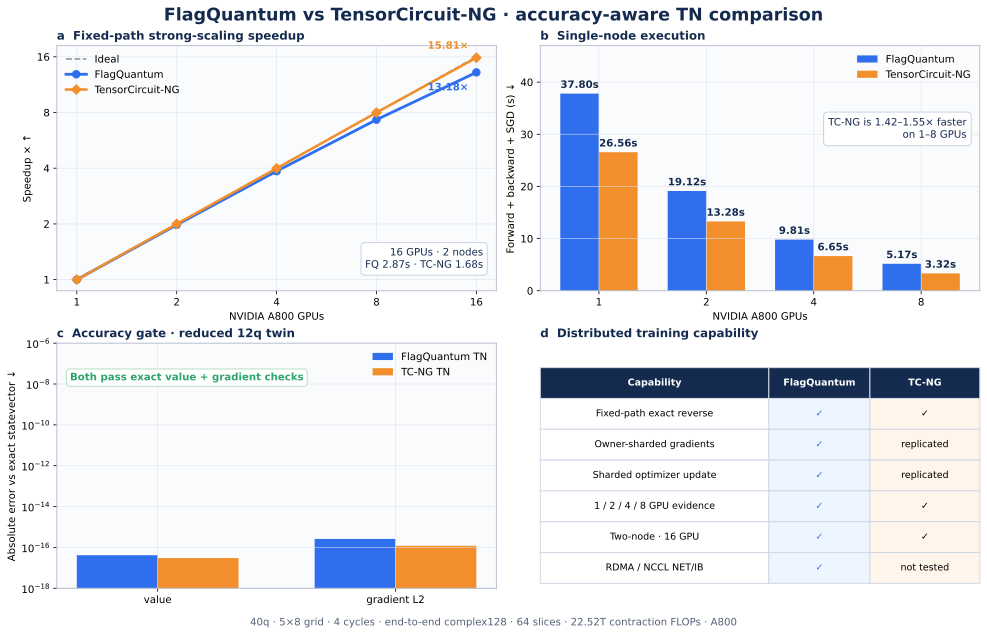

# 40q fixed-path TN strong scaling

Saved on 2026-08-03. The workload is a 40-qubit 5x8 grid with four
entangling cycles, a global-Z expectation, complex128 tensors, and one frozen
64-slice contraction path. Its estimated contraction cost is
22,519,206,255,104 FLOPs.

| GPUs | Nodes | Seconds | Speedup | Efficiency | Slices/rank |
|---:|---:|---:|---:|---:|---:|
| 1 | 1 | 37.863603 | 1.000x | 100.00% | 64 |
| 2 | 1 | 19.041517 | 1.988x | 99.42% | 32 |
| 4 | 1 | 9.698835 | 3.904x | 97.60% | 16 |
| 8 | 1 | 5.042368 | 7.509x | 93.86% | 8 |
| 16 | 2 | 2.684235 | 14.106x | 88.16% | 4 |

The optimized executor builds the contraction DAG, reverse DAG, and checkpoint
decision once per rank instead of once per slice, and uses zero-copy detached
input views. This reduced the single-GPU time from 41.056488 to 37.863603
seconds (8.4%) without changing the value, gradient norm, or optimizer checksum.

All FlagQuantum runs produced `value_real = 0.1587475016117143`,
`gradient_l2 = 0.35571696371725126`, finite outputs and gradients, and
consistent optimizer parameters. The 16-GPU run completed forward, backward,
and owner-sharded SGD on two nodes. NCCL reported `Using network IB` and
enumerated the RoCE devices, providing direct RDMA-path evidence.

TensorCircuit-NG took 26.563448 seconds on one A800 for its steady-state
forward, backward, and SGD step. It produced
`value_real = 0.1587473236596179` and
`gradient_l2 = 0.35571657755069713` at the same initial parameter point. A
reduced 12q twin was checked against an exact statevector: both FlagQuantum and
TensorCircuit-NG passed the value and gradient-norm checks. TC-NG is 1.43x
faster on one GPU in this run; FlagQuantum additionally demonstrates positive
scaling through 16 GPUs, two nodes, owner-sharded gradients and optimizer
updates, and NCCL NET/IB over RoCE.

The raw JSON files and portable cotengra tree-data path are retained in this
directory. `SHA256SUMS` protects the frozen evidence files against accidental
replacement.
