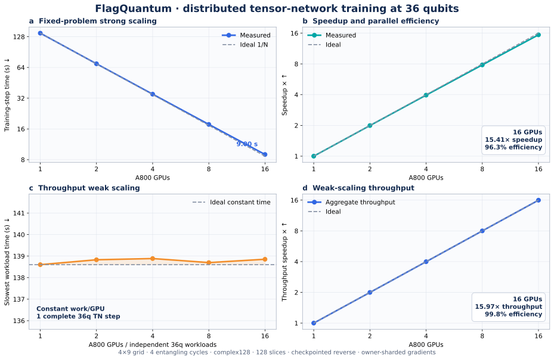

# FlagQuantum 36q distributed-TN scaling

## Workload

Every measurement uses a 36-qubit 4x9 grid circuit with four entangling
cycles, complex128 tensors, 128 contraction slices, a 4-GiB intermediate
policy, a 16-GiB checkpoint budget, explicit reverse contraction, and
owner-sharded parameter gradients. A dense complex128 statevector would
require 1 TiB, so this is outside one A800's statevector capacity.

## Fixed-problem strong scaling

One logical training workload is partitioned across ranks. The 16-GPU point
uses two nodes with eight A800s per node.

| A800 GPUs | Nodes | Step time (s) | Speedup | Efficiency |
|---:|---:|---:|---:|---:|
| 1 | 1 | 138.602 | 1.00x | 100.0% |
| 2 | 1 | 69.527 | 1.99x | 99.7% |
| 4 | 1 | 35.029 | 3.96x | 98.9% |
| 8 | 1 | 17.717 | 7.82x | 97.8% |
| 16 | 2 | 8.995 | 15.41x | 96.3% |

## Throughput weak scaling

Weak scaling uses constant work per GPU: each GPU executes one independent,
complete 36q TN training workload. This is data-parallel TN throughput
scaling, not single-problem capacity scaling. The reported wall time is the
slowest replica. The 8-GPU point is split 4+4 across two nodes; the 16-GPU
point is split 8+8.

| A800 GPUs | Nodes | Workloads | Slowest time (s) | Throughput speedup | Efficiency |
|---:|---:|---:|---:|---:|---:|
| 1 | 1 | 1 | 138.602 | 1.00x | 100.0% |
| 2 | 1 | 2 | 138.829 | 2.00x | 99.8% |
| 4 | 1 | 4 | 138.886 | 3.99x | 99.8% |
| 8 | 2 | 8 | 138.698 | 7.99x | 99.9% |
| 16 | 2 | 16 | 138.853 | 15.97x | 99.8% |

All measured outputs and gradients were finite. Strong-scaling gradients were
reduced to unique optimizer owners, and updated parameters were synchronized
for the next forward pass. The raw artifacts are content-hashed in
[`figures/summary.json`](figures/summary.json).

## README asset

```markdown

```

The SVG is preferred for GitHub README rendering. PNG and PDF variants are
provided for presentations and papers.
