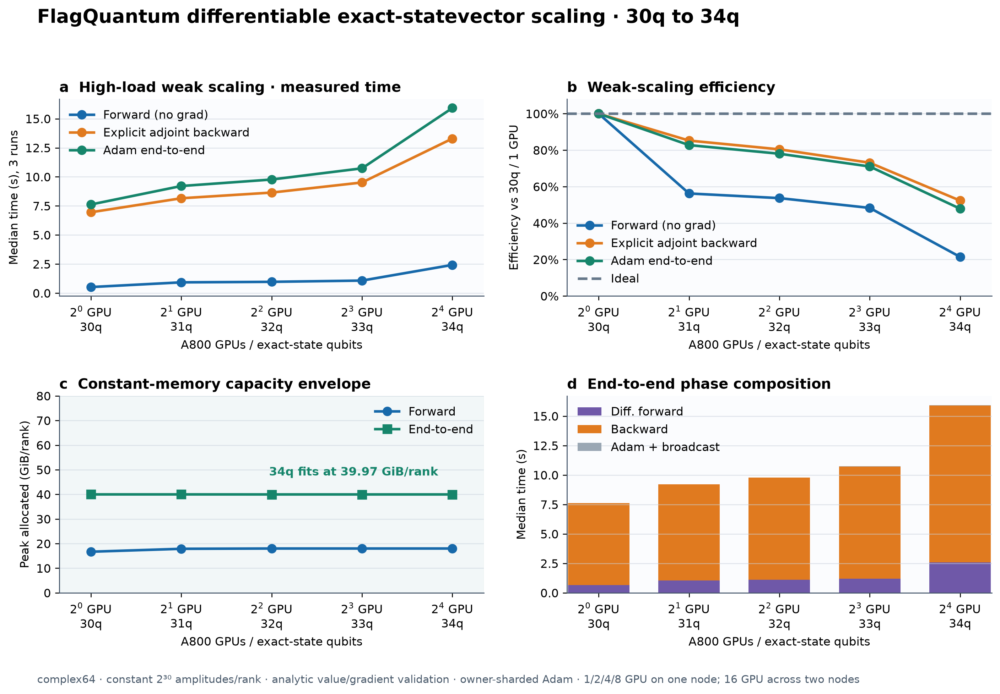

# FlagQuantum differentiable exact-statevector scaling: 30q–34q

This high-load weak-scaling campaign keeps exactly `2^30` complex64 amplitudes
(8 GiB of raw state) per rank while increasing 30q/1 GPU through 34q/16 GPUs.
The workload performs a differentiable three-gate circuit, explicit sharded
adjoint backward, owner-sharded Adam update, and parameter broadcast.  Values
and gradients are checked against a closed-form analytic reference on every
measured step.

| GPUs | Nodes | Qubits | Forward | Backward | Backward efficiency | End-to-end | E2E efficiency | E2E peak/rank |
|---:|---:|---:|---:|---:|---:|---:|---:|---:|
| 1 | 1 | 30q | 0.521 s | 6.955 s | 100.0% | 7.623 s | 100.0% | 39.98 GiB |
| 2 | 1 | 31q | 0.926 s | 8.159 s | 85.2% | 9.211 s | 82.8% | 39.98 GiB |
| 4 | 1 | 32q | 0.970 s | 8.647 s | 80.4% | 9.771 s | 78.0% | 39.97 GiB |
| 8 | 1 | 33q | 1.078 s | 9.516 s | 73.1% | 10.733 s | 71.0% | 39.97 GiB |
| 16 | 2 | 34q | 2.426 s | 13.292 s | 52.3% | 15.919 s | 47.9% | 39.97 GiB |

The 34q point completes on 16 A800 GPUs with a maximum analytic gradient error
of `3.36e-8` and zero final-parameter spread across ranks.  The constant memory
line is enabled by streaming local basis-index construction and gate-matrix JVP
adjoints.  The efficiency drop at 16 GPUs is a measured two-node communication
cost and is retained rather than extrapolated away.

This is development evidence.  A matched cuQuantum/Qiskit Aer comparison and
deeper-circuit differentiable workloads remain necessary before making an
external superiority claim.
