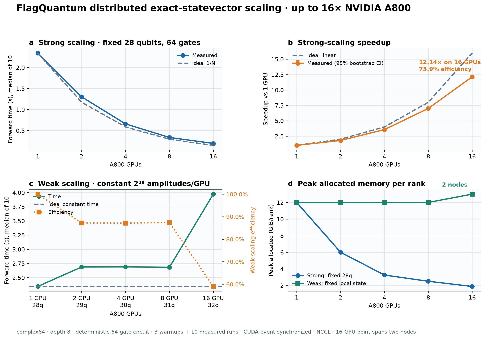

# FlagQuantum distributed exact-statevector scaling

This development campaign measures FlagQuantum's native `complex64` exact
statevector forward executor on NVIDIA A800-SXM4-80GB GPUs.  Every point uses a
deterministic depth-8, 64-gate circuit, three warmups, ten synchronized measured
runs, and NCCL.  Reported time is the median critical-rank wall time; speedup
confidence intervals use 10,000 independent bootstrap resamples.  Every source
artifact passed global norm and Z-observable invariants.

| GPUs | Nodes | Strong 28q time | Speedup | Strong efficiency | Weak qubits | Weak time | Weak efficiency | Weak peak/rank |
|---:|---:|---:|---:|---:|---:|---:|---:|---:|
| 1 | 1 | 2.3440 s | 1.00× | 100.0% | 28q | 2.3444 s | 100.0% | 12.01 GiB |
| 2 | 1 | 1.3014 s | 1.80× | 90.1% | 29q | 2.6881 s | 87.2% | 12.01 GiB |
| 4 | 1 | 0.6578 s | 3.56× | 89.1% | 30q | 2.6904 s | 87.1% | 12.01 GiB |
| 8 | 1 | 0.3348 s | 7.00× | 87.5% | 31q | 2.6826 s | 87.4% | 12.01 GiB |
| 16 | 2 | 0.1931 s | 12.14× | 75.9% | 32q | 3.9727 s | 59.0% | 13.01 GiB |

Strong scaling fixes the complete 28-qubit workload.  Weak scaling increases
the state by one qubit whenever the GPU count doubles, keeping exactly
`2^28` amplitudes (2 GiB of raw state) per rank.  The 16-GPU point crosses the
node boundary between `.172` and `.171`; its lower weak efficiency therefore
includes inter-node transport rather than being hidden or mixed into the
single-node series.

These are measured development artifacts, not release-certified comparative
claims.  They characterize FlagQuantum on this stated hardware/software
configuration and do not establish superiority over simulators that were not
measured in the campaign.
