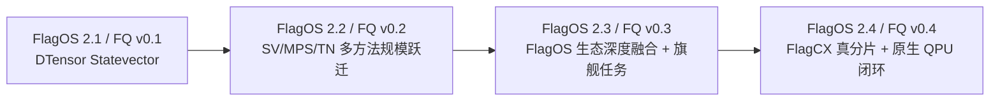

# FlagQuantum × FlagOS 版本列车

> 状态：执行权威（Living Document）  
> 基线日期：2026-07-17  
> FlagOS 节奏：2.1（5 月底）→ 2.2（8 月底）→ 2.3（11 月底）→ 2.4（次年 2 月底）  
> FlagQuantum 建议版本：v0.1.0 → v0.2.0 → v0.3.0 → v0.4.0

## 1. 使用原则

本文是 FlagQuantum 对齐 FlagOS 发版的版本范围权威。半年总路线回答“向哪里走”，
本文回答“每一版新增什么、什么不进这一版、凭什么能够发布”。日常 Issue 只有
映射到本文的 Feature ID，才允许占用发布关键路径资源。

每个版本遵循：

```text
上一版可验证基线
 → Scope Freeze
 → Feature 实现
 → Feature Freeze
 → RC 只修缺陷
 → FlagCICD Release Gate
 → FlagOS 联合发布
```

发布日期不是自动完成日。P0 Feature 或证据不完整时，必须移出该版、降级为
Experimental 或阻塞发布，不得降低冻结阈值。

## 2. FlagOS 2.1 发布基线

### 2.1 可追溯身份

| 字段 | 基线 |
| --- | --- |
| GitHub | [flagos-ai/FlagQuantum](https://github.com/flagos-ai/FlagQuantum) |
| Release | [FlagOS 2.1 — FlagQuantum v0.1.0](https://github.com/flagos-ai/FlagQuantum/releases/tag/v0.1.0) |
| Tag | `v0.1.0` |
| Commit | [`ecf04ebaecd7a709ec83accb511da73894e25006`](https://github.com/flagos-ai/FlagQuantum/commit/ecf04ebaecd7a709ec83accb511da73894e25006) |
| 代码切点 | 2026-05-27 |
| 本地只读对照 | `../FlagOS2_1` |
| 本地源码包 SHA256 | `b22bf4c13c7f0f6e3c0b0657d43b7b2b577c50752ca95e8090f5785c2da6cd85` |

GitHub Release 页面发布于 2026-06-24；本文按 FlagOS 版本列车把它归入用户给定的
“2.1／5 月底”发布槽，代码能力以 tag 和 commit 为准，不以发布日期推断。

### 2.2 v0.1.0 已发布 Feature

- 基于 PyTorch DTensor 的分布式 Statevector 模拟；
- Gate 执行时自动 sharding/resharding；
- Pauli、Clifford、Rotation、Controlled 等 Gate；
- 参数化 Gate 和 Invertible Backpropagation；
- Angle、Amplitude、Basis 和 General Encoding；
- 测量、Post-selection 和 Depolarizing Noise；
- 自定义 Gate 注册；
- 文本/MPL 电路绘制与 6 个教程；
- OpenQASM 2.0/3.0 导出；
- NVIDIA GPU、海光 DCU、摩尔线程等加速卡的多芯运行支持。

边界：v0.1.0 的核心产品抽象是 `DistributedQuantumDevice + Gate`；它已经可以
通过 OpenQASM 连接并运行真实 QPU。其边界是 Provider 提交、作业管理、结果追溯
和硬件反馈尚未成为 FlagQuantum 原生闭环。已有多芯运行支持也不等于统一的
FlagOS Backend Protocol、生态算子/通信栈、跨芯认证或可发布的容量扩展证据。

## 3. 当前主干相对 2.1 的差异

当前主干包含大量 Unreleased 实现。下表中的“已有”只表示仓库实现和记录存在，
不自动表示已经独立评审或可进入 FlagOS 发布。

| 能力面 | FlagOS 2.1／FQ v0.1.0 | 当前主干 | 发布差距 |
| --- | --- | --- | --- |
| 用户入口 | Device/Gate 为中心，root wildcard exports | `fq.Circuit`、`fq.Module`、`run/plan`、稳定/实验 API 边界 | 冻结 v0.2 API，验证 v0.1 兼容和弃用路径 |
| 中间表示 | 主要依赖 Device `op_history` | 版本化 FlagQuantum IR、统一 Operator Schema/Lowering | 完成发布级 schema/round-trip/conformance |
| Statevector | DTensor Forward、自动 reshard、invertible 路径 | PyTorch-native 真分片 Forward/Reverse/SGD/Adam/Checkpoint/Recovery | 独立评审、FlagCICD 硬件再认证、公开支持矩阵 |
| MPS/TN | 无正式产品路径，主要是分布式 SV | Local/Distributed MPS、TN contraction/training 和证据基础已经形成 | 2.2 的主增量是多方法规模跃迁；按支持矩阵区分 Stable/Experimental/Blocked |
| Runtime/Planner | 隐式设备和执行选择 | RuntimeConfig、Typed Contracts、Unified Planner、ExecutionRecord | 冻结最小 v1，清理不必要字段并验证 fail closed |
| JAX | 无 | 可选 JAX Kernel 与 PyTorch 边界 | 保持 optional，不进入默认产品依赖 |
| 多芯 | NVIDIA、海光 DCU、摩尔线程等卡已支持运行 | 统一 FlagOS Backend、TLE/FlagBLAS/FlagCX 仍是目标架构 | 2.3 的增量是生态统一、优化和认证，不是第一次支持国产卡 |
| QPU | OpenQASM 2/3 连接真实 QPU | Provider、QCIS、Deployment Artifact 等部分实现 | 把参数绑定、目标编译、作业、结果和反馈升级为框架原生闭环 |
| 工程质量 | 基础 pytest 和打包 | 分层 CI、Typed Evidence、审计、可复现构建、Extension SDK | 组装为 FlagCICD 版本 Gate，完成独立评审 |
| 发布证据 | README Feature 声明为主 | 明确区分开发证据、真分片和 Release Gate | 当前仍无 Beta 或通用扩展性发布批准 |

核心判断：2.2 应把已经实现的 MPS/TN、统一 IR、PyTorch-native Training、
Typed Runtime 和 FlagCICD 收敛为第一个多方法规模升级；FlagOS 生态深度融合和
旗舰任务作为 2.3 主增量；规模化分片与框架原生 QPU 闭环作为 2.4。

## 4. 三版 Feature 路线

### 4.1 FlagOS 2.2／FlagQuantum v0.2.0：多方法规模跃迁

> 发布目标：2026-08-31  
> 一句话价值：从“只有分布式 Statevector”升级为统一 SV/MPS/TN 的 PyTorch
> Native 模拟训练体系，用张量结构显著提升可模拟量子比特规模。

| Feature ID | P0 新增 Feature | 验收边界 |
| --- | --- | --- |
| F22-01 | 稳定 `fq.Circuit`、`fq.Module`、`fq.run`、`fq.plan` 与 IR v1 | Stable API snapshot、IR round-trip、v0.1 兼容测试通过 |
| F22-02 | SV/MPS/TN 多表示方法 | 同一 IR 可选择三类方法；MPS 通过 1024 比特代表任务；TN 通过冻结 contraction/slicing 工作负载；无静默 SV fallback |
| F22-03 | PyTorch-native 多方法训练 | 已声明的 SV/MPS/TN 组合通过 Forward/Backward/Optimizer；不完整组合明确 Experimental 或 Blocked |
| F22-04 | Typed Runtime 与 Unified Planner v1 | Request/Plan/ExecutionRecord 可审计；解释表示选择；未知 dtype、gradient、fallback fail closed |
| F22-05 | FlagCICD v1 | CPU PR、NVIDIA scheduled、package、benchmark/release-contract 四类 Gate 可执行 |
| F22-06 | 可复现安装与升级 | Wheel/sdist 可复现；干净环境 Quick Start；v0.1 迁移指南 |
| F22-07 | FlagOS 接入契约与 2.1 设备兼容保全 | Device/Capability/Kernel/Collective Protocol 冻结；Hygon/Mthreads 旧路径不被静默破坏 |

2.2 Experimental：尚未通过硬件认证的分布式 MPS/TN 组合、可选 JAX Kernel、
Extension SDK。它们可以随包交付，但不得继承 Stable 或容量扩展声明。

2.2 明确不做：完整 `flagquantum.backends.flagos`、国产芯片 MPS 生产闭环、FlagCX
MPS 跨芯生产认证、真实 QPU 原生作业闭环、任意拓扑的通用生产 TN。

2.2 时间门：

| Gate | 日期 | 通过条件 |
| --- | --- | --- |
| Scope Freeze | 2026-07-24 | F22-01～07 owner、依赖、验收和证据路径冻结 |
| Feature Freeze | 2026-08-07 | P0 实现合入；此后不新增 Feature |
| RC1 | 2026-08-15 | FlagCICD 全部必需矩阵通过；只接受 P0 缺陷修复 |
| Release Ready | 2026-08-24 | Release notes、迁移、Wheel、复现包和已知限制齐全 |
| FlagOS 2.2 GA | 2026-08-31 | 无 P0 blocker；联合版本身份和制品哈希冻结 |

### 4.2 FlagOS 2.3／FlagQuantum v0.3.0：FlagOS 生态深度融合与旗舰价值

> 发布目标：2026-11-30  
> 一句话价值：把 v0.1 已有的多芯运行能力升级为统一、优化、可认证的 FlagOS
> Backend 与生态栈，并完成可复现旗舰任务。

| Feature ID | P0 新增 Feature | 验收边界 |
| --- | --- | --- |
| F23-01 | `flagquantum.backends.flagos` 最小稳定后端 | Capability、Stream、Memory、Kernel、Factorization 接口通过 Conformance |
| F23-02 | TLE/FlagBLAS MPS Kernel Pack | Contraction、two-site、complex GEMM、QR/SVD 支持 Forward/Backward 或明确 fail closed |
| F23-03 | 国产芯片单卡 MPS 训练 | 真机 FWD+BWD+Optimizer；结果进入冻结误差；ExecutionRecord 证明零 CPU fallback |
| F23-04 | 跨芯旗舰任务 | NVIDIA 与国产芯片复现同一任务，报告经典/量子/量子启发强基线 |
| F23-05 | FlagCICD 跨芯矩阵 | 国产芯片 scheduled lane、数值 Gate、无回退 Gate、制品/环境身份一致 |
| F23-06 | FlagCX 生态接入与分片基础 | Collective/拓扑/错误语义接入统一 Backend；完成单平台通信 smoke 与可审计记录，不宣称生产级真分片训练 |

2.3 挑战目标：FlagCX 同平台多卡 Statevector；MPS 多卡只在 Forward、Backward、
Optimizer 都保持 ownership 且有真机证据时晋级。第二种国产芯片不作为 P0。
v0.3 不设计 QPU 产品 Feature；目标编译、Provider Job、结果追溯和反馈训练统一归入 v0.4。

2.3 时间门：Scope Freeze `09-07`，架构/真机 Preflight `09-20`，Feature Freeze
`10-31`，RC1 `11-15`，FlagOS 2.3 GA `11-30`。

### 4.3 FlagOS 2.4／FlagQuantum v0.4.0：规模化训练与原生 QPU 闭环

> 发布目标：2027-02-28  
> 一句话价值：一个超过单卡资源边界的量子 AI 任务能够真分片训练，并把训练产物
> 通过 FlagQuantum 原生部署链运行真实 QPU，形成可追溯反馈。

| Feature ID | P0 新增 Feature | 验收边界 |
| --- | --- | --- |
| F24-01 | FlagCX MPS 真分片训练 | Forward/Backward/Optimizer/Checkpoint 同一 ownership；每 rank 只持有 owned state |
| F24-02 | 容量、稳定性和恢复认证 | 超单卡容量任务完成；多步稳定、故障清理和恢复通过；不把复制称为扩展 |
| F24-03 | Unified Planner 跨芯自动选择 | 基于实测 calibration 选择 local/NVIDIA/FlagOS/sharded，结论可解释且 fail closed |
| F24-04 | FlagQuantum 原生 QPU 部署闭环 | 参数绑定、目标编译、Provider Job、shots、校准、结果及 ideal/noise/hardware 对比全部可追溯 |
| F24-05 | FlagCICD Release Gate v2 | 跨芯、分片、QPU、Wheel/镜像和声明审计组成同一发布证据包 |
| F24-06 | FlagQuantum Beta 对外交付 | 教程、支持矩阵、运维手册、已知限制和第三方复现签字 |

2.4 挑战目标：第二种国产芯片、多节点 FlagCX、Hardware-in-loop 更新、TN
slice/reduction Preview。任一挑战目标失败不得阻塞 P0，也不得伪装成已发布能力。

2.4 时间门：Scope Freeze `12-07`，Feature Freeze `2027-01-31`，RC1
`2027-02-15`，FlagOS 2.4 GA `2027-02-28`。

## 5. Feature 依赖链



```text
F22 契约和可信训练
 ├─→ F23 FlagOS Backend ─→ F23 国产芯片训练 ─→ F24 FlagCX 真分片
 ├─→ F23 旗舰任务 ─────────────────────────→ F24 超单卡验收
 ├─→ F23 FlagCX 分片基础 ──────────────────→ F24 FlagCX 真分片
 └─→ F24 目标编译与 Provider Job ──────────→ F24 真实 QPU 闭环

FlagCICD v1 ─→ 跨芯矩阵 ─→ Release Gate v2
```

## 6. 每版发布清单

每个版本必须同时提供：版本化 Feature Manifest、API/IR 兼容报告、支持矩阵、
正确性报告、性能与内存原始数据、fallback/blocked 清单、Wheel/sdist/镜像哈希、
Quick Start、升级说明、Release Notes 和 FlagCICD Gate 结论。

只有 `FlagCICD Gate=passed` 且 PD 批准的 Feature 才写入 FlagOS 对外材料；
`implemented`、`review_pending`、`experimental` 和 `blocked` 必须分别展示。
