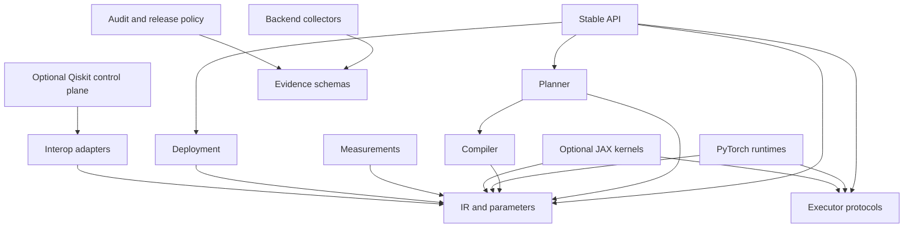

# Architecture Dependency Direction

The enforced dependency direction is:

Reverse edges into IR/core are forbidden. Executors emit backend-neutral
records and cannot import audit/release classification. Importing the stable
root API is lazy and does not load runtime, provider, drawing, distributed, or
optional-kernel modules.

`architecture.toml` owns module-size budgets and compatibility exceptions.
Every exception names an owner and removal version. Run
`python tools/check_architecture.py` locally and in CI.

## Enforced Package Surfaces

| Responsibility | Package/module |
| --- | --- |
| Stable API | `flagquantum.__init__`, `flagquantum.circuit` |
| Compatibility API | `flagquantum.api` through version 0.3.0 |
| IR and parameters | `flagquantum.core` |
| Compiler | `flagquantum.compiler` |
| Transitional execution planning | `flagquantum.compilation.planner` |
| Runtime API and contracts | `flagquantum.runtime` |
| Executor protocols | `flagquantum.runtime.contracts` |
| Backend boundaries | `flagquantum.runtime.backends` |
| Distributed orchestration | `flagquantum.runtime.distributed` |
| Optional kernels | backend adapters behind `flagquantum.runtime.backends` |
| Measurements | `flagquantum.measurement` |
| Deployment/providers | `flagquantum.deployment` |
| External framework adapter contract | `flagquantum.interop` |
| External framework conversion | `flagquantum.interop.<framework>` |
| Evidence and audit policy | `flagquantum.runtime.audit` |

`flagquantum.runtime` is the sole runtime implementation namespace. New
application, plugin, and backend code must use its explicit contracts,
backend, distributed, and audit subpackages.

The circuit implementation lives at `flagquantum.circuit`; `flagquantum.core`
contains backend-neutral IR, operator schemas, parameters, configuration, and
versioned contracts only.

External framework objects stop at `flagquantum.interop`. Its immutable lazy
registry and framework-neutral conversion contracts are the shared control-plane
boundary; concrete implementations live under `flagquantum.interop.<framework>`.
The Qiskit and PennyLane adapters convert to or from versioned FlagQuantum IR,
report semantic loss explicitly, and load their external framework only when
conversion is called. PennyLane v1 stops specifically at immutable
`QuantumScript`; QNodes, devices, execution, and autograd remain outside it.
Runtime kernels, distributed worker contracts, CUDA, and FlagOS never receive
external framework objects.
