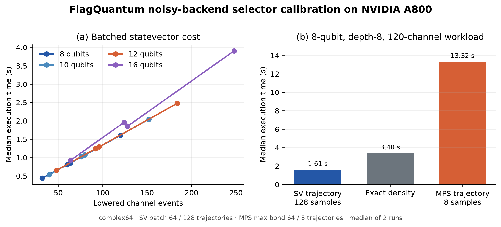
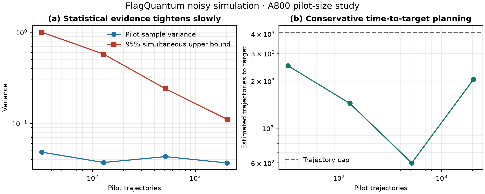
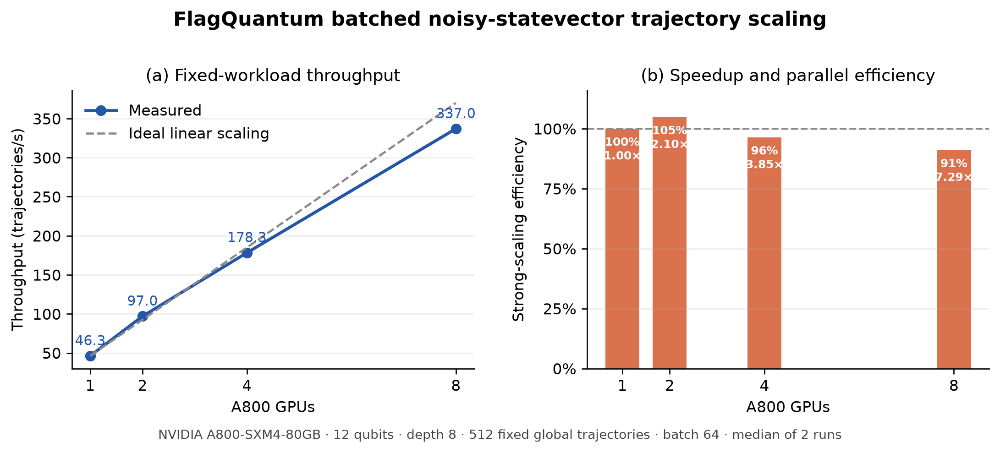

# Noisy simulation

FlagQuantum uses one backend-neutral `NoiseModel` for exact density-matrix
evolution, batched statevector trajectories, and MPS quantum trajectories. The
exact path is the small-system correctness oracle; trajectory paths report
sampling statistics, and the MPS path additionally reports truncation data.

## Quick start

```python
import flagquantum as fq

circuit = fq.Circuit(2).h(0).cx(0, 1)
noise = (
    fq.NoiseModel()
    .add("h", fq.thermal_relaxation_channel(
        t1=50_000,
        t2=70_000,
        duration=35,
    ))
    .add("cx", fq.depolarizing_channel(0.01))
    .add_readout(0, fq.ReadoutError(((0.98, 0.02), (0.07, 0.93))))
)

rho = fq.noisy_density_matrix(circuit, noise)
exact_z = noise.apply_readout_expectation_z(fq.expectation_z_density(rho))

sampled = fq.run_noisy_mps(
    circuit,
    noise,
    trajectories=4096,
    min_trajectories=128,
    target_standard_error=1e-3,
    seed=42,
    retain_trajectories=False,
)

print(noise.identity)
print(exact_z)
print(sampled.expectation_z_mean)
print(sampled.statistics.standard_error)
print(sampled.converged, sampled.stopped_early)
```

For dense circuits that fit statevector memory, trajectories can be processed
in true tensor batches:

```python
sampled_sv = fq.run_noisy_statevector(
    circuit,
    noise,
    trajectories=4096,
    trajectory_batch_size=64,
    seed=42,
)
print(sampled_sv.expectation_z)
print(sampled_sv.standard_error)
```

The state layout is
`[trajectory_batch, circuit_batch, 2**n_wires]`. Seeded random streams belong
to global trajectory IDs, so changing `trajectory_batch_size` preserves every
sampled trajectory. Pauli channels use a state-independent branch fast path;
amplitude damping uses a branch-state-free specialized kernel, and other Kraus
channels use batched probability, sampling, application, and normalization.
Multi-wire Kraus channels are supported by the generic path.

With `mode="auto"`, specifying `trajectories` selects this path when its
trajectory block satisfies the supplied memory budget. `max_bond` or `cutoff`
selects MPS, and an over-budget statevector block falls back to MPS.

## Auditable backend selection

`plan_noise_execution_selection` evaluates density matrix, batched
statevector trajectory, and MPS trajectory together. Every candidate reports
representation, evolution semantics, memory estimate, exact/sampling/
truncation error flags, eligibility, reasons, and explicit rejection reasons.
If every candidate exceeds policy or memory constraints, selection fails
instead of silently ignoring the budget.

```python
selection = fq.plan_noise_execution_selection(
    circuit,
    noise,
    trajectories=512,
    trajectory_batch_size=64,
    world_size=8,
    memory_limit_bytes=80 * 1024**3,
)
print(selection.selected_mode)
print(selection.summary())
```

For the documented A800 workload, the selector counted 184 lowered channel
events with maximum Kraus rank 4 and selected `noisy_statevector`. The exact
density candidate was rejected because trajectories were explicitly
requested; MPS remained eligible but carried truncation-error semantics. The
reproducible snapshot is
`benchmarks/results/local/noise_selector_a800_20260806.json`.

The broader A800 calibration artifact covers 8/10/12/16 qubits, depth 4/8,
and local-only versus full gate-noise placement. Batched statevector timings
track lowered channel count closely. At 16 qubits and 248 channel events, 128
trajectories completed in 3.91 s with about 457 MiB peak allocation. On the
8-qubit, depth-8, 120-channel case, statevector completed 128 trajectories in
1.61 s, exact density took 3.40 s, and MPS took 13.32 s for only 8
trajectories. These results demonstrate why memory size alone is not a speed
model; MPS remains valuable for capacity and low-entanglement regimes.



Raw measurements are in
`benchmarks/results/local/noise_selector_calibration_a800_20260806.json`.

The artifact can be supplied as an optional selector cost input:

```python
selection = fq.plan_noise_execution_selection(
    circuit,
    noise,
    trajectories=128,
    trajectory_batch_size=64,
    calibration="benchmarks/results/local/noise_selector_calibration_a800_20260806.json",
)
```

A timing is used only when the circuit digest, noise-model identity, wire and
lowered-channel counts, backend mode, trajectory batch size, and world size
match. If both eligible trajectory backends match, the measured-time estimate decides; an
incomplete or mismatched calibration falls back to the analytic policy. The
8-qubit single-A800 full-noise decision and all candidate evidence are preserved in
`benchmarks/results/local/noise_selector_a800_calibrated_20260806.json`. Public
`fq.run_native(..., noise_performance_calibration=...)` uses the same policy.

For adaptive runs, the selector also reports a time-to-target trajectory
estimate when both a standard-error target and a hard trajectory ceiling are
provided:

```python
selection = fq.plan_noise_execution_selection(
    circuit,
    noise,
    trajectories=4096,
    min_trajectories=128,
    target_standard_error=0.02,
)
```

Without a workload-specific variance pilot, it uses the explicit conservative
planning assumption `Var(Pauli) <= 1`, giving
`ceil(1 / target_standard_error**2)` trajectories, bounded below by
`min_trajectories`. The report states whether that estimate fits inside the
requested ceiling. This is a cost-planning estimate, not a convergence
guarantee; runtime stopping still uses the observed global standard error.

A reproducible pilot can replace the worst-case variance assumption:

```bash
python benchmarks/export_noise_pilot_selection.py \
  --pilot-trajectories 32 --trajectory-cap 4096 \
  --trajectory-batch-size 64 --target-standard-error 0.02 \
  --seed 20260806 \
  --calibration benchmarks/results/local/noise_selector_calibration_a800_20260806.json \
  --output benchmarks/results/local/noise_selector_pilot_a800_20260806.json
```

On the documented single-A800 workload, the fixed-ID pilot measured maximum
sample variance 0.04815 across the eight Z observables. Its point estimate is
121 trajectories for standard error 0.02. However, the 95% bounded-variance
upper confidence limit with Bonferroni correction across eight observables is
still 1.0 at only 32 pilot samples, requiring the conservative 2,500
trajectories. Calibrated time-to-target is therefore 31.41 s for statevector,
while exact density takes 3.40 s and is selected because it has no sampling
error.
The raw per-observable pilot means, variances, IDs, seed, circuit/model
identities, confidence level, simultaneous observable count, and decision are
stored in the JSON artifact. Runtime stopping still uses observed error.

### Pilot-size study

The fixed-workload A800 curve tests 32, 128, 512, and 2,048 pilot trajectories:



The simultaneous variance bound tightened from 1.0 to 0.5745, 0.2394, and
0.1104. The smallest conservative target count was 599 at a 512-trajectory
pilot; the 2,048-point estimate is floored by the pilot already spent. More
importantly, that 512 pilot took 6.51 s, already exceeding the calibrated
3.40 s exact-density solution. Density was therefore selected at every tested
point. Pilot planning is useful primarily after exact density has become
ineligible by memory or scale, rather than as mandatory overhead for small
systems. Raw evidence is in
`benchmarks/results/local/noise_selector_pilot_curve_a800_20260806.json`; the plotting
script exports PNG, PDF, and SVG.

### Distributed selector calibration

The formal 512-trajectory scaling measurements are also packaged as strict
world-size-specific selector calibrations under
`benchmarks/results/legacy/distributed_selector_calibrations/`. Exact workload
matching reports 11.07, 5.28, 2.87, and 1.52 s on 1, 2, 4, and 8 A800 GPUs,
respectively, and every corresponding decision records
`selection_basis="exact_device_calibration"`.

These distributed artifacts currently contain only the noisy-statevector
candidate. For `world_size > 1`, the selector marks noisy MPS ineligible with
`distributed_collective_not_implemented`: its low-level runner can produce
explicit rank-local results for later `merge_noisy_mps_results`, but public
`fq.run`/`run_native` does not yet infer ranks and collectively reduce MPS
statistics. Distributed `noisy_mps` requests without an explicit rank fail
closed; explicit rank-local execution remains available for manual merging. Thus these
snapshots do not claim a calibrated multi-GPU MPS comparison. An artifact for
one world size is rejected for every other world size. They can be regenerated
from the sealed raw benchmark JSON files with:

```bash
python benchmarks/build_distributed_noise_selector_calibrations.py \
  --inputs benchmarks/results/local/noisy_statevector_a800_{1,2,4,8}gpu_20260806.json \
  --output-dir benchmarks/results/legacy/distributed_selector_calibrations
```

## Reproducible throughput benchmark

The same-workload benchmark compares trajectory block sizes while keeping the
circuit, noise model, seed, and global trajectory IDs fixed:

```bash
python benchmarks/benchmark_noisy_statevector_trajectories.py \
  --n-wires 12 --depth 8 --trajectories 256 \
  --batch-sizes 1 8 32 64 --repeats 3 --device cuda \
  --output benchmarks/results/noisy-statevector.json
```

It refuses to report results if a seeded expectation changes with batch size.
On CUDA it also records peak allocated and reserved memory. CPU smoke results
are useful for regression testing but are not GPU performance evidence.

The 2026-08-06 A800 evidence run used 512 fixed global trajectories on a
12-qubit, depth-8 workload with trajectory batch 64. Measured throughput was
46.26, 96.96, 178.27, and 337.01 trajectories/s on 1, 2, 4, and 8
A800-SXM4-80GB GPUs. The 8-GPU result is 7.29× the single-GPU throughput
(91.1% strong-scaling efficiency). Timings include the public `fq.run` planner,
runtime, and NCCL statistics reduction. These are medians of two executions;
raw JSON is retained under `benchmarks/results/` and should not be generalized
to other circuits or noise densities.



Rank-local semantic execution is available through `rank` and `world_size`.
`merge_noisy_statevector_results` validates compatible plans, disjoint global
IDs, complete ownership, and noise-model identity before merging Welford
statistics. When torch.distributed is initialized, `fq.run` automatically
infers rank/world size, partitions global trajectory IDs, and collectively
reduces count/sum/sum². Retained trajectory states intentionally fail closed
in collective mode rather than triggering an implicit all-gather.

`min_trajectories` and `target_standard_error` also work collectively. Every
rank evaluates the same global standard error after a trajectory batch and
stops on the same round. The first implementation requires `trajectories` to
be divisible by `world_size * trajectory_batch_size`; unsupported schedules
fail before execution rather than risk mismatched collective ordering. An
8×A800 validation requested 512 trajectories with minimum 128 and target
standard error 0.03; it converged and stopped globally after 128 trajectories.
The raw result is
`benchmarks/results/local/noisy_statevector_a800_8gpu_adaptive_20260806.json`.

Statevector statistics checkpoints are atomic and tensor-only. They bind the
requested count, base seed, completed global IDs, Welford moments, circuit
digest, NoiseModel identity, trajectory batch size, rank, and world size. A
distributed checkpoint path must contain `{rank}` so ranks never overwrite one
another. Resume refuses changed circuits, models, seeds, schedules, or foreign
trajectory ownership. Retained quantum states are not checkpointed.

An 8×A800 interruption test wrote 8 rank-local checkpoints after 128/512
global trajectories and completed 512/512 after a new torchrun launch. Against
the uninterrupted execution, maximum expectation and variance differences
were `1.79e-7` and `1.86e-8`. Raw resumed output is
`benchmarks/results/local/noisy_statevector_a800_8gpu_checkpoint_resume_20260806.json`.

With `continue_on_error=True`, a failed vectorized batch is retried one global
trajectory at a time. Successful trajectories still contribute to moments;
failed IDs retain exception type, message, and retryability in both results
and checkpoints. Collective completion gathers explicit ID lists, so holes are
never inferred from counts. An 8×A800 injected-failure run isolated global ID
3 on rank 3, completed 127/128 trajectories, reduced global statistics, and
exited all ranks without a collective hang. Raw evidence is
`benchmarks/results/local/noisy_statevector_a800_8gpu_failure_isolation_20260806.json`.

The complete executable version is
[`examples/noisy_simulation_v1.py`](../../examples/noisy_simulation_v1.py).

## Built-in channels

The current built-ins are:

- `bit_flip_channel(probability)`;
- `phase_flip_channel(probability)`;
- `depolarizing_channel(probability)`;
- `amplitude_damping_channel(gamma)`;
- `phase_damping_channel(gamma)`;
- `reset_error_channel(probability_zero, probability_one=0)`;
- `thermal_relaxation_channel(t1, t2, duration, excited_population=0)`;
- `coherent_overrotation_channel(angle, axis="x")`.

Every `KrausChannel` is validated at construction. Operators must be finite,
square, equal-sized, act on a power-of-two Hilbert space, and satisfy

```math
\sum_k K_k^\dagger K_k = I.
```

Invalid channels fail before compilation or execution.

## Reproducibility and identity

`NoiseModel.to_dict()` returns the versioned
`flagquantum.noise_model.v1` schema. `NoiseModel.from_dict()` validates and
restores it, while `NoiseModel.identity` is a SHA-256 digest of the canonical
device-independent representation.

MPS trajectories derive each random stream from `(base_seed,
global_trajectory_id)`. Checkpoint/resume and rank-local trajectory ownership
therefore preserve the trajectory IDs and random streams.

For a single-rank run, `target_standard_error` enables adaptive stopping after
at least `min_trajectories` have completed. The result records `converged` and
`stopped_early`; reaching the trajectory ceiling without meeting the target is
reported as `converged=False`. Distributed adaptive stopping fails closed until
a collective statistics reduction is available.

`ReadoutError` is a classical true-to-observed confusion matrix. It is kept
separate from quantum Kraus evolution. `run_noisy_mps` applies configured
readout rules to its per-wire Z statistics, while
`NoiseModel.apply_readout_probabilities` can transform an explicit ideal
probability distribution.

## Calibration-driven timing and idle noise

`DeviceNoiseProfile` stores timestamped per-wire T1/T2/readout calibration and
gate durations in one declared time unit:

```python
profile = fq.DeviceNoiseProfile(
    qubits=(
        fq.QubitNoiseCalibration(
            0,
            t1=50_000,
            t2=70_000,
            readout_error=fq.ReadoutError(((0.98, 0.02), (0.07, 0.93))),
        ),
        fq.QubitNoiseCalibration(1, t1=48_000, t2=65_000),
    ),
    gate_durations=(
        fq.GateDuration("h", 35),
        fq.GateDuration("cx", 280),
    ),
    source="device-calibration-export",
    captured_at="2026-08-06T12:00:00+08:00",
    time_unit="ns",
)
noise = fq.NoiseModel.from_device_profile(profile)
```

Lowering uses an ASAP wire-clock schedule. It inserts per-wire thermal
relaxation for gate duration, idle gaps before synchronization gates, and
terminal idle time. Every generated channel records its placement, duration,
time unit, source gate, and `device_profile_identity`. Missing gate duration or
qubit calibration fails closed rather than silently assuming zero noise.

This is an explicit Markovian timing approximation. A profile import does not
by itself prove that the model reproduces real hardware.

## Current support boundary

- Density-matrix evolution is exact but requires exponential memory.
- Batched statevector trajectories support arbitrary gates and single- or
  multi-wire Kraus channels; large target arity remains exponentially costly.
- Single-wire MPS channels sample Kraus branches directly in MPS form.
- Multi-wire MPS channels sample the correct Kraus branch but currently use an
  explicitly dense statevector correctness fallback before rebuilding the MPS.
- Rank-local trajectory partitioning is semantic parallel ownership, not
  evidence of production multi-GPU scalability.
- Pulse overlap, crosstalk, leakage, calibration-provider adapters,
  distributed adaptive stopping, noisy gradients, and production multi-GPU
  scheduling are not yet supported.

See [Known limitations](../reference/KNOWN_LIMITATIONS.md) and the
[Noisy simulation roadmap](../roadmap/NOISY_SIMULATION_ROADMAP.md).
