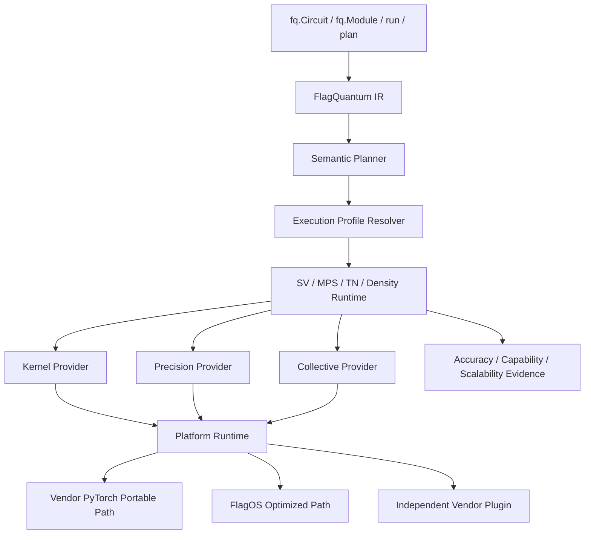

# Domestic Accelerators and Numerical Trust Plan

> **Status:** architecture and staged implementation plan, not current support.
> **Scope:** PyTorch, FlagOS/vendor accelerators, statevector, MPS, TN, density/
> noisy simulation, training, and genuinely sharded execution.
> **Principles:** one IR, one user API, explicit precision, evidence-driven
> capabilities, and no silent degradation.

> **Implementation record (2026-08-25):** Phase 0–2 control-plane foundations are
> underway; see [Platform Runtime](../reference/ACCELERATOR_PLATFORM_RUNTIME.md).
> Phase 3 includes `statevector_local_p0`, executable forward/backward probes,
> FlagOS preflight, and small CPU complex128 certification bound to
> AccuracyRequirement/PrecisionPlan. Isolated forward-only
> `split_real_imag_statevector_p0` uses FP32; P1 adds restricted Pauli expectations
> and explicit parameter-shift gradients. P2 selectively upgrades Pauli inner
> products, Hamiltonian sums, and shift accumulation to Double-Single while states
> and gates remain FP32. `split_real_imag_statevector_p3_double_single` uses four
> FP32 words for complete state evolution, gates, and periodic normalization, with
> matrices explicitly encoded from CPU complex128. P4 device Double-Single moves
> trigonometry and matrices to pure device FP32 for restricted built-ins and
> `|angle| <= 1024`. These experiments do not certify convergence, domestic
> hardware, performance, or production. P5 separates ordinary PyTorch FP32 `.grad`
> from explicit high/low gradients and has A800 native CUDA/CUDA-backed `flagos:0`
> portability evidence. P0–P5 domestic-device acceptance tools require Torch-FL/
> provisioner physical-device and no-CPU-fallback attestations. Until real results
> are executed and reviewed, outputs are certification candidates, not hardware,
> convergence, performance, FlagCX, or production certification.

## 1. Objective

Domestic integration must deliver more than device-name recognition:

1. Reuse vendor PyTorch support for low-cost basic execution.
2. Add missing complex, decomposition, communication, or optimized kernels through
   isolated plugins without changing quantum algorithms or public APIs.
3. For devices without FP64/complex128, provide auditable real/imag, extended,
   adaptive, and high-precision fallback paths without mislabeling low precision.
4. Bind support, exactness, convergence, and scalability claims to actual devices,
   software, algorithms, dtypes, forward/backward paths, topology, and errors.
5. Keep Qiskit/PennyLane and other heavy dependencies in optional control-plane
   adapters or plugins, outside accelerator workers' core execution.



Preserve IR, representations, and autograd. Replace device, operator,
communication, and precision infrastructure incrementally.

## 2. Baseline and Gaps

Retain Circuit/Module/IR, PyTorch training, SV/MPS/TN algorithms, existing real/imag
kernels, sharding/evidence semantics, ExecutionResult/versioned contracts/maturity,
extension negotiation, and JAX/DLPack/autograd boundaries.

The baseline still assumes CUDA: unrecognized accelerators may become CUDA;
discovery/synchronization/memory/streams/events/RNG/profiling call `torch.cuda`
directly; capabilities use coarse booleans; distributed code assumes CUDA/NCCL;
MPS compilation assumes Inductor/Triton/CUDA; extension conformance covers only
basic CPU/float32 gradients.

Numerics also lack independent storage/compute/reduction/decomposition/gradient/
communication/checkpoint precision. Configuration accepts fixed complex64/float32
or complex128/float64 pairs, without BF16/FP16, software extension, adaptive/error
budgets, separate truncation/contraction/rounding errors, or evidence of scientific
precision and convergence on no-FP64 devices.

The defensible baseline is possible execution through some vendor compatibility
layers, not universal seamless, fast, equal-precision support.

## 3. Goals and Non-Goals

Users retain `import flagquantum as fq` and one program across CPU, portable
PyTorch, FlagOS, and plugins. Single-device paths avoid distributed/plugin
orchestration overhead. Representations avoid vendor calls. Negotiate before
large allocations. Specify error goals rather than equating dtype with accuracy.
Certify forward, backward, optimizer, and communication separately. Integrate a
second vendor without algorithm changes; keep external frameworks optional.

Do not promise generic low-bit/complex128 equivalence, duplicate algorithms per
vendor, call replication capacity scaling, hide CPU fallback, replace IR with
external frameworks, or claim production/equivalence without hardware evidence.

## 4. Terminology

| Term | Meaning |
| --- | --- |
| Tensor backend | Tensor/autograd semantics, e.g. PyTorch, not device brand |
| Platform | Device/stream/event/memory/RNG/profiler runtime |
| Device | Concrete location such as cpu, cuda:0, npu:0, musa:0 |
| Representation runtime | SV/MPS/TN/density/noisy algorithms |
| Kernel provider | Implementations keyed by quantum semantic IDs |
| Precision provider | Native, split, software-extended, quantized numerics |
| Collective provider | All-reduce/gather/reduce-scatter/all-to-all/P2P |
| Interoperability adapter | External framework/IR conversion boundary |
| Capability evidence | Reproducible scoped facts, not static booleans |
| Accuracy contract | Result, gradient, fidelity, convergence error bounds |

PyTorch does not imply CUDA; a vendor device does not imply a particular
collective or kernel provider.

## 5. Runtime Layers

### 5.1 Execution Profile Resolver

The planner derives semantic needs; the resolver matches environment evidence:

```python
ExecutionRequest(
    representation="mps",
    gradients="reverse_mode",
    distribution="sharded_across_ranks",
    accuracy=AccuracyContract(...),
)
ExecutionProfile(
    tensor_backend="pytorch",
    platform="flagos",
    devices=("vendor:0", "vendor:1"),
    kernel_provider="flagos",
    precision_provider="double_single_fp32",
    collective_provider="flagcx",
    precision_plan=PrecisionPlan(...),
    capability_evidence_ids=(...),
)
```

Report reasons, excluded alternatives, blockers, and fallback. Constructing a
device object does not establish representation, gradient, or distributed support.

### 5.2 PlatformRuntime

Proposed minimum:

```python
class PlatformRuntime(Protocol):
    def discover(self) -> tuple[DeviceInfo, ...]: ...
    def synchronize(self, device: DeviceRef) -> None: ...
    def memory_snapshot(self, device: DeviceRef) -> MemorySnapshot: ...
    def stream(self, device: DeviceRef, priority: int = 0) -> StreamHandle: ...
    def event(self, device: DeviceRef) -> EventHandle: ...
    def rng_state(self, device: DeviceRef) -> bytes: ...
    def restore_rng_state(self, device: DeviceRef, state: bytes) -> None: ...
    def profiler_metadata(self, device: DeviceRef) -> Mapping[str, object]: ...
```

Wrap existing CPU/CUDA behavior first; other devices implement through public
PyTorch accelerator APIs, FlagOS, or plugins.

### 5.3 KernelProvider

Use semantic IDs, not vendor functions:

```text
statevector.apply_1q
statevector.apply_2q
statevector.expectation_pauli
mps.apply_1site
mps.apply_2site
mps.qr_split
mps.svd_truncate
tn.contract
tn.reverse_contract
density.apply_kraus
reduction.complex_sum
```

Declare layouts, dtypes, autograd, determinism, shape/rank limits, workspace,
error class, hardware evidence. Same-device portable PyTorch fallback requires
permission and recording.

### 5.4 CollectiveProvider

```python
class CollectiveProvider(Protocol):
    def all_reduce(self, tensor, *, op, group): ...
    def all_gather(self, outputs, tensor, *, group): ...
    def reduce_scatter(self, output, inputs, *, op, group): ...
    def all_to_all(self, outputs, inputs, *, group): ...
    def send_recv(self, send, recv, *, peer, group): ...
    def capabilities(self) -> CollectiveCapabilities: ...
```

Report dtypes, direct/staged transport, synchronization, topology, determinism,
timeouts, errors. Host staging is visible in results and performance evidence.

## 6. Numerical Trust

### 6.1 Accuracy Is More Than dtype

Complex128 cannot fix incorrect algorithms, truncation, or ill-conditioned
optimization. Complex64 may suffice for shallow circuits and error-tolerant
training. Deep evolution, near-degenerate levels, tiny gaps, precise gradients,
and difficult SVD/QR may need FP64-like effective precision. BF16/FP16/FP8/INT8
are not generic replacements. Renormalization repairs norm, not lost phase.

### 6.2 AccuracyContract

```python
AccuracyContract(
    mode="strict",  # strict | adaptive | fast
    max_norm_drift=1e-10,
    max_expectation_abs_error=1e-9,
    max_expectation_rel_error=1e-8,
    max_gradient_rel_error=1e-6,
    min_gradient_cosine_similarity=0.999999,
    max_state_infidelity=1e-10,
    max_decomposition_residual=1e-10,
    max_truncation_error=None,
    require_determinism=False,
    require_convergence_evidence=True,
)
```

Strict uses certified profiles or rejects before execution. Adaptive may escalate
but must satisfy final bounds. Fast permits controlled approximation with visible
error status and no strict-result claim.

### 6.3 PrecisionPlan

```python
PrecisionPlan(
    complex_representation="split_real_imag",
    parameter_dtype="float64",
    gate_generation_dtype="float64",
    state_storage_dtype="float32",
    kernel_compute_dtype="float32",
    reduction_dtype="double_single_fp32",
    decomposition_dtype="double_single_fp32",
    gradient_dtype="double_single_fp32",
    optimizer_master_dtype="float64_cpu",
    communication_dtype="float32",
    checkpoint_dtype="float32",
    refinement="adaptive_block_replay",
)
```

Include the complete plan in caches, checkpoints, compilation identity, and rank
consistency checks to prevent reuse across different numerical semantics.

### 6.4 No-FP64 Precision Ladder

```text
Native complex128
 -> split real/imag float64
 -> certified Double-Single FP32
 -> certified adaptive mixed precision
 -> CPU/other-device high-precision correction or complete execution
 -> fail closed
```

Retain evidence identity at each step.

**Native complex128:** verify all critical forward/backward, decomposition,
collective, and long-sequence behavior, not tensor creation alone.

**Split float64:** represent `z = real_fp64 + i * imag_fp64` when real FP64 is
supported but complex coverage is incomplete. Reuse real GEMM/einsum/reductions/
autograd while preserving double-precision components.

**Double-Single FP32:** represent `x = x_hi + x_lo` and
`z = (re_hi, re_lo, im_hi, im_lo)`. Error-free transforms, TwoSum, TwoProd/FMA,
compensated multiply-add, and deterministic reductions extend effective mantissa.
Label this `emulated_high_precision`, not IEEE complex128. Verify FMA, rounding,
subnormals, compiler reassociation, collectives, and separate errors for gates,
inner products, expectations, gradients, norm, QR/SVD. Outside certified
shape/depth/operator scope, lower maturity or reject; report overhead separately.

**Adaptive mixed precision:**

| Stage | Candidate default |
| --- | --- |
| Storage | complex64 or split FP32 |
| Ordinary gates | FP32 |
| Parameter sin/cos/exp | CPU FP64, split FP64, or extension |
| Norm/inner product/expectation | Pairwise/Kahan/Double-Single |
| Loss | FP64 or extension |
| Gradient accumulation | FP64 master or extension |
| MPS QR/SVD | Certified high-precision provider |
| TN contraction | FP32 with sensitive contractions upgraded |
| Optimizer master | CPU FP64 or certified extension |
| Communication | FP32; compression separately authorized |

Stable checkpoints and replayable blocks support escalation:

```text
FP32 -> compensated reductions -> sensitive Double-Single kernels
 -> high-precision block replay -> full software extension
 -> CPU/other-device FP64 -> fail closed
```

Sampling/shadow execution provides scoped engineering evidence, not a universal
mathematical guarantee.

### 6.5 Quantization Boundaries

| Type | Scope | Initial maturity |
| --- | --- | --- |
| BF16/FP16 storage | Controlled approximation with FP32 compute/correction | experimental |
| BF16/FP16 contraction | Nonsensitive MPS/TN contractions | experimental |
| FP16/BF16 communication | Error feedback and result error evidence | experimental |
| Classical PTQ/QAT | PyTorch/vendor backends | external capability |
| FP8 quantum kernels | Research, no strict accuracy claims | research |
| INT8/INT4 quantum states | Explicit approximate research | research |

The proposed `flagquantum.nn.quantization` would thinly wrap classical PTQ/QAT
while protecting quantum layers. Low-bit quantum states belong to numerical
policy; do not combine both under one API or label.

## 7. Representation Strategies

**Statevector:** CPU/native complex128 reference; FP32 gates with compensated/
extended expectation/probability/gradient reductions; block accuracy checkpoints;
norm, infidelity, expectation, gradient monitoring. Renormalization still reports
phase/fidelity error. Separate rank-local and cross-rank reduction errors.

**MPS:** separate floating-point and truncation errors. Independently certify
QR/SVD and backward; escalate when singular gaps shrink. Budget canonicalization
residual, discarded weight, norm drift, and gradient error. Reconstructing a full
MPS during backward cannot be called sharded training.

**TN:** plan FLOPs, memory, numerical risk; use stable long reductions and scale/
exponent management where needed. Separate slicing, contraction approximation,
and rounding errors. Reverse precision must be compatible with forward.

**Density/noise:** check trace, Hermiticity, positivity, probability bounds; use
stable Kraus sums; separate stochastic/numerical errors. Do not clamp away
unphysical low-precision states or promote noisy training without gradient evidence.

## 8. Three Integration Routes

**A: Portable PyTorch.** Reuse vendor device/dispatcher/autograd/distributed
integration through public APIs and actual operator probes. Minimize integration
cost without promising optimal performance.

**B: FlagOS.** Platform/kernels/collectives provide devices, streams, memory,
events, RNG, profiling, complex algebra/contraction/QR/SVD, FlagCX, compilation
caches, graphs, topology, environment evidence. FlagQuantum keeps semantics,
algorithms, gradients, accuracy, maturity. Prefer Torch-FL `flagos` routing and
ProcessGroupFlagOS, with thin adapters. Core stays independent; bundles pin and
certify jointly. See [Torch-FL plan](FLAGQUANTUM_TORCH_FL_INTEGRATION_PLAN.md).

**C: Vendor plugins.** Heavy/proprietary SDKs remain outside Core wheels, e.g.
`flagquantum-vendor-<name>`. Entry points register platform/kernel/precision/
collective implementations against shared protocols, manifests, and conformance.
Failure must not break CPU/other devices. A second vendor adds only plugin,
manifest, hardware tests, docs, without representation-algorithm changes.

## 9. External Framework Isolation

`flagquantum.ecosystem.qiskit` converts through `from_qiskit()`/`to_qiskit()`,
reporting loss, degradation, bindings, control flow, and measurements. Qiskit is an
optional control-plane dependency, compilation reference, or oracle. Its objects
never enter kernels or worker protocols. Apply the same boundary to:

```text
flagquantum.ecosystem.qiskit
flagquantum.ecosystem.pennylane
flagquantum.ecosystem.cirq
flagquantum.ecosystem.pytket
flagquantum.ecosystem.qir
flagquantum.ecosystem.openfermion
```

Core remains PyTorch-only; adapters use extras/separate distributions; no eager
framework imports. After conversion transmit versioned IR only. Accelerator images
need no external quantum frameworks; their upgrade failures affect adapters only.

## 10. Atomic Capabilities and Evidence

Replace coarse production decisions such as `supports_mps=True` with scoped facts:

```text
mps.forward.local.complex64
mps.backward.local.complex64
mps.svd.forward.split_float64
mps.svd.backward.double_single_fp32
statevector.forward.sharded.complex64
statevector.backward.sharded.complex64
tn.contract.local.float32_pair
collective.all_to_all.float32.device_direct
precision.double_single.two_prod.fma
```

Discovery (`unsupported`, `unverified`, `available`) is separate from repository
maturity (`experimental`, `development_evidence`, `production_supported`,
`release_certified`). Availability or one probe does not promote maturity.

Minimum evidence example:

```json
{
  "capability_id": "mps.svd.backward.double_single_fp32",
  "platform": "vendor-name",
  "device_model": "exact-model",
  "device_count": 8,
  "tensor_backend": "pytorch",
  "pytorch_version": "exact-version",
  "plugin_version": "exact-version",
  "driver_version": "exact-version",
  "compiler_version": "exact-version",
  "collective_version": "exact-version",
  "representation": "mps",
  "precision_plan_hash": "sha256",
  "operator_set_hash": "sha256",
  "forward": true,
  "backward": true,
  "world_size": 8,
  "node_count": 1,
  "distribution_semantics": "sharded_across_ranks",
  "accuracy_metrics": {},
  "performance_metrics": {},
  "artifact_sha256": "sha256",
  "code_version": "git-revision"
}
```

Keep BackendCapabilities as a migration projection, not the planner's sole authority.

## 11. Fallback Policy

The proposal replaces a broad boolean with:

| Policy | Behavior |
| --- | --- |
| `FORBID` | Reject any missing critical profile capability |
| `SAME_DEVICE_PORTABLE` | Optimized to same-device portable PyTorch |
| `HOST_DEBUG_ONLY` | Explicit CPU correctness/debug only; no performance/production claims |

Never silently replace MPS/TN with dense statevector, sharding with replication,
device with CPU, complex128 with complex64, native FP64 with software extension,
direct transport with staging, or forward distribution with a different backward path.

## 12. Proposed Layout

This is a planning sketch, subject to current architecture ownership:

```text
flagquantum/
  core/
    accuracy_contracts.py
    precision_contracts.py
  compilation/
    execution_profile_resolver.py
  runtime/
    capabilities/
      model.py
      registry.py
      probes.py
      evidence.py
    platforms/
      protocol.py
      cpu.py
      cuda.py
    kernels/
      protocol.py
      registry.py
      portable_torch.py
    numerics/
      policy.py
      planner.py
      monitors.py
      compensated.py
      double_single.py
    distributed/
      collectives/
        protocol.py
        torch_distributed.py
    observability/
      accelerator_evidence.py
      accuracy_evidence.py
    backends/
      statevector/
      mps/
      tensor_network/
      density/
  interop/
    qiskit/
    pennylane/
    cirq/
```

Respect `architecture.toml` budgets and single responsibilities; do not create
empty packages merely to complete the tree.

## 13. User API Target

Ordinary users call `fq.run(circuit)`. Scientific users specify goals:

```python
import flagquantum as fq

result = fq.run(
    circuit,
    accuracy=fq.AccuracyPolicy(
        mode="adaptive",
        expectation_abs_error=1e-9,
        gradient_relative_error=1e-6,
    ),
)
```

This proposed public policy becomes a versioned serializable AccuracyContract in
planning for workers, caches, audits. Experts may pin profiles. Results always
expose providers, full precision plan, fallback/staging, errors/contract status,
world size/ownership/bytes/distribution, evidence IDs, blockers.

## 14. Incremental Migration

Wrap established behavior, then replace it; do not build a parallel framework.

### Phase 0: Semantics and Decisions

Deliver ADR/FEP, CUDA/distributed/precision call inventory, CPU/CUDA complex64/128
baselines, approved vocabulary/fallback/evidence, and checks prohibiting new vendor
calls in representations. Exit: baseline and dependency checks, unchanged public API.

### Phase 1: CPU/CUDA Platform Wrappers

Deliver protocol/adapters and device/memory/stream/event/RNG/profiler entries;
remove unknown-to-CUDA inference; preserve fast paths. Exit: no new representation
CUDA calls; correctness/performance within approved thresholds.

### Phase 2: Capabilities, Preflight, Discovery

Deliver atomic registry/evidence, operator probes, entry points, platform/kernel/
precision/collective conformance, compatibility projection. Exit: names/environment
cannot fabricate production support.

### Phase 3: Domestic Single-Device Statevector

Existing vendor-neutral P0–P5 tools require provisioner attestations and return
review candidates only. Deliver split FP32, common 1q/2q gates/expectation/sampling,
gradients/optimizer, supported split FP64, Double-Single basics, monitors/adaptation.
Exit: scoped forward/gradient/convergence against CPU complex128 with real hardware evidence.

### Phase 4: Domestic MPS/TN/Density

Deliver MPS contraction, QR, SVD/truncation/stable backward, TN contraction/reverse,
density/Kraus, representation monitors. Exit: separated rounding/truncation/TN/
stochastic errors, without dense fallback to pass acceptance.

### Phase 5: Distributed Statevector

Deliver collectives, amplitude-sharded forward/backward, direct/staged distinctions,
topology/bytes/precision/ownership, checkpoint/restart/fault diagnostics. Exit:
one workload too large for one device completes sharded training; CPU tests are
not hardware proof.

### Phase 6: Distributed MPS/TN

Deliver owned MPS training, TN slice/intermediate sharding/reverse, topology-aware
placement, inter-node/recovery/soak evidence, identical rank precision plans.
Exit: capability, correctness, numerical, capacity, performance, stability gates.

### Phase 7: Multiple Vendors and Interoperability

Deliver at least two non-CUDA plugins, second-vendor proof without algorithm
changes, optional framework adapters/matrices, separate control-plane and worker
images, cross-vendor accuracy/performance catalog. Exit: same IR/code across
certified profiles with differences explained by plans/evidence.

## 15. First Work Packages

In dependency order, independently reviewed:

1. Vocabulary/dependency ADR.
2. Fix unknown-to-CUDA detection.
3. CPU/CUDA platform wrappers.
4. Migrate synchronization/memory/RNG/streams/events.
5. Atomic CapabilityRecord/EvidenceRef.
6. Complex/real-imag/autograd/SVD/QR probes.
7. AccuracyContract/PrecisionPlan/result metadata.
8. CPU complex128 golden corpus.
9. Existing real/imag portable kernel registration.
10. Compensated reductions/determinism tests.
11. Double-Single scalar/vector primitives/references.
12. Domestic statevector forward.
13. Gradients/optimizer.
14. Adaptive monitoring/escalation.
15. Stable discovery/conformance package.
16. Optimized kernels and collectives afterward.

Contracts/evidence precede mass CUDA replacement; Runtime semantics precede demos.

## 16. Validation

Five layers: operator dtype/layout/broadcast/autograd/errors/determinism; semantic
kernel references/errors/workspace/cache; representation forward/backward;
fixed-problem optimizer/seed/step convergence; distributed sharding/communication/
memory/topology/recovery.

Measure norm drift, fidelity, absolute/relative expectations, probability
conservation, gradient max/relative error/cosine, finite-difference/shift/adjoint
agreement, QR/SVD reconstruction, MPS residual/discarded weight, density physicality,
and final loss/energy/parameters/convergence-step differences.

Certification is scoped to:

```text
platform × model × count × PyTorch × driver/compiler/plugin/collective versions
× representation × operators × precision plan × forward/backward/optimizer
× depth/shape/bond dimension × world size/topology × accuracy contract
```

Vendor PyTorch support alone is insufficient.

## 17. Maintainability

One protocol/registration per concept. Algorithms depend on semantic IDs, not
vendors. Each migration changes one boundary. Public APIs need contracts,
failures, examples, tests. Use explicit immutable policy/state machines rather
than scattered environment switches. Centralize fallback and machine-readable
promotion. Enforce imports/budgets. Share conformance across plugins. Benchmarks
consume evidence, not reimplement discovery. Comments explain scientific invariants.

Review ownership, exact/approximate/performance semantics, separate training/
distributed evidence, visible fallback changes, second-vendor portability, and
independent CPU/single-device behavior.

## 18. Risks

| Risk | Control |
| --- | --- |
| Incomplete vendor PyTorch | Actual probes, no brand inference |
| Missing complex | Real/imag lowering and semantic tests |
| Missing/slow FP64 | Double-Single, adaptive, alternate-device fallback |
| Broken compensation under compilation | Strict tests, disable unsafe fusion, compiler identity |
| Unstable decomposition backward | Independent provider, gap/residual checks, escalation |
| Hidden CPU fallback | Provenance, profiling, fail closed |
| False scaling | Distribution/ownership evidence |
| SDK dependency leakage | Separate plugins, lazy loading, entry points |
| Heavy external frameworks | Control-plane conversion, IR-only transport |
| Excess abstraction | Minimal protocols, incremental migration, budgets/ADRs |
| Fast but scientifically wrong | Accuracy before performance promotion |

## 19. Milestones

| Milestone | Gate |
| --- | --- |
| M0 architecture | Approved terms/protocols/dependencies/fallback/evidence |
| M1 CPU/CUDA wrappers | No significant correctness/fast-path regression |
| M2 domestic portable SV | Forward/gradient/optimizer/accuracy evidence |
| M3 no-FP64 precision | Scoped Double-Single/adaptive accuracy |
| M4 domestic MPS/TN | Decomposition/backward/separate errors |
| M5 distributed SV | Single-device OOM workload completes sharded training |
| M6 distributed MPS/TN | Capacity/training/recovery/inter-node evidence |
| M7 second vendor | Zero representation-algorithm changes |
| M8 release | Exact environment, reproducible artifacts, complete audit |

Performance cannot override failed accuracy/correctness gates.

## 20. Definition of Done

Device brands do not change user code. Core wheels need no vendor SDK/framework.
Platforms share stable protocols; missing complex/FP64 has explicit split,
extended, adaptive, or rejection paths. Results reveal devices, precision,
fallback, errors. Forward/backward/optimizer/distributed each have evidence.
Fast paths avoid orchestration overhead; distributed workloads truly shard.
Second vendors need no representation changes. Contributors can trace
IR -> plan -> representation -> provider -> evidence. Matrices/limitations match facts.

## 21. Recommendation

Combine portable PyTorch, optimized FlagOS, isolated plugins, accuracy/precision
contracts, real/imag and software extension, atomic evidence, and fail-closed
release gates. Prioritize Phases 0–3: establish boundaries, then complete one real
domestic statevector forward/gradient/optimizer/accuracy loop before MPS/TN and
scale-out.

## References

- [Distributed Quantum AI Principles](../concepts/DISTRIBUTED_QUANTUM_AI_PRINCIPLES.md)
- [Distributed Scalability Principles](../concepts/DISTRIBUTED_SCALABILITY_PRINCIPLES.md)
- [Capability maturity](CAPABILITY_MATURITY.md)
- [Known limitations](../reference/KNOWN_LIMITATIONS.md)
- [Architecture dependencies](../architecture/ARCHITECTURE_DEPENDENCIES.md)
- [Dependency policy](../development/DEPENDENCY_POLICY.md)
- [PyTorch accelerator integration](https://docs.pytorch.org/docs/main/accelerator/index.html)
- [Operator registration](https://docs.pytorch.org/docs/stable/accelerator/operators.html)
- [Complex numbers](https://docs.pytorch.org/docs/stable/complex_numbers.html)
- [cuStateVec precision](https://docs.nvidia.com/cuda/cuquantum/latest/custatevec/overview/index.html)
