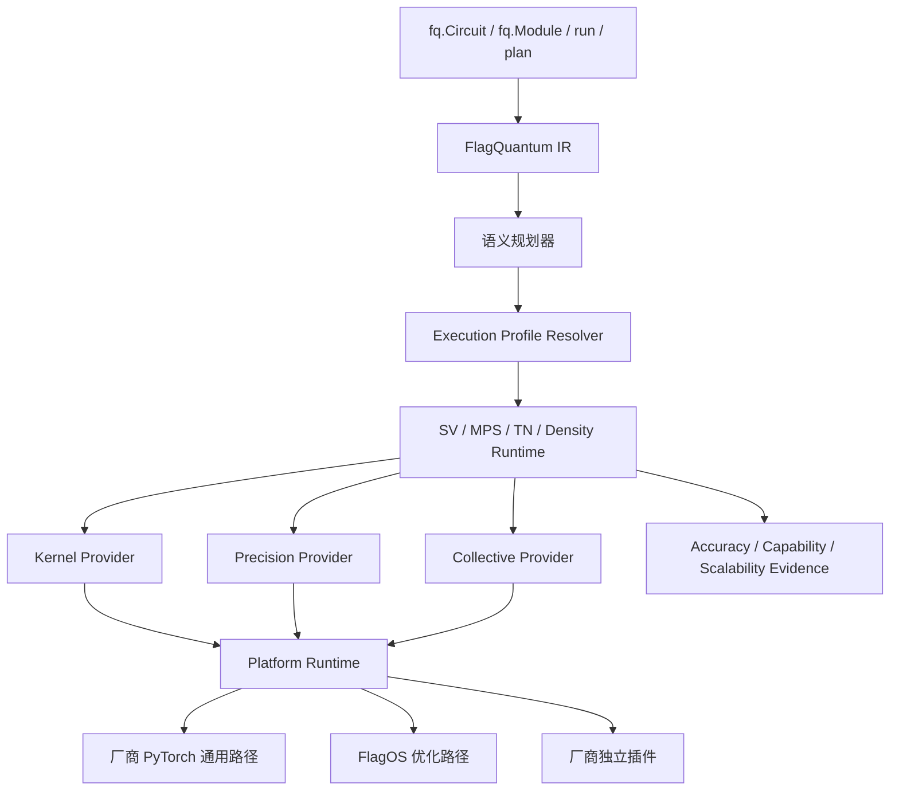

# FlagQuantum 国产加速器与可信数值计算顶层规划

> **文档状态：** 顶层设计与分阶段实施计划，不代表当前支持能力
> **适用范围：** PyTorch 主运行时、FlagOS/厂商加速器、statevector、MPS、
> tensor network、density/noisy simulation、训练与真正分布式执行
> **核心原则：** 一个 FlagQuantum IR、一个用户 API、显式精度语义、能力证据
> 驱动、无静默降级

> **实施状态（2026-08-21）：** Phase 0–2 控制面基础已开始落地，准确边界见
> [Accelerator Platform Runtime](../reference/ACCELERATOR_PLATFORM_RUNTIME.md)。
> Phase 3 已落地 `statevector_local_p0` profile、可执行 forward/backward probe、
> `flagos` 执行前 preflight，以及 AccuracyRequirement/PrecisionPlan 绑定的 CPU
> complex128 小型数值认证；该状态不等于国产卡生产能力认证。

## 1. 执行摘要

FlagQuantum 不应以“识别更多设备名称”作为国产加速器适配目标。最终目标是：

1. 厂商已经完成 PyTorch 适配时，FlagQuantum 能通过通用 PyTorch 路径快速获得
   基础可运行能力；
2. 厂商需要更高性能或缺少关键复数、分解、通信算子时，能够通过独立插件补齐，
   而不污染 FlagQuantum 的量子算法和公共 API；
3. 对缺少原生 FP64/complex128 的设备，提供可审计的实虚拆分、软件扩展精度、
   自适应混合精度和高精度兜底，而不是把低精度结果伪装成 complex128；
4. 所有“支持”“精确”“收敛”“可扩展”声明均绑定到具体设备、软件栈、算法、
   dtype、前反向、拓扑和误差证据；
5. 接入 Qiskit、PennyLane 等外部框架时，外部依赖只存在于控制面适配器或独立
   插件中，不进入国产加速器工作节点的核心执行路径。

目标架构可概括为：



这套设计保留现有 FlagQuantum IR、statevector、MPS、TN 和 PyTorch autograd
资产，只逐步替换最底层的设备、算子、通信与数值策略，不重写整个框架。

## 2. 当前基线与关键差距

### 2.1 可以保留的核心资产

- `fq.Circuit`、`fq.Module` 和统一 FlagQuantum IR；
- PyTorch 主训练界面和 autograd 语义；
- statevector、MPS、tensor-network 的表示层与算法主体；
- 已有的 real/imag kernel 基础；
- 真实 statevector/MPS/TN sharding 的语义约束与证据模型；
- `ExecutionResult`、版本化 runtime contracts 和能力成熟度机制；
- extension SDK 的生命周期、协商和 fail-closed 方向；
- PyTorch/JAX 双路径及 DLPack/autograd 边界。

### 2.2 当前必须解决的结构问题

现有运行时仍然以 CUDA 作为事实上的默认加速器抽象：

- 未识别的加速器可能被归类为 `cuda`；
- 设备发现、同步、显存、stream、event、RNG 和 profiler 存在大量
  `torch.cuda.*` 直接调用；
- backend capability 以粗粒度布尔值硬编码，不能证明某个具体设备、dtype、
  算法和 backward 是否真的可用；
- 分布式路径直接依赖 `torch.distributed` 和 CUDA/NCCL 假设；
- MPS 编译路径存在 `torch.compile`、Inductor/Triton 和 CUDA 同步假设；
- extension conformance 当前只覆盖基础 CPU/float32 梯度，无法认证量子核心。

数值能力目前也不是一等公民：

- runtime configuration 仅接受 `complex64/float32` 和
  `complex128/float64` 两个固定组合；
- 没有独立的状态存储、算子计算、归约累加、分解、梯度、通信和 checkpoint
  精度；
- 没有 BF16/FP16、软件扩展精度、动态升级或误差预算契约；
- 没有把 MPS 截断误差、TN 近似误差和浮点舍入误差分开报告；
- 没有证据证明无原生 FP64 设备能达到特定科学精度或训练收敛要求。

因此，当前能够诚实承诺的是“部分设备可能通过厂商 PyTorch 兼容层运行”，不能
承诺“所有完成 PyTorch 适配的国产卡都无缝、高性能、等精度运行”。

## 3. 设计目标与非目标

### 3.1 设计目标

- 用户继续只使用 `import flagquantum as fq`；
- 同一份 Circuit/IR 在 CPU、通用厂商 PyTorch、FlagOS 和厂商插件之间迁移；
- 本地单设备路径不承担分布式初始化或插件调度开销；
- 量子表示层不直接调用 `torch.cuda`、NCCL、MUSA、NPU 或厂商 SDK；
- 所有能力在执行前协商，缺失能力在分配大内存前失败；
- 数值目标由误差契约表达，dtype 只是实现选择；
- 前向、反向、优化器更新和分布式通信分别认证；
- 新增第二家厂商时，量子算法主体不发生修改；
- 外部量子框架保持可选依赖，不进入核心 runtime 信任边界。

### 3.2 非目标

- 不承诺低比特计算普遍等价于 complex128；
- 不为每家厂商复制一套 statevector/MPS/TN 算法；
- 不把每 rank 完整复制任务描述为分布式容量扩展；
- 不通过隐式 CPU fallback 获得“可运行”假象；
- 不把 Qiskit、PennyLane、CUDA-Q 等框架变成 FlagQuantum IR 的替代品；
- 不在没有实机证据时声明生产支持或跨设备数值等价。

## 4. 必须统一的术语

| 术语 | 唯一含义 |
| --- | --- |
| tensor backend | 张量与 autograd 语义，例如 PyTorch；不是设备品牌 |
| platform | 设备、stream、event、内存、RNG、profiler 的运行平台 |
| device | 具体执行位置，例如 `cpu`、`cuda:0`、`npu:0`、`musa:0` |
| representation runtime | statevector、MPS、TN、density/noisy 算法运行时 |
| kernel provider | 以量子语义 kernel ID 提供算子实现 |
| precision provider | 原生精度、实虚拆分、软件扩展精度和量化实现 |
| collective provider | all-reduce、all-gather、reduce-scatter、all-to-all、P2P |
| interoperability adapter | 外部框架与 FlagQuantum IR 的转换边界 |
| capability evidence | 对特定环境和能力的可复验证据，不是静态布尔声明 |
| accuracy contract | 用户要求的结果、梯度、保真度或收敛误差边界 |

`backend="pytorch"` 不得继续隐含 `device="cuda"`，`device="vendor:0"`
也不得隐含某个 collective 或 kernel provider。

## 5. 目标运行时分层

### 5.1 Execution Profile Resolver

规划器先基于 IR 生成语义执行计划，再由 resolver 把需求与当前环境能力匹配：

```python
ExecutionRequest(
    representation="mps",
    gradients="reverse_mode",
    distribution="sharded_across_ranks",
    accuracy=AccuracyContract(...),
)

ExecutionProfile(
    tensor_backend="pytorch",
    platform="flagos",
    devices=("vendor:0", "vendor:1"),
    kernel_provider="flagos",
    precision_provider="double_single_fp32",
    collective_provider="flagcx",
    precision_plan=PrecisionPlan(...),
    capability_evidence_ids=(...),
)
```

resolver 必须输出选择理由、被排除方案、阻塞项和任何 fallback。它不能因为设备
对象可以构造，就推断 statevector/MPS/TN、gradient 或 distributed 已受支持。

### 5.2 PlatformRuntime

建议稳定最小协议：

```python
class PlatformRuntime(Protocol):
    def discover(self) -> tuple[DeviceInfo, ...]: ...
    def synchronize(self, device: DeviceRef) -> None: ...
    def memory_snapshot(self, device: DeviceRef) -> MemorySnapshot: ...
    def stream(self, device: DeviceRef, priority: int = 0) -> StreamHandle: ...
    def event(self, device: DeviceRef) -> EventHandle: ...
    def rng_state(self, device: DeviceRef) -> bytes: ...
    def restore_rng_state(self, device: DeviceRef, state: bytes) -> None: ...
    def profiler_metadata(self, device: DeviceRef) -> Mapping[str, object]: ...
```

首批内置实现只包装现有 CPU 和 CUDA 行为，保证迁移前后语义一致。国产设备通过
通用 PyTorch accelerator API、FlagOS 或外部厂商插件实现该协议。

### 5.3 KernelProvider

kernel 以稳定的量子语义 ID 注册，不以厂商函数名进入算法层：

```text
statevector.apply_1q
statevector.apply_2q
statevector.expectation_pauli
mps.apply_1site
mps.apply_2site
mps.qr_split
mps.svd_truncate
tn.contract
tn.reverse_contract
density.apply_kraus
reduction.complex_sum
```

每个实现声明输入布局、dtype、autograd、determinism、最大 rank/shape、workspace、
误差等级及实机证据。缺失优化 kernel 时，可以使用同设备 PyTorch portable
kernel，但必须由 fallback policy 允许并记录。

### 5.4 CollectiveProvider

```python
class CollectiveProvider(Protocol):
    def all_reduce(self, tensor, *, op, group): ...
    def all_gather(self, outputs, tensor, *, group): ...
    def reduce_scatter(self, output, inputs, *, op, group): ...
    def all_to_all(self, outputs, inputs, *, group): ...
    def send_recv(self, send, recv, *, peer, group): ...
    def capabilities(self) -> CollectiveCapabilities: ...
```

provider 必须报告支持的 dtype、设备直连/host staging、同步语义、拓扑、确定性、
超时和错误传播。host staging 不是透明优化，必须出现在执行结果和性能证据中。

## 6. 可信数值架构

### 6.1 基本判断

科学结果和训练收敛不能仅用 `complex64` 或 `complex128` 标签定义：

- complex128 不能修复错误的算法、MPS 截断或病态优化问题；
- complex64 对许多浅电路和容错训练任务可能足够；
- 深电路、近简并能级、长时间演化、微小能隙、高精度梯度、复杂 SVD/QR
  往往需要接近 FP64 的有效精度；
- BF16、FP16、FP8、INT8 不能一般性替代 complex128；
- 归一化只能修正范数，不能恢复已经丢失的相位。

因此 FlagQuantum 应面向目标误差规划精度，而不是面向 dtype 猜测正确性。

### 6.2 AccuracyContract

建议新增版本化契约：

```python
AccuracyContract(
    mode="strict",  # strict | adaptive | fast
    max_norm_drift=1e-10,
    max_expectation_abs_error=1e-9,
    max_expectation_rel_error=1e-8,
    max_gradient_rel_error=1e-6,
    min_gradient_cosine_similarity=0.999999,
    max_state_infidelity=1e-10,
    max_decomposition_residual=1e-10,
    max_truncation_error=None,
    require_determinism=False,
    require_convergence_evidence=True,
)
```

- `strict`：只能使用经认证满足全部边界的 profile，否则执行前失败；
- `adaptive`：允许从快速精度逐级升级，但最终必须满足边界；
- `fast`：允许受控近似，结果必须携带误差状态且不得冒充严格结果。

### 6.3 PrecisionPlan

不得继续用一个 dtype 控制全部过程：

```python
PrecisionPlan(
    complex_representation="split_real_imag",
    parameter_dtype="float64",
    gate_generation_dtype="float64",
    state_storage_dtype="float32",
    kernel_compute_dtype="float32",
    reduction_dtype="double_single_fp32",
    decomposition_dtype="double_single_fp32",
    gradient_dtype="double_single_fp32",
    optimizer_master_dtype="float64_cpu",
    communication_dtype="float32",
    checkpoint_dtype="float32",
    refinement="adaptive_block_replay",
)
```

cache key、checkpoint identity、编译产物和分布式一致性检查必须包含完整
`PrecisionPlan`，避免不同数值语义错误复用。

### 6.4 无原生 FP64 设备的精度阶梯

resolver 按以下顺序选择，并保留每一级的证据身份：

```text
native complex128
  → split real/imag float64
  → certified double-single FP32
  → certified adaptive mixed precision
  → CPU/其他设备高精度修正或完整执行
  → fail closed
```

#### A. Native complex128

设备和全部关键算子原生支持 complex128，作为高精度首选。必须分别验证 forward、
backward、SVD/QR、collective 和长序列误差，不能只验证张量创建。

#### B. Split float64

设备支持 float64 但复数算子不完整时，将复数表示为两个 float64 tensor：

```text
z = real_fp64 + i * imag_fp64
```

该路径保持双精度分量语义，优先复用厂商已经优化的实数 GEMM、einsum、reduction
和 autograd，适合成为国产设备高精度兼容主路径。

#### C. Double-Single FP32 软件扩展精度

设备没有高效 float64 时，用两个 float32 limb 表示一个实数：

```text
x = x_hi + x_lo
z = (re_hi, re_lo, im_hi, im_lo)
```

通过 error-free transform、TwoSum、TwoProd/FMA、补偿乘加和确定性归约获得高于
普通 FP32 的有效尾数。该路径：

- 只能称为 `emulated_high_precision`，不能伪装成 IEEE complex128；
- 需要验证 FMA、舍入模式、subnormal、编译器重排和 collective 语义；
- 必须为门作用、内积、期望值、梯度、norm、QR/SVD 分别提供误差证据；
- 超越已认证 shape/depth/operator 范围时必须降级成熟度或拒绝；
- 性能和存储开销必须独立报告。

#### D. Adaptive mixed precision

FP32 承担主要吞吐，高精度用于敏感环节：

| 环节 | 缺省候选策略 |
| --- | --- |
| 状态存储 | complex64 或 split FP32 |
| 常规门作用 | FP32 |
| 参数门 `sin/cos/exp` | FP64 CPU、split FP64 或软件扩展精度 |
| norm/inner product/expectation | pairwise/Kahan/Double-Single |
| loss | FP64 或软件扩展精度 |
| gradient accumulation | FP64 master 或软件扩展精度 |
| MPS QR/SVD | 认证高精度 provider |
| TN 普通 contraction | FP32，关键 contraction 动态升级 |
| optimizer master state | CPU FP64 或认证扩展精度 |
| distributed communication | 默认 FP32；压缩必须单独获准 |

自适应执行需要稳定的检查点和可重放 block。检测到误差超预算后按以下顺序升级：

```text
FP32
  → 补偿归约
  → 敏感 kernel Double-Single
  → 局部 block 高精度重放
  → 全路径软件扩展精度
  → CPU/其他设备 FP64
  → fail closed
```

局部抽样或 shadow execution 只能形成受限工程证据，不能自动推广为所有电路的
数学保证。

### 6.5 量化能力边界

“量化”必须按用途拆分：

| 类型 | 允许范围 | 初始成熟度 |
| --- | --- | --- |
| BF16/FP16 状态存储 | 受控近似，FP32 计算/修正 | experimental |
| BF16/FP16 contraction | TN/MPS 非敏感 contraction | experimental |
| FP16/BF16 通信压缩 | 有 error feedback 和结果误差证据 | experimental |
| 经典神经网络 PTQ/QAT | 交给 PyTorch/厂商量化后端 | external capability |
| FP8 quantum kernels | 研究用途，禁止严格精度声明 | research |
| INT8/INT4 quantum state | 仅显式近似研究 | research |

经典混合模型的 PTQ/QAT 建议放在 `flagquantum.nn.quantization`，薄封装 PyTorch
能力并保护量子层边界；量子状态低比特实现属于 runtime numerical policy，二者
不得混在一个 API 或能力标签中。

## 7. 不同量子表示的数值策略

### 7.1 Statevector

- 基线 reference 为 CPU/native complex128；
- 常规门可采用 FP32，期望值、概率和梯度归约优先补偿或扩展精度；
- 深电路按 gate block 设置 accuracy checkpoint；
- 监控 norm drift、state infidelity、expectation 和 gradient；
- 重新归一化只能作为稳定化操作，必须继续报告相位/保真度误差；
- sharded statevector 的本地误差和跨 rank reduction 误差分别计量。

### 7.2 MPS

- 浮点误差与 bond truncation error 分开累计和报告；
- QR/SVD 是最高风险算子，必须具有独立精度 provider 和 backward 认证；
- singular-value gap 过小时自动提升分解精度；
- canonicalization residual、discarded weight、norm drift 和 gradient error
  同时进入误差预算；
- 分布式边界更新不得在 backward 中重建完整 MPS 后仍声称 sharded training。

### 7.3 Tensor Network

- contraction planner 同时估计 FLOPs、内存和数值风险；
- 对长 reduction 使用 pairwise/compensated summation；
- 必要时对中间 tensor 进行 scale/exponent 管理，避免 overflow/underflow；
- slicing 近似、contraction 近似和浮点误差分别记录；
- reverse contraction 必须使用与 forward 相容的 precision plan。

### 7.4 Density Matrix 与 noisy simulation

- 检查 trace、Hermiticity、positivity 和 probability bounds；
- Kraus accumulation 使用稳定归约；
- trajectory 的随机误差与数值误差分开；
- 低精度造成的非物理状态不能通过简单 clamp 隐藏；
- 没有 noisy gradient 证据时不提升训练能力成熟度。

## 8. 国产厂商接入的三条通道

### 8.1 通道 A：通用 PyTorch 兼容路径

适用于厂商已经完成 PyTorch device、dispatcher、autograd 和 distributed 接入的
场景。FlagQuantum 只依赖 PyTorch 公共能力，运行时探测实际 operator，而不是
根据品牌名称推断支持。

该通道的目标是“最低接入成本的兼容运行”，不自动意味着最优性能。

### 8.2 通道 B：FlagOS 优化路径

FlagOS 提供统一 platform、kernel 和 collective provider：

- 设备、stream、memory、event、RNG、profiler；
- complex linear algebra、contraction、QR、SVD；
- FlagCX 集合通信；
- 编译缓存、图捕获和拓扑信息；
- 完整环境指纹和证据采集。

FlagQuantum 仍然拥有 IR、语义规划、表示算法、梯度语义、误差契约和能力成熟度。

该通道的规范实现优先采用 Torch-FL 提供的 `flagos` PyTorch device、operator
routing 和 `ProcessGroupFlagOS`，FlagQuantum 只保留薄 platform/collective
adapter、量子语义和证据层。核心包不强制依赖 Torch-FL，正式 FlagOS Quantum
Runtime 则锁版本联合认证。详细边界见
[FlagQuantum–Torch-FL 顶层集成与联合发布规划](FLAGQUANTUM_TORCH_FL_INTEGRATION_PLAN.md)。

### 8.3 通道 C：独立厂商插件

重依赖或厂商专有 SDK 不进入核心 wheel，建议单独发布：

```text
flagquantum-vendor-<name>
```

插件通过 entry point 注册 platform/kernel/precision/collective provider。核心包
只保存稳定协议、manifest schema 和 conformance suite。插件失败不得破坏 CPU
和其他设备路径。

第二家厂商接入的架构验收标准是：只新增插件、能力 manifest、硬件测试和文档，
不修改 statevector/MPS/TN 算法主体。

## 9. 外部量子框架的隔离策略

`flagquantum.interop.qiskit` 的定位是反腐层：

- `from_qiskit()` 将 Qiskit circuit 转为 FlagQuantum IR；
- `to_qiskit()` 将可表达的 FlagQuantum IR 导出；
- 显式报告丢失、降级、参数绑定、控制流和测量语义；
- Qiskit 只能作为可选控制面依赖、编译参考和正确性 oracle；
- Qiskit 对象不得进入 statevector/MPS/TN kernel 或分布式 worker 协议。

其他外部框架遵循相同结构：

```text
flagquantum.interop.qiskit
flagquantum.interop.pennylane
flagquantum.interop.cirq
flagquantum.interop.pytket
flagquantum.interop.qir
flagquantum.interop.openfermion
```

依赖策略：

- 核心安装继续只要求 PyTorch；
- adapter 使用 extras 或独立分发包；
- 顶层 import 不加载外部框架；
- 转换完成后只传输版本化 FlagQuantum IR；
- 国产加速器执行镜像无需安装 Qiskit/PennyLane/Cirq；
- 外部框架升级失败只影响对应 adapter，不影响核心 runtime。

## 10. 原子化能力与证据模型

粗粒度 `supports_mps=True` 不足以支撑生产决策。能力必须原子化：

```text
mps.forward.local.complex64
mps.backward.local.complex64
mps.svd.forward.split_float64
mps.svd.backward.double_single_fp32
statevector.forward.sharded.complex64
statevector.backward.sharded.complex64
tn.contract.local.float32_pair
collective.all_to_all.float32.device_direct
precision.double_single.two_prod.fma
```

能力发现状态与仓库的能力成熟度必须分开。发现状态只回答当前环境能否执行：

```text
unsupported
unverified
available
```

确认 `available` 后，能力成熟度仍严格使用仓库已经定义的四级模型：

```text
experimental
development_evidence
production_supported
release_certified
```

`available` 不等于 `production_supported`，一次本机 probe 通过也不能自动提升能力
成熟度。

一条证据至少包含：

```json
{
  "capability_id": "mps.svd.backward.double_single_fp32",
  "platform": "vendor-name",
  "device_model": "exact-model",
  "device_count": 8,
  "tensor_backend": "pytorch",
  "pytorch_version": "exact-version",
  "plugin_version": "exact-version",
  "driver_version": "exact-version",
  "compiler_version": "exact-version",
  "collective_version": "exact-version",
  "representation": "mps",
  "precision_plan_hash": "sha256",
  "operator_set_hash": "sha256",
  "forward": true,
  "backward": true,
  "world_size": 8,
  "node_count": 1,
  "distribution_semantics": "sharded_across_ranks",
  "accuracy_metrics": {},
  "performance_metrics": {},
  "artifact_sha256": "sha256",
  "code_version": "git-revision"
}
```

现有 `BackendCapabilities` 在迁移期保留为兼容投影，但不能继续作为规划器唯一事实
来源。

## 11. Fallback 策略

建议废除简单的布尔 `allow_backend_fallback`，改为：

```text
FORBID
SAME_DEVICE_PORTABLE
HOST_DEBUG_ONLY
```

| 策略 | 允许行为 |
| --- | --- |
| `FORBID` | profile 任一关键能力不满足即失败 |
| `SAME_DEVICE_PORTABLE` | 优化 kernel 可回退到同设备 PyTorch portable kernel |
| `HOST_DEBUG_ONLY` | 只允许 correctness/debug 显式转 CPU，不允许性能或生产声明 |

以下行为永远不能静默发生：

- MPS/TN 回退到 statevector；
- sharded workload 变成 replicated；
- device tensor 转 CPU；
- complex128 变成 complex64；
- native FP64 变成软件扩展精度；
- distributed direct transport 变成 host staging；
- backward 使用与 forward 不同的分布式语义。

## 12. 建议包结构

```text
flagquantum/
  core/
    accuracy_contracts.py
    precision_contracts.py
  compilation/
    execution_profile_resolver.py
  runtime/
    capabilities/
      model.py
      registry.py
      probes.py
      evidence.py
    platforms/
      protocol.py
      cpu.py
      cuda.py
    kernels/
      protocol.py
      registry.py
      portable_torch.py
    numerics/
      policy.py
      planner.py
      monitors.py
      compensated.py
      double_single.py
    distributed/
      collectives/
        protocol.py
        torch_distributed.py
    observability/
      accelerator_evidence.py
      accuracy_evidence.py
    backends/
      statevector/
      mps/
      tensor_network/
      density/
  interop/
    qiskit/
    pennylane/
    cirq/
```

具体落地时应遵守 `architecture.toml` 的模块预算；每个文件保持单一职责，不为
目录结构完整而一次性创建空包。

## 13. 用户 API 目标

基础用户无需理解 provider：

```python
import flagquantum as fq

result = fq.run(circuit)
```

有科学精度要求的用户声明目标而不是设备技巧：

```python
result = fq.run(
    circuit,
    accuracy=fq.AccuracyPolicy(
        mode="adaptive",
        expectation_abs_error=1e-9,
        gradient_relative_error=1e-6,
    ),
)
```

公共 `AccuracyPolicy` 在进入 planner 后必须固化为版本化、可序列化的
`AccuracyContract`；前者服务易用性，后者服务跨进程执行、缓存和审计。

高级用户可以固定 execution profile，但结果始终暴露：

- 选中的 platform/kernel/precision/collective provider；
- 完整 precision plan；
- fallback 和 host staging；
- accuracy metrics 与是否满足 contract；
- world size、rank ownership、通信量和 distribution semantics；
- capability evidence ID 和 blockers。

## 14. 分阶段迁移计划

采用 strangler migration：先包裹现有行为，再逐步替换，不建立第二套并行框架。

### Phase 0：冻结语义与建立决策记录

交付物：

- 本文档及对应 ADR/FEP；
- CUDA/torch.distributed/precision 直接调用清单；
- 当前 CPU、CUDA、complex64、complex128 golden baseline；
- 术语、fallback 和 evidence schema 冻结；
- 禁止新 CUDA/vendor 直接调用进入表示算法层的架构检查。

退出条件：现有行为有基线、依赖方向可机器检查、后续修改不改变公共 API。

### Phase 1：PlatformRuntime 包装现有 CPU/CUDA

交付物：

- platform protocol；
- CPU/CUDA adapter；
- device、memory、stream、event、RNG、profiler 统一入口；
- 删除 backend registry 对未知加速器默认为 CUDA 的行为；
- 单设备 fast path 性能不回退。

退出条件：representation runtime 不再新增 `torch.cuda.*` 调用，CPU/CUDA
结果和性能在批准阈值内保持一致。

### Phase 2：原子能力、preflight 与插件发现

交付物：

- capability registry 和结构化 evidence；
- 基于真实 operator probe 的 fail-closed preflight；
- extension entry-point 自动发现；
- platform/kernel/precision/collective conformance suite；
- `BackendCapabilities` 兼容投影。

退出条件：不能通过设备名称或环境变量制造未经验证的生产能力。

### Phase 3：单国产卡 statevector

交付顺序：

1. split FP32 real/imag portable path；
2. 常用 1q/2q gate、expectation、sampling；
3. parameter gradients 和 optimizer step；
4. split float64（设备支持时）；
5. Double-Single 基础 kernel；
6. accuracy monitor 和 adaptive profile。

退出条件：固定 operator/depth/shape 范围内，通过 CPU complex128 reference 的
forward、gradient 和训练收敛门槛，并有真实设备证据。

### Phase 4：单国产卡 MPS/TN/Density

交付顺序：

- MPS contraction；
- QR；
- SVD/truncation 与稳定 backward；
- TN einsum/contraction 与 reverse contraction；
- density/Kraus；
- 表示特定的 accuracy monitor。

退出条件：浮点误差、MPS 截断误差、TN 近似误差和随机误差可分离；不允许通过
dense statevector fallback 通过验收。

### Phase 5：国产卡真正分布式 statevector

交付物：

- collective provider；
- amplitude sharding forward/backward；
- device-direct 和 host-staged 路径显式区分；
- topology、通信量、精度和 rank ownership 证据；
- checkpoint/restart 和故障诊断。

退出条件：一个单卡放不下的逻辑任务以 `sharded_across_ranks` 完成训练步骤；
CPU 语义测试不能替代真实设备证据。

### Phase 6：国产卡分布式 MPS/TN

交付物：

- rank-owned MPS forward/backward/optimizer；
- TN slice、intermediate sharding 和 reverse contraction；
- topology-aware placement；
- 跨节点通信、恢复和 soak evidence；
- 混合精度在不同 rank 上使用同一 precision plan。

退出条件：通过能力、正确性、数值、容量、性能和运行稳定性六类 release gate。

### Phase 7：多厂商认证与生态互操作

交付物：

- 至少两种非 CUDA accelerator plugin；
- 不修改量子表示算法的第二厂商接入证明；
- Qiskit/PennyLane 等 adapter 独立 extras 和兼容矩阵；
- 控制面与国产执行镜像分离的部署样例；
- 跨厂商 accuracy/performance evidence catalog。

退出条件：同一 IR 和用户代码可在已认证 profile 间切换，所有差异可由 plan 和
evidence 解释。

## 15. 首批可执行工作包

按依赖顺序建议建立以下工作包，每个工作包保持可独立 review：

1. ADR：冻结 platform/kernel/precision/collective 术语与依赖方向；
2. 修复未知设备默认识别为 CUDA；
3. 新增 CPU/CUDA `PlatformRuntime`，只包装现有行为；
4. 将同步、显存、RNG、stream/event 调用迁移到 platform；
5. 定义原子 `CapabilityRecord` 和 `EvidenceRef`；
6. 建立 PyTorch operator probe，覆盖 complex、real/imag、autograd、SVD/QR；
7. 定义 `AccuracyContract`、`PrecisionPlan` 与结果 metadata；
8. 建立 complex128 CPU golden corpus；
9. 将现有 real/imag kernels 注册为 portable kernel provider；
10. 实现 compensated reduction 和确定性测试；
11. 实现 Double-Single 标量/向量基础算子及 reference tests；
12. 打通单国产卡 statevector forward；
13. 打通 parameter gradient 和 optimizer step；
14. 添加 adaptive accuracy monitor 和升级状态机；
15. 稳定 extension entry-point 与厂商 conformance package；
16. 再开始 FlagOS/首家厂商优化 kernel 和 collective。

不得先大规模替换 CUDA 调用，再补协议和证据；也不得先做演示 benchmark，再
倒推运行时语义。

## 16. 验证与认证体系

### 16.1 五层验证

1. **Operator conformance**：dtype、layout、broadcast、autograd、异常、确定性；
2. **Kernel conformance**：语义 kernel 对 reference、误差、workspace、编译缓存；
3. **Representation correctness**：SV/MPS/TN/density 的 forward/backward；
4. **Training convergence**：固定问题、优化器、seed、步数和收敛边界；
5. **Distributed evidence**：sharding、通信、内存、拓扑、checkpoint 和故障恢复。

### 16.2 数值指标

- state norm drift；
- state fidelity/infidelity；
- expectation absolute/relative error；
- probability conservation；
- gradient max/relative error；
- gradient cosine similarity；
- finite-difference/parameter-shift/adjoint 交叉检查；
- QR/SVD reconstruction residual；
- MPS canonicalization residual 和 discarded weight；
- density trace、Hermiticity、positivity；
- 最终 loss、能量、参数和收敛步数差异。

### 16.3 认证坐标

任何生产支持必须精确到：

```text
platform × device model × device count × PyTorch
× driver/compiler/plugin/collective versions
× representation × operator set × precision plan
× forward/backward/optimizer
× circuit depth/shape/bond dimension
× world size/topology
× accuracy contract
```

“某厂商支持 PyTorch”不能作为 FlagQuantum 生产认证的替代证据。

## 17. 保持代码可理解的工程治理

- 一个概念只有一个协议和一个注册入口；
- 表示算法依赖语义 kernel ID，不依赖厂商包；
- 每个迁移 PR 只改变一个边界，避免“新增抽象 + 全量重写”；
- 新增 public API 必须先有 contract、失败语义、最小示例和测试；
- 复杂策略用不可变 dataclass 和显式状态机，不使用散落环境变量；
- 所有 fallback 在一个 policy 模块中决策；
- 所有 capability promotion 通过 machine-readable matrix；
- 使用 architecture check 禁止 reverse imports 和厂商依赖泄漏；
- 保持 module-size budget，超过预算必须拆分职责；
- 每个厂商插件提供相同 conformance suite，不复制测试逻辑；
- benchmark 只消费 runtime evidence，不重新实现能力判断；
- 核心算法注释解释量子/数值不变量，不解释显而易见的 Python 代码。

以下代码评审问题必须得到明确答案：

1. 该修改属于 platform、kernel、precision、collective 还是 representation？
2. 它改变的是精确语义、受控近似还是性能实现？
3. forward、backward、optimizer 和 distributed 分别有什么证据？
4. fallback 是否可见，是否改变设备、表示、精度或分布语义？
5. 第二家厂商是否能通过插件完成同类接入？
6. CPU 和单设备 fast path 是否仍然独立且没有回退？

## 18. 风险与控制措施

| 风险 | 控制措施 |
| --- | --- |
| 厂商 PyTorch 支持不完整 | 真实 operator probe；不按品牌推断 |
| 原生复数缺失 | real/imag lowering；语义 kernel 测试 |
| FP64 缺失或极慢 | Double-Single、adaptive precision、CPU/其他设备兜底 |
| 编译器破坏补偿算法 | 严格 kernel 测试、禁用不安全融合、记录编译器版本 |
| SVD/QR backward 不稳定 | 独立 provider、gap/residual 检测、精度升级 |
| 隐式 CPU fallback | device provenance、profiler probe、fail-closed |
| 分布式伪扩展 | 强制 distribution semantics 和 rank ownership evidence |
| 厂商 SDK 污染依赖 | 独立插件包、lazy loading、entry point |
| 外部框架拖累国产部署 | interop 控制面隔离、只传 FlagQuantum IR |
| 抽象过多导致代码难懂 | 最小协议、strangler migration、模块预算和 ADR |
| benchmark 领先但科学结果错误 | accuracy contract 优先于性能 promotion |

## 19. 里程碑与决策门

| 里程碑 | 决策门 |
| --- | --- |
| M0 架构冻结 | 术语、协议、依赖方向、fallback、证据 schema 获批 |
| M1 CPU/CUDA 等价包装 | 现有正确性和单设备性能无显著回退 |
| M2 国产卡 portable SV | forward + gradient + optimizer + accuracy evidence |
| M3 无 FP64 高精度路径 | Double-Single/adaptive 在限定工作负载满足误差契约 |
| M4 国产卡 MPS/TN | 分解、反向和误差分解通过 |
| M5 真实分布式 SV | 单卡 OOM 任务完成 sharded training step |
| M6 真实分布式 MPS/TN | 容量、训练、恢复和跨节点证据通过 |
| M7 第二厂商接入 | 核心表示算法零修改 |
| M8 Release certification | 精确环境范围、可复现 artifact、审计 gate 全部通过 |

任一里程碑未通过 accuracy/correctness gate，不得因性能结果优秀而晋级。

## 20. 最终 Definition of Done

该规划完成时，应同时满足：

- 用户代码不因设备品牌改变；
- 核心 wheel 不依赖任何厂商 SDK 或外部量子框架；
- CPU、CUDA、FlagOS 和厂商设备通过同一组稳定协议；
- 无原生复数的设备可使用 real/imag 路径；
- 无原生 FP64 的设备具有明确的软件扩展精度、自适应精度或拒绝策略；
- 所有结果说明实际执行设备、precision plan、fallback 和误差状态；
- forward、backward、optimizer 与 distributed 分别有证据；
- 单设备快路径没有分布式或插件开销；
- 分布式能力确实分片一个逻辑任务；
- 第二家厂商接入不修改 statevector/MPS/TN 算法；
- 人类可以沿着 IR → plan → representation → provider → evidence 跟踪一次执行；
- capability matrix 和 Known Limitations 与真实证据一致。

## 21. 推荐实施结论

FlagQuantum 的最佳路线不是“为国产卡重写一套框架”，也不是“只要厂商适配
PyTorch 就宣布无缝运行”，而是：

```text
PyTorch 通用兼容路径
+ FlagOS 高性能路径
+ 厂商插件路径
+ AccuracyContract/PrecisionPlan
+ real/imag 与软件扩展精度
+ 原子能力证据和 fail-closed release gate
```

近期最优先工作应是 Phase 0 到 Phase 3：先建立 platform、能力和可信数值边界，
再以一张国产卡完成 statevector 的 forward、gradient、optimizer 和 accuracy
闭环。只有该闭环通过，才应扩展到 MPS/TN 和真正分布式执行。

## 参考资料

- [FlagQuantum Distributed Quantum AI Principles](../concepts/DISTRIBUTED_QUANTUM_AI_PRINCIPLES.md)
- [FlagQuantum Distributed Scalability Principles](../concepts/DISTRIBUTED_SCALABILITY_PRINCIPLES.md)
- [Capability maturity](CAPABILITY_MATURITY.md)
- [Known limitations](../reference/KNOWN_LIMITATIONS.md)
- [Architecture dependency direction](../architecture/ARCHITECTURE_DEPENDENCIES.md)
- [Python and dependency policy](../development/DEPENDENCY_POLICY.md)
- [PyTorch accelerator integration](https://docs.pytorch.org/docs/main/accelerator/index.html)
- [PyTorch accelerator operator registration](https://docs.pytorch.org/docs/stable/accelerator/operators.html)
- [PyTorch complex numbers](https://docs.pytorch.org/docs/stable/complex_numbers.html)
- [cuStateVec supported precision model](https://docs.nvidia.com/cuda/cuquantum/latest/custatevec/overview/index.html)
