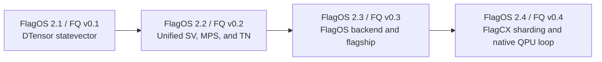

# FlagOS-Aligned Release Train

> **Status:** Living planning authority — future intent  
> **Planning baseline:** 2026-07-28  
> **Cadence:** FlagOS 2.2 → 2.3 → 2.4  
> **Proposed FlagQuantum versions:** v0.2.0 → v0.3.0 → v0.4.0

This document defines proposed release scope and acceptance criteria. It is not
a statement that planned capabilities are implemented, supported, or
release-certified. Current truth is published in the
[capability catalog](../generated/CAPABILITIES.md) and
[known limitations](../reference/KNOWN_LIMITATIONS.md).

## Release policy

Every release follows the same evidence-driven sequence:

```text
verified previous baseline
  → scope freeze
  → implementation
  → feature freeze
  → release-candidate validation
  → FlagCICD release gate
  → joint FlagOS release
```

A target date is not an automatic completion date. A feature with incomplete
P0 implementation or evidence must be deferred, explicitly marked
experimental, or reported as blocked. Acceptance thresholds are never reduced
to preserve a date.

Only work mapped to a feature ID in this document belongs on the critical
release path.

## Historical baseline: FlagOS 2.1 / FlagQuantum v0.1.0

| Field | Baseline |
| --- | --- |
| Release tag | `v0.1.0` |
| Source commit | `ecf04ebaecd7a709ec83accb511da73894e25006` |
| Code cutoff | 2026-05-27 |
| Historical source archive SHA-256 | `b22bf4c13c7f0f6e3c0b0657d43b7b2b577c50752ca95e8090f5785c2da6cd85` |

The v0.1 line established distributed statevector simulation with PyTorch
DTensor, parameterized gates, differentiable execution, encodings,
measurements, postselection, noise, custom gates, circuit drawing, tutorials,
OpenQASM export, and multi-accelerator execution paths.

Its public model was centered on `DistributedQuantumDevice` and gate objects.
OpenQASM export provided an interoperability bridge, but provider submission,
job lifecycle, result provenance, and hardware feedback were not yet one native
FlagQuantum deployment contract.

Historical multi-accelerator execution is not, by itself, evidence of a unified
FlagOS backend or general capacity scaling. Those claims require current typed
runtime evidence and release-gate validation.

## Current mainline versus the baseline

Mainline contains unreleased implementation. Presence in source code does not
mean a feature has passed independent review or a release gate.

| Surface | v0.1 baseline | Current direction | Release gap |
| --- | --- | --- | --- |
| User API | Device- and gate-centered exports | `fq.Circuit`, `fq.Module`, `fq.run`, `fq.plan`; stable and experimental boundaries | Freeze the v0.2 API and verify migration behavior |
| Program representation | Device operation history | Versioned FlagQuantum IR and operator-lowering registry | Complete schema, round-trip, and conformance gates |
| Statevector | DTensor forward and invertible paths | PyTorch-native sharded forward, reverse, optimizers, checkpoint, and recovery | Independent review and target-hardware recertification |
| MPS and tensor networks | No primary product path | Local and distributed MPS plus tensor-network execution and training | Separate supported, experimental, and blocked combinations |
| Runtime | Implicit execution choice | Typed requests, plans, results, evidence, and unified selection | Freeze a minimal v1 contract and verify fail-closed behavior |
| JAX | Not included | Optional JAX kernels exposed through PyTorch | Keep optional and outside the core dependency set |
| FlagOS backend | Accelerator-specific paths | Unified device, kernel, memory, stream, and collective contracts | Implement, optimize, and certify the backend boundary |
| Deployment | OpenQASM interoperability | Parameter binding, target compilation, sealed packages, providers | Complete an auditable provider job and result lifecycle |
| Release evidence | Feature-oriented README claims | Typed evidence, claim audit, tiered CI, reproducible artifacts | Assemble and independently approve the release bundle |

## FlagOS 2.2 / FlagQuantum v0.2.0

**Target:** 2026-08-31  
**Release outcome:** one PyTorch-facing API across statevector, MPS, and
tensor-network representations, with explicit maturity boundaries.

| ID | P0 feature | Acceptance boundary |
| --- | --- | --- |
| F22-01 | Stable `fq.Circuit`, `fq.Module`, `fq.run`, `fq.plan`, and IR v1 | Stable API snapshot, IR round trip, and v0.1 migration tests pass |
| F22-02 | Statevector, MPS, and tensor-network representations | The same IR selects each declared method; no silent statevector fallback |
| F22-03 | PyTorch-native training | Declared combinations pass forward, backward, and optimizer tests; incomplete combinations are labeled |
| F22-04 | Typed runtime and unified planner v1 | Requests, plans, results, blockers, and fallbacks are auditable and fail closed |
| F22-05 | FlagCICD v1 | CPU PR, scheduled accelerator, package, benchmark-contract, and release-gate lanes execute |
| F22-06 | Reproducible installation and migration | Wheel and sdist install cleanly; Quick Start and v0.1 migration are verified |
| F22-07 | FlagOS integration contract | Device, capability, kernel, and collective protocols are frozen without silently breaking v0.1 device paths |

Experimental in v0.2: distributed MPS or tensor-network combinations without
target-hardware certification, optional JAX kernels, and the extension SDK.

Out of scope for v0.2: a fully certified
`flagquantum.backends.flagos`, production cross-chip MPS through FlagCX, a
native real-QPU job loop, and production tensor-network support for arbitrary
topologies.

| Gate | Target | Exit condition |
| --- | --- | --- |
| Scope freeze | 2026-07-24 | Owners, dependencies, acceptance criteria, and evidence paths assigned |
| Feature freeze | 2026-08-07 | P0 implementation merged; no new release feature admitted |
| RC1 | 2026-08-15 | Required FlagCICD matrix passes; only P0 defect fixes accepted |
| Release ready | 2026-08-24 | Artifacts, migration, release notes, and known limitations complete |
| GA | 2026-08-31 | No P0 blocker; joint version identity and artifact hashes frozen |

## FlagOS 2.3 / FlagQuantum v0.3.0

**Target:** 2026-11-30  
**Release outcome:** a unified, optimized, and certifiable FlagOS backend plus
a reproducible flagship workload.

| ID | P0 feature | Acceptance boundary |
| --- | --- | --- |
| F23-01 | Minimal stable `flagquantum.backends.flagos` | Capability, stream, memory, kernel, and factorization conformance passes |
| F23-02 | TLE/FlagBLAS MPS kernel pack | Contraction, two-site update, complex GEMM, QR, and SVD support declared forward/backward or fail closed |
| F23-03 | MPS training on a FlagOS accelerator | Real-device forward, backward, and optimizer execution; numerical gate passes; no hidden CPU fallback |
| F23-04 | Cross-accelerator flagship task | The same frozen task runs on NVIDIA and one FlagOS accelerator with strong classical and quantum baselines |
| F23-05 | Cross-accelerator FlagCICD | Scheduled hardware, numerical, no-fallback, and artifact-identity gates pass |
| F23-06 | FlagCX integration foundation | Collective, topology, and error semantics use the unified backend and emit auditable records |

Challenge target: promote multi-GPU MPS only if forward, backward, and optimizer
state preserve ownership and audited hardware evidence passes. A second FlagOS
accelerator is not P0.

Target gates: scope freeze 2026-09-07, hardware preflight 2026-09-20, feature
freeze 2026-10-31, RC1 2026-11-15, GA 2026-11-30.

## FlagOS 2.4 / FlagQuantum v0.4.0

**Target:** 2027-02-28  
**Release outcome:** train one workload beyond a single-device capacity limit
and carry the trained program through an auditable native QPU deployment loop.

| ID | P0 feature | Acceptance boundary |
| --- | --- | --- |
| F24-01 | FlagCX sharded MPS training | Forward, backward, optimizer, and checkpoint preserve one ownership model; ranks retain only owned state |
| F24-02 | Capacity, stability, and recovery certification | A beyond-single-device workload completes; multistep stability, cleanup, and recovery gates pass |
| F24-03 | Cross-accelerator unified planning | Measured calibration selects local, NVIDIA, FlagOS, or sharded execution with an explainable fail-closed decision |
| F24-04 | Native QPU deployment loop | Parameter binding, target compilation, provider job, shots, calibration, result, and ideal/noise/hardware comparison are traceable |
| F24-05 | FlagCICD release gate v2 | Cross-accelerator, sharding, QPU, package, image, and claim audits form one release bundle |
| F24-06 | External beta | Tutorials, support matrix, operations guide, limitations, and independent reproduction are complete |

Challenge targets: a second FlagOS accelerator, multi-node FlagCX,
hardware-in-the-loop updates, and tensor-network slice/reduction preview.
Challenge targets do not block P0 and cannot be presented as released features.

Target gates: scope freeze 2026-12-07, feature freeze 2027-01-31, RC1
2027-02-15, GA 2027-02-28.

## Dependency chain



Contract and training work in v0.2 enables the FlagOS backend and flagship task
in v0.3. Backend and collective evidence in v0.3 enables capacity certification
in v0.4. FlagCICD evolves with the same dependency chain.

## Required release bundle

Every release must include:

- a versioned feature manifest and API/IR compatibility report;
- support, correctness, and known-limitations matrices;
- raw performance and memory evidence with provenance;
- explicit fallback and blocker records;
- wheel, sdist, and image hashes where applicable;
- a verified Quick Start and migration guide;
- release notes and a FlagCICD gate decision.

Only features with `FlagCICD Gate = passed` and release-owner approval may
appear in external FlagOS release material. `implemented`, `review_pending`,
`experimental`, and `blocked` remain distinct states.
