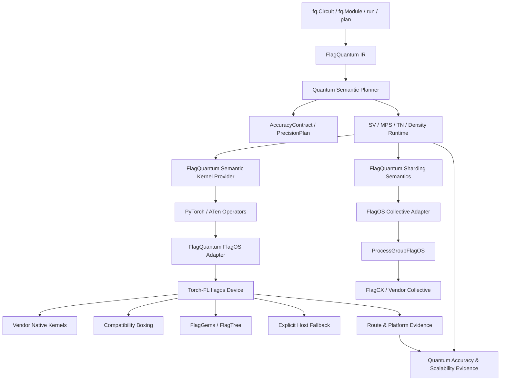

# FlagQuantum–Torch-FL Integration and Joint Release Plan

> **Status:** architecture recommendation and staged plan, not a statement of
> current support.
> **Decision:** whether and how FlagQuantum depends on Torch-FL.
> **Recommendation:** integrate capabilities deeply, keep Core installation
> independent, and certify pinned FlagOS release environments jointly.
> **Scope:** FlagQuantum, Torch-FL, FlagGems/FlagTree, FlagCX, vendor SDKs,
> and production domestic accelerators.

> **Implementation record (2026-08-25):** a minimal lazy FlagOS adapter and strict
> route/fallback contracts are being implemented; see
> [Accelerator Platform Runtime](../reference/ACCELERATOR_PLATFORM_RUNTIME.md).
> `statevector_local_p0` has CUDA-backed `flagos:0` validation, operator preflight,
> numerical contracts, and small CPU complex128 certification. No particular
> domestic-device profile is declared production-ready. On 2026-08-24, the v2
> environment lock passed Torch-FL CUDA-reference validation on NVIDIA A800:
> 21 P0 requirements, complex64/128, depths 8/32/128. Evidence:
> [A800 reference artifact](../../artifacts/flagos_cuda_reference_a800_20260824.json).
> Split real/imag FP32 statevector P0, added on 2026-08-24, is an isolated
> forward-only experiment with independent FP32 operator profiles; it changes
> neither dependency boundaries nor default Runtime. P2/P3/P4 also keep Core
> independent. In Torch-FL validation environments, P4 uses only logical
> `flagos:0` for device-side FP32 Double-Single gate generation and evolution.
> P5 explicit Double-Single SGD passed single-device portability checks on native
> A800 CUDA and CUDA-backed `flagos:0`. Domestic P0–P5 acceptance tools require
> physical-device and no-CPU-fallback attestations from Torch-FL/provisioners;
> real domestic-device evidence still awaits execution and review. Single-device
> validation and FlagCX distributed validation remain separate.

## 1. Decision

Torch-FL should be the preferred, standardized infrastructure for FlagOS device
execution without becoming a mandatory FlagQuantum Core dependency.

```text
Product capabilities: deep integration
Python Core package: independent installation
FlagOS plugin: explicit dependency
Production environment: pinned versions
Capability claims: joint evidence certification
```

Mandatory rules:

1. `pip install flagquantum` continues to require only PyTorch.
2. CPU, native PyTorch/CUDA, JAX, and interoperability do not require Torch-FL.
3. `device="flagos:0"` requires a compatible Torch-FL provider.
4. FlagQuantum does not maintain separate Ascend, DCU, GCU, MUSA, or MetaX runtimes.
5. Torch-FL owns PyTorch devices, ATen routing, general kernels, streams/events/
   memory, compilation, profiling, and underlying collectives.
6. FlagQuantum owns IR, SV/MPS/TN/density algorithms, gradients, precision,
   convergence, sharding semantics, and its capability maturity.
7. General Torch-FL model/operator tests do not automatically certify quantum capabilities.
8. Production quantum profiles prohibit silent CPU fallback, precision reduction,
   and distribution changes.
9. Releases pin verified FlagQuantum, Torch-FL, PyTorch, FlagCX, compiler, and SDK combinations.
10. Projects collaborate through versioned public contracts, not private C++/Python internals.

Even if Torch-FL uses a CUDA-compatible Hygon route, FlagQuantum sees the `flagos`
platform. Do not add Hygon/DCU adapters, vendor-name branches, or direct DTK
requirements. Use mock/reference providers for contracts without hardware and add
numerical, residency, and performance evidence on real devices later.

The source dependency remains optional while the FlagOS product capability
depends on compatible infrastructure.

## 2. Background and Recorded Facts

### 2.1 FlagQuantum Constraints

Core requires only PyTorch, with the recorded policy `>=2.5,<2.14`. PyTorch is the
primary training interface; IR is the sole quantum authority. CPU/single-device
fast paths remain first-class. Distributed claims require real partitioning of
one workload. Complex64/128, autograd, noncontiguous layouts, and QR/SVD are core
needs. Accelerator providers and heavy dependencies remain optional.

### 2.2 Torch-FL Infrastructure

The design reviewed for this plan provides:

- a PrivateUse1-based `flagos` device;
- exact ATen operator/overload routing;
- vendor kernels, compatibility boxing, FlagGems/compiler kernels, CPU fallback;
- eager, autograd, AMP, compile, and profiler support at differing maturity levels;
- ProcessGroupFlagOS and FlagCX/vendor communication;
- vendor build selection, route configuration, compatibility matrices;
- operator surveys, route-set hashes, hardware verification.

Maturity varies by platform. Registered devices and existing code paths do not
prove quantum training, complex dtype, distributed, or production support.

### 2.3 Version Tension

| Project | Recorded dependency boundary | Effect |
| --- | --- | --- |
| FlagQuantum | PyTorch `>=2.5,<2.14` | Broad developer/user environments |
| Torch-FL | PyTorch `>=2.10,<2.11` | Generated ATen bindings coupled to minor-line ABI |

A mandatory Torch-FL dependency would narrow Core's PyTorch range and impose
CMake, SDK, compiler, and ABI constraints on all users. This conflicts with Core
policy. These versions are observations, not permanent contracts; releases read
machine-readable compatibility matrices rather than hard-code them in Runtime.

## 3. Principles

### 3.1 One Product, Separate Responsibilities

Users continue with `import flagquantum as fq`. FlagQuantum owns quantum semantics,
scientific trust, training, and scale-out. Torch-FL owns cross-vendor PyTorch
execution, routing, and devices. Users should not write Torch-FL routes, FlagCX
communicators, or vendor SDK code to integrate them.

### 3.2 Compose Existing Infrastructure

Do not duplicate PrivateUse1 registration, vendor streams/events/guards, ATen
bindings, vendor routes, FlagGems/FlagTree integration, general AMP, process-group
selection, or profiler events. FlagQuantum supplies thin adaptation, quantum
requirements, policy decisions, and evidence composition.

### 3.3 Device Names Are Not Evidence Identities

`flagos:0` does not replace actual vendor/model/count, driver/SDK/compiler,
PyTorch/Torch-FL/FlagGems/FlagTree/FlagCX versions, kernel routes, host staging,
CPU fallback, precision plans, topology, or rank ownership in evidence.

### 3.4 Fail Closed

An available fallback route does not make a quantum profile production-capable.
Reject missing critical capabilities before large allocation or distributed initialization.

## 4. Target Architecture



Torch-FL belongs to PyTorch infrastructure, outside IR, planning semantics, and
representation algorithms.

## 5. Ownership

| Capability | FlagQuantum | Torch-FL | Joint work |
| --- | --- | --- | --- |
| Public quantum API | Owns | Unaware | Compatibility |
| IR | Owns | Unaware | None |
| SV/MPS/TN/density algorithms | Owns | Unaware | End-to-end performance |
| Quantum gradients/optimizers | Semantics | Autograd foundation | Backward consistency |
| AccuracyContract | Owns | Capability facts | Error evidence |
| PrecisionPlan | Decisions/reporting | Available dtypes/kernels | Certification |
| `flagos` device | Consumes | Owns | User experience |
| ATen routes | Requirements | Owns | Quantum profiles |
| SDK/ABI | No direct dependency | Owns | Release matrix |
| FlagGems/FlagTree | Quantum kernel needs | Integration/routing | Optimization |
| Streams/events/memory/RNG | Adapter/audit | Implementation | Conformance |
| `torch.compile` | Quantum graph | Backend | Correctness/performance |
| Profiler | Evidence requirements | Device events | Provenance |
| Logical sharding | Owns | Unaware | None |
| Rank ownership | Owns | Unaware | Evidence linkage |
| Collectives | Semantics/traffic | Transport | Communication correctness |
| Scalability claims | Owns/audits | Facts | Hardware evidence |
| Maturity | FlagQuantum status | Torch-FL status | No automatic promotion |

Qubits, gates, state shards, MPS bonds, TN slices, observables, quantum gradients,
and scientific error belong to FlagQuantum. Tensor/ATen/device/stream/event/
compiler/transport infrastructure generally belongs to Torch-FL.

## 6. Three Delivery Layers

### 6.1 Core

```bash
pip install flagquantum
```

Core requires PyTorch only, does not import `torch_fl`, link its C++ ABI, or load
vendor SDKs. CPU/native execution remains independent; importing FlagQuantum does
not register PrivateUse1 devices.

### 6.2 FlagOS Provider

Recommended distribution: `flagquantum-flagos`. An initial internal prototype is
acceptable, but establish a separate dependency boundary before stabilization.
It depends on a defined compatible Torch-FL range, registers platform/collective/
evidence adapters, contains no quantum algorithms or vendor branches, and is
lazily discovered/activated only for FlagOS selections.

```toml
[project.entry-points."flagquantum.platforms"]
flagos = "flagquantum_flagos:provider"
```

### 6.3 Certified Runtime Bundle

```text
FlagOS Quantum Runtime <release>
├── FlagQuantum <exact version/revision>
├── flagquantum-flagos <exact version>
├── Torch-FL <exact version/revision>
├── PyTorch <exact patch version>
├── FlagGems/FlagTree <exact version/revision>
├── FlagCX <exact version/revision>
├── vendor SDK/runtime/compiler <exact versions>
└── capability/evidence manifest <signed hash>
```

Deliver through containers, locks, conda, or vendor wheel indexes with offline
rebuild and complete environment-fingerprint verification.

## 7. Activation and Lifecycle

Never import Torch-FL from `flagquantum/__init__.py`. Instead:

```text
Select FlagOS profile/device
 -> Discover platform entry point
 -> Check version compatibility
 -> Activate Torch-FL
 -> Preflight
 -> ExecutionProfile
```

Missing-provider diagnostic:

```text
FlagOS execution requires a compatible FlagQuantum–Torch-FL provider.
CPU and native PyTorch execution remain available.
```

Registration, environment, libraries, and PrivateUse1 effects are process-wide.
Activation is idempotent, not fully reversible. Detect conflicts before tensor
creation; allow one PrivateUse1 owner; verify identical provider identities before
rank initialization; diagnose repeated notebook activation without re-registering.

## 8. Stable Collaboration Contracts

Define small public interfaces rather than reading private modules, vendor
profiles, or C++ objects. The following are proposed shapes.

### 8.1 RuntimeIdentity

```python
torch_fl.runtime_identity() -> RuntimeIdentity

RuntimeIdentity(
    schema_version="1.0",
    torch_fl_version="...",
    torch_version="...",
    platform="flagos",
    vendor="...",
    device_models=(...),
    device_count=...,
    driver_version="...",
    sdk_version="...",
    compiler_identity="...",
    flaggems_identity="...",
    flagtree_identity="...",
    flagcx_identity="...",
    build_selector="...",
    build_manifest_hash="...",
)
```

### 8.2 RouteExplanation

```python
torch_fl.explain_route(
    op="aten::linalg_svd",
    overload="default",
    dtype="complex64",
    device="flagos:0",
    layout=...,
) -> RouteExplanation
```

Return category (`native_vendor`, `compatibility_boxing`, `flaggems_python`,
`flaggems_cpp`, `compiled`, `composite`, `host_fallback`, `unsupported`), forward/
backward routes, dtype/layout/shape limits, device-direct/host behavior,
configuration hash, evidence references, and maturity.

### 8.3 StrictExecutionScope

```python
with torch_fl.strict_execution(
    forbid_host_fallback=True,
    forbid_dtype_demotion=True,
    require_route_provenance=True,
):
    ...
```

Reject before fallback occurs, not merely through post-execution logs.

### 8.4 FallbackEvent

```python
torch_fl.fallback_events(clear=True) -> tuple[FallbackEvent, ...]
```

Include operator/overload, input/output dtypes, source/target devices, reason,
call site, transfer bytes, timestamp. FlagQuantum incorporates events into results.

### 8.5 Distributed Boundary Decision

FlagQuantum does not currently define or require
`torch_fl.distributed_identity(group)`. Validation uses existing public
PyTorch/Torch-FL ProcessGroup boundaries and labels evidence `backend="flagos"`.
A successful collective does not identify FlagCX/NCCL/HCCL or direct/staged
transport.

If future release/diagnostic needs require inner-route distinctions, Torch-FL and
FlagCX owners first agree on observability. FlagQuantum does not preselect names,
schemas, implementations, or read private ProcessGroup fields.

### 8.6 Compatibility

Version contracts. Additions may be compatible; removals/semantic changes require
major schemas. No private `_C`, internal config, or undocumented environment
contracts. Missing contracts fail closed rather than using `hasattr` to guess
production support. Development shims need tests and removal versions.

## 9. Platform Adapter

Retain `PlatformRuntime` with a thin FlagOS implementation:

```python
class FlagOSPlatformRuntime(PlatformRuntime):
    def discover(self): ...
    def synchronize(self, device): ...
    def memory_snapshot(self, device): ...
    def stream(self, device, priority=0): ...
    def event(self, device): ...
    def rng_state(self, device): ...
    def profiler_metadata(self, device): ...
```

It aligns CPU/CUDA/FlagOS internal contracts, isolates Torch-FL changes, projects
versioned metadata, applies quantum fallback/accuracy/evidence rules, and keeps
representation code from importing Torch-FL. It does not inspect vendor device
files, duplicate streams/events, maintain ATen routes, load ACLNN/mudnn/topsaten,
or bypass Torch-FL through private FlagCX APIs.

## 10. Quantum Operator Profiles

General surveys are necessary but insufficient. FlagQuantum owns machine-readable
workload requirements consumed by Torch-FL CI and hardware environments.

```yaml
schema: flagquantum_operator_profile_v1
name: flagquantum_mps_training_p0
representation: mps
distribution: local
requirements:
  - op: aten::einsum
    overload: default
    dtypes: [complex64, complex128]
    layouts: [contiguous, noncontiguous]
    forward: required
    backward: required
  - op: aten::linalg_qr
    overload: default
    dtypes: [complex64, complex128]
    forward: required
    backward: required
  - op: aten::linalg_svd
    overload: default
    dtypes: [complex64, complex128]
    forward: required
    backward: required
fallback:
  host: forbidden
  dtype_demotion: forbidden
```

Initial profiles:

```text
flagquantum_statevector_local_p0
flagquantum_statevector_sharded_p0
flagquantum_mps_local_p0
flagquantum_mps_sharded_p0
flagquantum_tn_local_p0
flagquantum_tn_sharded_p0
flagquantum_density_local_p1
flagquantum_noisy_trajectory_p1
flagquantum_split_real_imag_p0
flagquantum_split_real_imag_p1
flagquantum_split_real_imag_p2_precision
flagquantum_split_real_imag_p3_double_single
flagquantum_extended_precision_p0
```

P0 needs mm/bmm/matmul, einsum, complex arithmetic, abs/conj/real, real/complex
reductions, exp/cos/sin/sqrt, reshape/permute/transpose/expand/stack,
view_as_real/view_as_complex, QR/SVD and stable backward, noncontiguous/broadcast/
batched tensors, factory device/dtype preservation, and no host fallback in either
direction. Specify exact overloads and case schemas, not Python function names only.

## 11. Complex Values, FP64, and Precision

Torch-FL supplies dtypes, routes, AMP, and kernels, not scientific error or
convergence acceptance. Generic FP16/BF16 AMP is not a quantum precision policy.
FlagQuantum retains PrecisionPlan:

```text
native complex128
 -> split real/imag float64
 -> certified double-single FP32
 -> adaptive mixed precision
 -> high precision on CPU/another certified device
 -> fail closed
```

Torch-FL supplies executable facts; FlagQuantum decides AccuracyContract
satisfaction. Real/imag kernels use underlying float32/64 ATen operations when
complex support is incomplete. Validate dtype, FMA/rounding/subnormals, layouts,
backward, reduction determinism, and pair consistency through collectives.

Double-Single is a FlagQuantum precision provider or jointly optimized quantum
kernel, not a global Torch-FL dtype. FP32/FMA kernels and compilers must preserve
error-free transforms and report actual routes.

## 12. Fallback and Residency

| FlagQuantum policy | Permitted Torch-FL routes |
| --- | --- |
| `FORBID` | Certified device-native/boxing/FlagGems/compiled; no host |
| `SAME_DEVICE_PORTABLE` | Portable/composite on the same `flagos` device |
| `HOST_DEBUG_ONLY` | Explicit host fallback; no performance/production claim |

Record host fallback, host/device transfer bytes, dtype changes, eager/compile
fallback, FlagGems-to-vendor/boxing changes, FlagCX-to-vendor changes, direct-to-
staged transport, and forward/backward route differences. Unauthorized production
events fail, rather than only warn.

## 13. Distributed Responsibilities

FlagQuantum owns amplitude/site/bond/slice/intermediate ownership; distinctions
between observable/data parallelism and capacity sharding; collective intent,
shape, dtype, estimated bytes; consistent forward/backward/optimizer sharding;
`distribution_semantics` and `scalability_claim_allowed`.

Torch-FL/ProcessGroupFlagOS owns inner FlagCX/HCCL/NCCL/RCCL routes, stream/event
synchronization, device views/boxing, direct/staged transport, Work handles,
timeouts, transport errors.

Joint evidence compares logical sharding/ownership/communication intent with
actual groups, routes, residency, and topology. Passing DDP/all-reduce proves
communication foundations only. Capacity evidence requires one oversized quantum
workload to complete forward, backward, and optimizer while sharded across ranks.

## 14. Compilation and Profiling

Initially compile only stable, tensor-only local kernels without implicit host
transfer through `torch.compile(backend="flagos")`. Exclude orchestration,
dynamic fallback, probes, precision-escalation state machines, checkpoint I/O,
and provider lifecycle. Validate eager/backward parity, FakeTensor/meta, dynamic
shape limits, cache identity, routes. Eager fallback needs explicit policy.

Torch-FL profiler evidence covers device kernels, host copies, stream/collective
overlap, compilation/fusion, and route agreement. FlagQuantum adds gate/layer/block,
representation phases, accuracy checkpoints, ownership, communication intent,
precision escalation. Without profiling, correctness may run, but performance or
no-host-fallback certification needs equivalent programmatic route/residency proof.

## 15. Evidence Composition

```text
L1 Torch-FL infrastructure:
   devices/operators/autograd/compile/profiler/collectives
L2 FlagQuantum semantics and accuracy:
   SV/MPS/TN/density/gradients/precision/convergence
L3 FlagQuantum scalability:
   sharding/ownership/capacity/communication/recovery
```

L1 is prerequisite evidence, not automatic L2/L3 maturity promotion.
Proposed joint manifest:

```json
{
  "flagquantum_code": "revision",
  "flagquantum_flagos_version": "version",
  "torch_fl_code": "revision",
  "torch_version": "exact",
  "torch_fl_build_manifest_hash": "sha256",
  "torch_fl_route_manifest_hash": "sha256",
  "quantum_operator_profile_hash": "sha256",
  "precision_plan_hash": "sha256",
  "flagcx_identity": "...",
  "vendor_environment": {},
  "fallback_events": [],
  "distribution_semantics": "single_device_fast_path",
  "accuracy_metrics": {},
  "artifact_sha256": "sha256"
}
```

Route configuration, compiler, SDK, or PyTorch minor changes invalidate affected
evidence and require recertification.

## 16. User Experience

Ordinary execution requires no explicit Torch-FL import:

```python
import flagquantum as fq
options = fq.ExecutionOptions(device="flagos:0")
result = fq.run(circuit, options=options)
```

Strict scientific execution:

```python
result = fq.run(
    circuit,
    options=fq.ExecutionOptions(
        device="flagos:0",
        allow_approximate=False,
        allow_backend_fallback=False,
    ),
)
```

Proposed preflight:

```python
report = fq.preflight(
    circuit,
    device="flagos:0",
    mode="mps",
    gradients=True,
    distributed=True,
)
```

Report installation/compatibility, physical stack, required profile, missing/
unverified operators, forward/backward routes, precision/blockers, collectives,
fallback/staging risk, maturity, and permission to execute/benchmark/claim production.

Proposed result information:

```python
result.runtime.platform
result.runtime.provider
result.runtime.actual_vendor
result.runtime.route_manifest_hash
result.runtime.fallback_events
result.accuracy.contract_satisfied
result.distributed.distribution_semantics
result.evidence.ids
```

These define information boundaries; final public names require versioned contracts.

## 17. Compatibility and Releases

Example machine-readable matrix:

```toml
schema = "flagquantum_torch_fl_compatibility_v1"

[[profiles]]
flagquantum = "0.x"
flagquantum_flagos = "0.y"
torch_fl = "0.z"
torch = "2.10.*"
platform = "vendor-model"
status = "development_evidence"
evidence = "path-or-id"
```

Distinguish import, operator, quantum correctness, distributed, and release
compatibility. FlagQuantum keeps independent semantic releases and broad Core
PyTorch coverage. Torch-FL follows minor/vendor ABI lines; the provider follows
both contracts; bundles pin complete certified combinations. Security fixes may
trigger bundle patches. Commits need not synchronize, but release candidates do.

Reject incompatibility during activation, before kernels/collectives encounter ABI errors:

```text
Installed Torch-FL targets PyTorch 2.10.x, but this process uses 2.11.x.
Install a certified FlagOS Quantum Runtime profile; native CPU/PyTorch paths
remain available.
```

## 18. CI and Hardware Certification

| Lane | Environment | Evidence |
| --- | --- | --- |
| `flagquantum-core` | No Torch-FL | Independent install and CPU/native paths |
| `flagquantum-flagos-contract` | Mock/reference | Schema, activation, errors, policy |
| `torch-fl-quantum-ops` | Real vendor hardware | Exact overload/dtype/layout/autograd/routes |
| `flagquantum-flagos-local` | Real single device | Representation forward/backward/accuracy |
| `flagquantum-flagos-distributed` | Real multiple devices | Collectives, sharding, optimizer |
| `flagquantum-flagos-multinode` | Real nodes | Topology, inter-node, recovery, soak |
| `flagos-quantum-release` | Frozen bundle | Manifest, benchmark audit, reproducibility |

FlagQuantum owns profile schemas, workload references, end-to-end tests. Torch-FL
owns route/operator hardware tests. FlagOS/vendor CI owns runners, drivers, SDKs,
hardware. FlagQuantum and FlagOS release owners jointly sign evidence audits.

Single-device production needs a complete statevector training workload, forward/
backward/optimizer, complex64 or certified real/imag, strict residency, accuracy
contract, route/profiler evidence, repeatability, peak memory. Distributed support
also needs single-device failure/over-budget proof, one sharded workload, complete
ownership, preserved training sharding, bytes/actual routes, checkpoint/restart,
repeated stable runs, and release audit.

## 19. Joint Governance

| Area | Owner | Reviewer |
| --- | --- | --- |
| RuntimeIdentity/RouteExplanation | Torch-FL | FlagQuantum |
| Quantum profiles | FlagQuantum | Torch-FL/FlagGems |
| Strict fallback | Torch-FL | FlagQuantum |
| Accuracy/precision | FlagQuantum | Torch-FL |
| ProcessGroup evidence | Torch-FL/FlagCX | FlagQuantum |
| Capability promotion | FlagQuantum | FlagOS release owner |
| Bundles | FlagOS release owner | Both projects |

Public changes need compatibility tests in both repositories. Notify route/schema
changes a compatibility window ahead. New P0 operators need reference cases.
Vendor claims need specific environments/evidence. Chats/private scripts must not
be the sole compatibility authority. Emergency workarounds need owners, expiry,
and removal tests.

Only integration adapters import `torch_fl`; Torch-FL does not import FlagQuantum.
Exchange JSON/TOML/dataclass facts. Vendor branches remain below the boundary,
quantum branches above. Benchmarks reuse discovery. Each fallback has one decision
entry and each capability ID one authority.

## 20. Implementation Phases

### Phase 0: Joint Decision

Convert this plan to an agreed ADR/FEP, assign owners, fix Core/plugin/bundle
boundaries, inventory available/missing public interfaces, draft compatibility,
choose the first domestic card and workload. Exit: no private-API integration or
mandatory Core dependency.

### Phase 1: Minimal Provider

Deliver entry point, lazy activation, `flagos:0` resolution, identity adaptation,
missing/incompatible errors, independent Core and no-top-level-import tests.
Exit: basic tensor preflight with Torch-FL and unaffected Core tests without it.

### Phase 2: Routes and Strict Fallback

Deliver RouteExplanation, StrictExecutionScope, FallbackEvent, route hash, policy
mapping, profiler/residency cross-checks. Exit: unauthorized CPU/dtype/compile
fallback fails before or at occurrence with structured diagnostics.

### Phase 3: P0 Operators

Deliver statevector/real-imag profiles, exact overload/case generators,
complex64/128/float32/64, contiguous/noncontiguous, forward/backward, hardware
result conversion. Exit: complete preflight before large workloads with precise
routes/blockers.

### Phase 4: Single-Device Statevector

Run the same Circuit/IR on CPU reference and `flagos:0`; cover values,
expectations, gradients, optimizer, accuracy, residency, route/memory/profiler/
precision evidence, reproducible artifacts. Exit: scoped operator/depth/shape
profiles have real domestic development evidence; one success is not production.

### Phase 5: High Precision, MPS, and TN

Deliver split float64, Double-Single/compensated reductions, QR/SVD forward/
backward, TN contraction/reverse, representation monitors, eager/compile parity.
Exit: distinguish floating-point/truncation/contraction/stochastic errors and
make escalation/fallback auditable.

### Phase 6: Distributed Execution

Deliver ProcessGroupFlagOS adaptation, the candidate DistributedIdentity evidence,
sharded statevector training followed by MPS/TN, intent/route reconciliation,
checkpoint/restart, fault diagnostics. Section 8.5 governs the actual observability
interface; this candidate does not require a new Torch-FL API.
Exit: a workload too large for one device completes a sharded training step with
all release metadata.

### Phase 7: Joint Certification

Deliver bundles, SBOM/licenses/version/environment manifests, repeated hardware
runs, install/upgrade/rollback runbooks, capability/limitations updates, release
audits. Exit: rebuildable, reproducible, diagnosable, reversible delivery with
claims matching evidence.

## 21. First Work Packages

Review independently, in order:

1. Joint ADR and owners.
2. `flagquantum_torch_fl_compatibility_v1`.
3. RuntimeIdentity schema.
4. RouteExplanation/categories.
5. StrictExecutionScope/FallbackEvent.
6. Extension SDK capabilities for stable platform/collective providers.
7. Internal FlagOSPlatformRuntime prototype.
8. Independent Core/no-import tests.
9. Statevector P0 profile from current requirements.
10. Profile integration into Torch-FL surveys.
11. Complex64/128, noncontiguous, backward cases.
12. Route/evidence conversion.
13. FlagOS preflight.
14. Single-device forward.
15. Gradients/optimizer.
16. Strict fallback/residency checks.
17. First development hardware artifact.
18. MPS QR/SVD and distributed ProcessGroup work afterward.

## 22. Risks

| Risk | Control |
| --- | --- |
| Minor/ATen ABI lock | Independent Core, early compatibility, pinned bundles |
| Import side effects | Lazy activation, sole PrivateUse1 owner, process diagnostics |
| Hidden CPU fallback | Strict scope/events/residency |
| Surveys mistaken for quantum support | Quantum profiles and workloads |
| Incomplete complex support | Real/imag and specialized kernels |
| No native FP64 | PrecisionPlan, Double-Single, adaptive/CPU failover |
| FlagGems/Triton vendor conflicts | Bundle isolation, compiler identity/hash, no guessing |
| Hidden vendor identity | Required vendor/model/SDK |
| Collectives mistaken for capacity | Sharding evidence and capacity gates |
| Interface drift | Versioned schemas, dual-repository tests, removal windows |
| Different maturity meanings | Explicit evidence mapping, no automatic promotion |
| Plugin maintenance cost | Internal prototype before separate distribution |
| Private API shortcuts | Missing public contracts fail closed; no `_C` workaround |

## 23. Supply Chain, Security, and Licensing

Record sources, versions, hashes, licenses for Torch-FL/FlagGems/FlagTree/FlagCX
and vendor libraries. Generate production SBOMs. Exclude credentials/tokens from
manifests/evidence. Audit dynamic-library paths/preloads. Mark unofficial local
wheels nonportable and exclude release certification. Providers run with process
permissions and load trusted packages. Record build hosts, compilers, revisions.
Preserve Apache-2.0 licenses/NOTICE for reused code; prefer public APIs over copied
generated/ABI-sensitive implementations.

## 24. Definition of Done

- Core installs/runs without Torch-FL and top-level imports load no vendor libraries.
- Stable provider activation handles FlagOS without private `_C`/vendor internals.
- Physical vendor/device/version remains visible.
- Profiles pass exact overload/dtype/layout/backward hardware checks.
- Production fallback, demotion, staging, compile fallback are controlled/audited.
- FlagQuantum AccuracyContract certifies numerical and convergence behavior.
- No-FP64 devices have explicit real/imag, extended-precision, alternate-device,
  or rejection paths.
- Logical sharding is distinct from transport, and one oversized workload completes training.
- Pinned bundles include SBOM, evidence, and runbooks.
- A second vendor requires no representation-algorithm changes.
- Matrices, limitations, benchmarks, release notes remain within evidence scope.

## 25. Recommendation

```text
FlagQuantum Core: PyTorch-only dependency; quantum product/semantics
FlagQuantum FlagOS Provider: optional Torch-FL dependency; adaptation/preflight/evidence
Torch-FL: devices, ATen, general execution, ProcessGroupFlagOS, physical facts
FlagOS Quantum Runtime: pinned, jointly certified PyTorch/FlagCX/compiler/SDK bundle
```

Keep vendor branches and duplicate quantum algorithms out of the provider. The
highest-value collaboration is agreement on RuntimeIdentity, RouteExplanation,
StrictExecutionScope, quantum operator profiles, and joint evidence manifests.

## References

- [Domestic accelerators and numerical trust](DOMESTIC_ACCELERATOR_AND_NUMERICAL_TRUST_PLAN.md)
- [FlagOS-aligned release train](FLAGOS_ALIGNED_RELEASE_TRAIN.md)
- [Dependency policy](../development/DEPENDENCY_POLICY.md)
- [PyTorch operator and precision requirements](../guides/PYTORCH_OPERATOR_REQUIREMENTS_FOR_FLAGGEMS.md)
- [Capability maturity](CAPABILITY_MATURITY.md)
- [Torch-FL repository](https://github.com/flagos-ai/Torch-FL)
- [Compatibility matrix](https://github.com/flagos-ai/Torch-FL/blob/main/docs/reference/compatibility.md)
- [Operator support](https://github.com/flagos-ai/Torch-FL/blob/main/docs/reference/operator-support.md)
- [Distributed FlagCX](https://github.com/flagos-ai/Torch-FL/blob/main/docs/architecture/distributed-flagcx.md)
- [torch.compile integration](https://github.com/flagos-ai/Torch-FL/blob/main/docs/architecture/torch-compile-integration.md)
