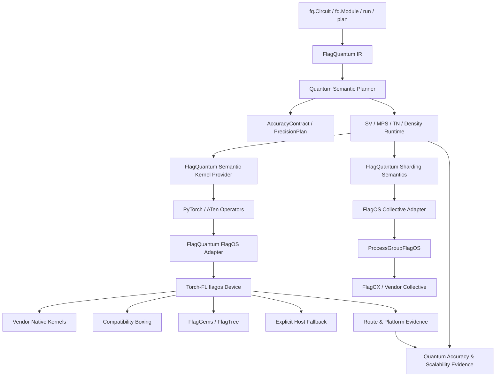

# FlagQuantum–Torch-FL 顶层集成与联合发布规划

> **文档状态：** 架构决策建议与分阶段实施计划，不代表当前支持能力
> **决策主题：** FlagQuantum 是否以及如何依赖 Torch-FL
> **推荐结论：** 能力深度依赖，核心安装解耦，FlagOS 发行环境锁版本联合认证
> **适用范围：** FlagQuantum、Torch-FL、FlagGems/FlagTree、FlagCX、厂商 SDK
> 与国产加速器生产环境

> **实施状态（2026-08-21）：** 最小懒加载 FlagOS adapter 与严格 route/fallback
> 契约已开始落地，边界见
> [Accelerator Platform Runtime](../reference/ACCELERATOR_PLATFORM_RUNTIME.md)。
> `statevector_local_p0` 已接入 CUDA-backed `flagos:0` 联合验证、执行前
> operator preflight、数值契约与 CPU complex128 小型认证；尚未声明任何具体
> 国产卡 profile 达到生产成熟度。2026-08-24 已在 NVIDIA A800 上按 v2 环境锁
> 完成 Torch-FL CUDA reference 验证（21 项 P0 requirement、complex64/128、
> depth 8/32/128）；机器可读证据见
> [`artifacts/flagos_cuda_reference_a800_20260824.json`](../../artifacts/flagos_cuda_reference_a800_20260824.json)。
> 2026-08-24 新增的 split real/imag FP32 statevector P0 是隔离的
> forward-only 实验路径；它通过独立 profile 验证底层 FP32 算子，不改变
> Torch-FL 的依赖边界，也不自动进入默认 runtime。

## 1. 执行决策

FlagQuantum 不应在核心包中强制依赖 Torch-FL，但应把 Torch-FL 作为 FlagOS
设备执行的首选且规范化的基础设施。

```text
业务与产品层：深度绑定
Python 核心包：非强依赖
FlagOS 执行插件：显式依赖
正式发行环境：锁版本绑定
能力声明：联合证据认证
```

对应的强制规则是：

1. `pip install flagquantum` 继续只要求 PyTorch；
2. CPU、原生 PyTorch/CUDA、JAX 和外部框架互操作不要求 Torch-FL；
3. 用户选择 `device="flagos:0"` 时，必须存在兼容的 Torch-FL provider；
4. FlagQuantum 不分别维护 Ascend、DCU、GCU、MUSA、MetaX 等厂商设备运行时；
5. Torch-FL 负责 PyTorch device、ATen 路由、通用 kernel、stream/event/memory、
   compile、profiler 和底层 collective 接入；
6. FlagQuantum 负责量子 IR、SV/MPS/TN/Density 算法、梯度、精度、收敛、分片
   语义和能力成熟度；
7. Torch-FL 的通用模型或算子测试不能自动成为 FlagQuantum 的量子能力证据；
8. 生产量子 profile 禁止静默 CPU fallback、静默降精度和静默改变分布语义；
9. FlagOS 正式发行使用经过验证的 FlagQuantum、Torch-FL、PyTorch、FlagCX、
   compiler 和厂商 SDK 固定组合；

海光即使在 Torch-FL 内部采用 CUDA-compatible route，FlagQuantum 看到的仍是
`flagos` platform。FlagQuantum 不新增 Hygon/DCU adapter、不按设备名称分支，也
不直接依赖 DTK；无卡阶段通过 Torch-FL mock/reference provider 完成契约适配，
实卡阶段再补数值、驻留和性能证据。
10. 两个项目通过版本化公共契约协作，不互相调用私有 C++/Python 实现。

这是一项“软依赖源码边界、硬依赖产品能力”的架构决策。

## 2. 背景与当前事实

### 2.1 FlagQuantum 当前约束

- 核心仅依赖 PyTorch；
- 当前依赖政策覆盖 PyTorch `>=2.5,<2.14`；
- PyTorch 是主要训练界面；
- FlagQuantum IR 是唯一量子语义来源；
- CPU 和单设备 fast path 必须保持一等体验；
- 分布式声明必须证明一个逻辑任务被真实分片；
- complex64/complex128、autograd、非连续 layout、QR/SVD 是量子核心需求；
- 外部加速器、provider 和重依赖应保持可选。

### 2.2 Torch-FL 当前提供的基础设施

基于当前公开设计，Torch-FL 提供：

- 基于 PyTorch PrivateUse1 的统一 `flagos` device；
- 按精确 ATen operator/overload 选择执行路径；
- 厂商原生 kernel、compatibility boxing、FlagGems/编译器 kernel 和 CPU fallback；
- eager、autograd、AMP、`torch.compile` 与 profiler 的不同成熟度实现；
- `ProcessGroupFlagOS` 和 FlagCX/厂商通信后端；
- 多厂商构建选择、路由配置和兼容矩阵；
- operator survey、route-set hash 和硬件验证方法。

这些能力在不同平台上的成熟度不同。“代码路径存在”或“平台注册”不等于量子
训练、复杂 dtype、分布式或生产能力已经验证。

### 2.3 当前版本张力

规划制定时的已知版本边界为：

| 项目 | 当前依赖边界 | 架构影响 |
| --- | --- | --- |
| FlagQuantum | PyTorch `>=2.5,<2.14` | 面向较宽的普通用户和开发环境 |
| Torch-FL | PyTorch `>=2.10,<2.11` | 生成的 ATen binding 与 minor line/ABI 紧密相关 |

因此把 Torch-FL 写入 FlagQuantum 核心 dependencies，会把 FlagQuantum 的实际
PyTorch 支持范围立即缩窄，并把 CMake、厂商 SDK、compiler 和 ABI 约束传播给
所有用户。这不符合核心依赖政策。

版本数据属于当前观察值，不是永久契约；联合发布必须读取两个项目的机器可读
兼容矩阵，而不能把这些数字写死在运行时代码中。

## 3. 架构原则

### 3.1 一个用户产品，两个清晰责任域

用户继续面对一个 FlagQuantum 产品：

```python
import flagquantum as fq
```

内部责任分为：

```text
FlagQuantum：量子语义、数值可信度、训练和规模扩展
Torch-FL：PyTorch 跨厂商执行、算子路由和设备基础设施
```

不得为了集成而让用户直接编写 Torch-FL 路由、FlagCX communicator 或厂商 SDK
代码。

### 3.2 组合而非重复建设

FlagQuantum 不重新实现 Torch-FL 已经拥有的：

- PrivateUse1 设备注册；
- 每厂商的 stream/event/device guard；
- ATen schema binding；
- 厂商原生 operator 路由；
- FlagGems/FlagTree 接入；
- 通用 AMP；
- ProcessGroup 和厂商 collective 选择；
- 通用 profiler 设备事件。

FlagQuantum 只提供薄适配、量子需求描述、策略决策与证据组合。

### 3.3 不以统一设备名隐藏真实环境

`flagos:0` 是用户接口，不是证据身份。每次执行仍需记录：

- 实际厂商；
- 设备型号和数量；
- driver、SDK、compiler；
- PyTorch/Torch-FL/FlagGems/FlagTree/FlagCX 版本；
- 每个关键 kernel 的真实 route；
- host staging 和 CPU fallback；
- precision plan；
- 分布式拓扑和 rank ownership。

### 3.4 Fail closed 优先

FlagQuantum 的 production profile 不能因为 Torch-FL 能找到某条 fallback 路径就
推断任务可生产运行。缺少关键能力时，应在大内存分配和分布式初始化前失败。

## 4. 目标架构



关键点：Torch-FL 位于 PyTorch 执行基础设施层，不进入 FlagQuantum IR、planner
或 representation 算法层。

## 5. 双方责任边界

| 能力 | FlagQuantum | Torch-FL | 联合责任 |
| --- | --- | --- | --- |
| 公共量子 API | 拥有 | 不感知 | 兼容性验证 |
| FlagQuantum IR | 拥有 | 不感知 | 无 |
| SV/MPS/TN/Density 算法 | 拥有 | 不感知 | 端到端性能 |
| 量子 gradient/optimizer 语义 | 拥有 | 提供 PyTorch autograd 基础 | 反向一致性 |
| AccuracyContract | 拥有 | 提供底层能力事实 | 误差证据 |
| PrecisionPlan | 决策与报告 | 执行可用 dtype/kernel | 精度认证 |
| `flagos` device | 消费 | 拥有 | 用户体验 |
| ATen operator route | 声明需求 | 拥有 | quantum operator profile |
| 厂商 SDK/ABI | 不直接依赖 | 拥有 | 发布矩阵 |
| FlagGems/FlagTree 路由 | 声明量子 kernel 需求 | 集成和路由 | kernel 优化 |
| stream/event/memory/RNG | 薄适配与审计 | 实现 | conformance |
| `torch.compile` | 定义可编译量子图 | 提供 backend | 图正确性/性能 |
| profiler | 定义所需证据 | 采集设备事件 | provenance |
| logical sharding | 拥有 | 不感知 | 无 |
| rank ownership | 拥有 | 不感知 | 证据拼接 |
| collective transport | 描述语义和流量 | 执行 | 通信正确性 |
| scalability claim | 拥有并审计 | 提供事实 | 实机证据 |
| capability maturity | 拥有 FlagQuantum 状态 | 拥有 Torch-FL 状态 | 不自动互相提升 |

边界判定标准：如果一个概念包含 qubit、gate、state shard、MPS bond、TN slice、
observable、quantum gradient 或 scientific error，它属于 FlagQuantum；如果概念
只涉及 tensor、ATen operator、device、stream、event、compiler 或 collective
transport，它优先属于 Torch-FL。

## 6. 三层依赖与交付模型

### 6.1 第一层：FlagQuantum Core

安装方式：

```bash
pip install flagquantum
```

约束：

- 只强制依赖 PyTorch；
- 不导入 `torch_fl`；
- 不链接 Torch-FL C++ ABI；
- 不加载厂商 SDK；
- CPU/原生 PyTorch 路径独立可用；
- `import flagquantum as fq` 不产生 PrivateUse1 注册副作用。

### 6.2 第二层：FlagOS Integration Provider

推荐发行名：

```text
flagquantum-flagos
```

首个实验阶段可以先位于 FlagQuantum 仓库的内部 integration namespace，但在
稳定前必须形成独立依赖边界。该 provider：

- 依赖一个明确兼容范围的 Torch-FL；
- 注册 FlagQuantum platform/collective/evidence adapter；
- 不实现量子 IR 或表示算法；
- 不包含厂商特定分支；
- 通过 entry point 被 FlagQuantum 延迟发现；
- 只有用户选择 FlagOS profile/device 时才激活。

建议 entry point：

```toml
[project.entry-points."flagquantum.platforms"]
flagos = "flagquantum_flagos:provider"
```

### 6.3 第三层：FlagOS Quantum Runtime Bundle

正式生产交付不是“任意版本 pip 拼装”，而是认证 bundle：

```text
FlagOS Quantum Runtime <release>
├── FlagQuantum <exact version/revision>
├── flagquantum-flagos <exact version>
├── Torch-FL <exact version/revision>
├── PyTorch <exact patch version>
├── FlagGems/FlagTree <exact version/revision>
├── FlagCX <exact version/revision>
├── vendor SDK/runtime/compiler <exact versions>
└── capability/evidence manifest <signed hash>
```

可采用容器、锁文件、conda environment 或厂商 wheel index 交付，但必须能够离线
重建和验证完整环境指纹。

## 7. 激活与生命周期

### 7.1 延迟激活

禁止：

```python
# flagquantum/__init__.py
import torch_fl
```

允许：

```text
用户选择 flagos profile/device
  → 查找 flagquantum platform entry point
  → 验证版本兼容
  → 激活 Torch-FL
  → 运行 preflight
  → 生成 ExecutionProfile
```

如果 provider 未安装：

```text
FlagOS execution requires a compatible FlagQuantum–Torch-FL provider.
CPU and native PyTorch execution remain available.
```

### 7.2 进程级副作用

Torch-FL 的设备注册、环境变量、动态库和 PrivateUse1 行为通常是进程级的，因此：

- 激活必须幂等；
- 激活后不能假装完全卸载；
- 环境冲突必须在首次 tensor 创建前发现；
- 不允许两个 provider 同时争用 PrivateUse1；
- worker 必须在 rank 初始化前验证完全相同的 provider identity；
- notebook 中的重复激活需要明确诊断，而非重复注册。

## 8. 稳定协作契约

两个项目应共同定义一个小而稳定的公共接口，不让 FlagQuantum 读取 Torch-FL
私有模块、内部 vendor profile 或 C++ 对象。

### 8.1 RuntimeIdentity

建议 Torch-FL 提供：

```python
torch_fl.runtime_identity() -> RuntimeIdentity
```

至少包含：

```python
RuntimeIdentity(
    schema_version="1.0",
    torch_fl_version="...",
    torch_version="...",
    platform="flagos",
    vendor="...",
    device_models=(...),
    device_count=...,
    driver_version="...",
    sdk_version="...",
    compiler_identity="...",
    flaggems_identity="...",
    flagtree_identity="...",
    flagcx_identity="...",
    build_selector="...",
    build_manifest_hash="...",
)
```

### 8.2 RouteExplanation

```python
torch_fl.explain_route(
    op="aten::linalg_svd",
    overload="default",
    dtype="complex64",
    device="flagos:0",
    layout=...,
) -> RouteExplanation
```

返回：

- `native_vendor`、`compatibility_boxing`、`flaggems_python`、
  `flaggems_cpp`、`compiled`、`composite`、`host_fallback` 或 `unsupported`；
- forward/backward route；
- dtype/layout/shape 限制；
- 是否 device-direct；
- 是否经过 host；
- route configuration hash；
- 当前证据引用和成熟度。

### 8.3 StrictExecutionScope

```python
with torch_fl.strict_execution(
    forbid_host_fallback=True,
    forbid_dtype_demotion=True,
    require_route_provenance=True,
):
    ...
```

该 scope 必须在 fallback 实际发生前失败，不能只在执行后打印日志。

### 8.4 FallbackEvent

```python
torch_fl.fallback_events(clear=True) -> tuple[FallbackEvent, ...]
```

事件至少包含 operator、overload、input/output dtype、source/target device、原因、
调用位置、传输字节数和时间戳。FlagQuantum 将其合并进 `ExecutionResult`。

### 8.5 DistributedIdentity

```python
torch_fl.distributed_identity(group) -> DistributedIdentity
```

包含 inner backend、FlagCX/vendor collective、device-direct/host-staged、rank-device
映射、拓扑、支持 dtype、超时和版本信息。

### 8.6 API 兼容规则

- 所有契约必须带 schema version；
- 增加字段允许向后兼容，删除或改义必须升级 major schema；
- FlagQuantum 只依赖上述稳定接口；
- 私有 `_C`、内部 config 对象和 undocumented environment variable 不得成为集成
  契约；
- 契约缺失时 provider fail closed，不通过 `hasattr` 猜测生产能力；
- 开发兼容 shim 必须有移除版本和测试。

## 9. FlagQuantum Platform Adapter

FlagQuantum 仍保留 `PlatformRuntime`，但 FlagOS 实现是薄适配层：

```python
class FlagOSPlatformRuntime(PlatformRuntime):
    def discover(self): ...
    def synchronize(self, device): ...
    def memory_snapshot(self, device): ...
    def stream(self, device, priority=0): ...
    def event(self, device): ...
    def rng_state(self, device): ...
    def profiler_metadata(self, device): ...
```

它存在的理由：

- 保持 CPU、CUDA、FlagOS 的 FlagQuantum 内部契约一致；
- 隔离 Torch-FL API 演进；
- 将 Torch-FL metadata 转换为 FlagQuantum versioned contracts；
- 执行 FlagQuantum 特有的 fallback/accuracy/evidence 规则；
- 防止 representation runtime 直接 import `torch_fl`。

它不应：

- 自行检测每家厂商设备文件；
- 复制 Torch-FL stream/event 实现；
- 维护 ATen operator route table；
- 直接加载 ACLNN、mudnn、topsaten 等厂商库；
- 绕过 Torch-FL 调用 FlagCX 私有接口。

## 10. 量子算子 Profile

Torch-FL 的通用 operator survey 是必要证据，但不能替代 FlagQuantum workload
profile。FlagQuantum 应维护机器可读需求，Torch-FL CI 和硬件环境消费同一份
profile。

### 10.1 Profile 结构

```yaml
schema: flagquantum_operator_profile_v1
name: flagquantum_mps_training_p0
representation: mps
distribution: local
requirements:
  - op: aten::einsum
    overload: default
    dtypes: [complex64, complex128]
    layouts: [contiguous, noncontiguous]
    forward: required
    backward: required
  - op: aten::linalg_qr
    overload: default
    dtypes: [complex64, complex128]
    forward: required
    backward: required
  - op: aten::linalg_svd
    overload: default
    dtypes: [complex64, complex128]
    forward: required
    backward: required
fallback:
  host: forbidden
  dtype_demotion: forbidden
```

### 10.2 首批 profiles

```text
flagquantum_statevector_local_p0
flagquantum_statevector_sharded_p0
flagquantum_mps_local_p0
flagquantum_mps_sharded_p0
flagquantum_tn_local_p0
flagquantum_tn_sharded_p0
flagquantum_density_local_p1
flagquantum_noisy_trajectory_p1
flagquantum_split_real_imag_p0
flagquantum_split_real_imag_p1
flagquantum_extended_precision_p0
```

### 10.3 P0 共同需求

- `mm`、`bmm`、`matmul`；
- `einsum`；
- complex add/sub/mul/div；
- `abs`、`conj`、`real`；
- complex/real reduction；
- `exp`、`cos`、`sin`、`sqrt`；
- `reshape`、`permute`、`transpose`、`expand`、`stack`；
- `view_as_real`、`view_as_complex`；
- QR/SVD 及稳定 backward；
- 非连续 tensor、broadcast、batch；
- factory op 的 device/dtype 保持；
- forward/backward 不发生 host fallback。

每个 op 必须使用精确 overload 和 case schema，不能只记录 Python 函数名。

## 11. 复数、FP64 与可信精度

### 11.1 Torch-FL 的边界

Torch-FL 可以提供 dtype、operator route、AMP 和底层 kernel，但不负责判断某个
量子算法是否达到科学误差或训练收敛要求。通用 FP16/BF16 AMP 不构成量子模拟
精度策略。

### 11.2 FlagQuantum 继续拥有 PrecisionPlan

```text
native complex128
  → split real/imag float64
  → certified double-single FP32
  → adaptive mixed precision
  → CPU/其他认证设备高精度执行
  → fail closed
```

Torch-FL 对各层提供可执行事实，FlagQuantum resolver 决定是否满足
`AccuracyContract`。

### 11.3 Real/Imag 路径

当厂商复数覆盖不足时，FlagQuantum 生成 real/imag 语义 kernel，Torch-FL 负责
执行底层 float32/float64 ATen 算子。该路径必须单独验证：

- dtype 保持；
- FMA/舍入/subnormal；
- noncontiguous layout；
- backward；
- reduction determinism；
- collective 对 real/imag pair 的一致性。

### 11.4 Double-Single

Double-Single 是 FlagQuantum 的 precision provider 或双方共同优化的量子 kernel，
不应被实现为 Torch-FL 的全局 dtype。Torch-FL 需要保证底层 float32/FMA kernel
和编译器不破坏 error-free transform，并报告实际 route。

## 12. Fallback 与设备驻留

FlagQuantum 使用三级策略：

```text
FORBID
SAME_DEVICE_PORTABLE
HOST_DEBUG_ONLY
```

映射到 Torch-FL：

| FlagQuantum 策略 | Torch-FL 允许 route |
| --- | --- |
| `FORBID` | 已认证 device-native/boxing/FlagGems/compiled；禁止 host |
| `SAME_DEVICE_PORTABLE` | 允许同一 `flagos` device 的 portable/composite route |
| `HOST_DEBUG_ONLY` | 显式允许 host fallback，但关闭性能与生产声明 |

以下事件一律进入 result metadata：

- host fallback；
- device-to-host/host-to-device bytes；
- dtype promotion/demotion；
- eager/compile fallback；
- FlagGems → vendor/boxing route 变化；
- FlagCX → 厂商 collective 变化；
- direct transport → host staging；
- forward/backward route 不一致。

生产执行发现任何未授权事件时必须失败，不能只记录 warning。

## 13. 分布式职责

### 13.1 FlagQuantum 拥有语义

FlagQuantum 决定：

- statevector amplitude ownership；
- MPS site/bond ownership；
- TN slice/intermediate ownership；
- observable/data parallel 与容量 sharding 的区别；
- 每个 collective 的逻辑原因、tensor shape、dtype 和预计字节数；
- forward、backward、optimizer 是否保持相同 sharding；
- `distribution_semantics` 和 `scalability_claim_allowed`。

### 13.2 Torch-FL 拥有传输

Torch-FL/ProcessGroupFlagOS 决定：

- FlagCX、HCCL、NCCL/RCCL 或其他 inner backend；
- stream/event 同步；
- device view/boxing；
- device-direct 或 host staging；
- collective Work、timeout 和 transport error。

### 13.3 联合证据

一次分布式结果同时包含：

```text
FlagQuantum:
  logical sharding + rank ownership + communication intent

Torch-FL:
  actual process group + route + device transport + topology facts

联合审计:
  intent 与实际 transport 是否匹配
```

Torch-FL 的 DDP/all-reduce 通过，只能证明通信基础；只有一个过大逻辑量子任务
确实以 `sharded_across_ranks` 完成 forward、backward 和 optimizer，才能形成
FlagQuantum 容量扩展证据。

## 14. Compile 与 Profiler

### 14.1 `torch.compile`

FlagQuantum 只把稳定、纯 tensor、无隐式 host transfer 的局部 quantum kernel
交给 `torch.compile(backend="flagos")`。初始不编译：

- 分布式 orchestration；
- 动态 fallback；
- capability probe；
- accuracy escalation state machine；
- checkpoint I/O；
- provider lifecycle。

编译结果必须验证 eager parity、backward、FakeTensor/meta、动态 shape 边界、缓存
identity 和 route provenance。compile 失败回退 eager 必须由 policy 明确允许。

### 14.2 Profiler

Torch-FL profiler 数据用于证明：

- kernel 在真实 device 执行；
- 是否存在 host memcpy；
- stream 与 collective overlap；
- compile/fusion 是否生效；
- route 与声明一致。

FlagQuantum 补充：

- gate/layer/block 语义；
- SV/MPS/TN phase；
- accuracy checkpoint；
- rank ownership；
- communication intent；
- precision escalation。

Profiler 不可用时可以运行 correctness，但不能形成完整性能或“无 host fallback”
认证，除非存在等价的程序化 route/device-residency 证据。

## 15. 能力与证据组合

### 15.1 三层证据

```text
L1 Torch-FL Infrastructure Evidence
   device / operator / autograd / compile / profiler / collective

L2 FlagQuantum Semantic & Accuracy Evidence
   SV/MPS/TN/Density / gradient / precision / convergence

L3 FlagQuantum Scalability Evidence
   logical sharding / rank ownership / capacity / communication / recovery
```

L1 通过是 L2/L3 的前置条件，但不会自动提升 L2/L3 成熟度。

### 15.2 联合证据身份

建议 evidence manifest 增加：

```json
{
  "flagquantum_code": "revision",
  "flagquantum_flagos_version": "version",
  "torch_fl_code": "revision",
  "torch_version": "exact",
  "torch_fl_build_manifest_hash": "sha256",
  "torch_fl_route_manifest_hash": "sha256",
  "quantum_operator_profile_hash": "sha256",
  "precision_plan_hash": "sha256",
  "flagcx_identity": "...",
  "vendor_environment": {},
  "fallback_events": [],
  "distribution_semantics": "single_device_fast_path",
  "accuracy_metrics": {},
  "artifact_sha256": "sha256"
}
```

任何 route config、compiler、SDK 或 PyTorch minor 变化都使旧证据失效，必须重新
认证受影响能力。

## 16. 用户 API 与诊断体验

### 16.1 普通使用

```python
import flagquantum as fq

result = fq.run(circuit, device="flagos:0")
```

用户不需要显式 import Torch-FL；provider 根据 profile 延迟激活。

### 16.2 严格科学执行

```python
result = fq.run(
    circuit,
    device="flagos:0",
    accuracy=fq.AccuracyPolicy(
        mode="strict",
        expectation_abs_error=1e-9,
        gradient_relative_error=1e-6,
    ),
    fallback="forbid",
)
```

### 16.3 Preflight

```python
report = fq.preflight(
    circuit,
    device="flagos:0",
    mode="mps",
    gradients=True,
    distributed=True,
)
```

报告至少包含：

- provider 是否安装和兼容；
- 真实厂商、设备和软件栈；
- 所需 quantum operator profile；
- 缺失/未验证 operator；
- forward/backward route；
- precision plan 与 accuracy blockers；
- collective route；
- CPU fallback/host staging 风险；
- 当前 capability maturity；
- 是否允许执行、benchmark 和 production claim。

### 16.4 Result provenance

```python
result.runtime.platform
result.runtime.provider
result.runtime.actual_vendor
result.runtime.route_manifest_hash
result.runtime.fallback_events
result.accuracy.contract_satisfied
result.distributed.distribution_semantics
result.evidence.ids
```

公共字段最终名称应通过 runtime contract 版本化后确定，上述仅定义信息边界。

## 17. 版本与联合发布策略

### 17.1 兼容矩阵

建立机器可读文件，例如：

```toml
schema = "flagquantum_torch_fl_compatibility_v1"

[[profiles]]
flagquantum = "0.x"
flagquantum_flagos = "0.y"
torch_fl = "0.z"
torch = "2.10.*"
platform = "vendor-model"
status = "development_evidence"
evidence = "path-or-id"
```

矩阵必须区分 Python import compatibility、operator compatibility、quantum
correctness、distributed 和 release certification。

### 17.2 发布节奏

建议：

- FlagQuantum 保持自身语义版本和较宽 PyTorch core 矩阵；
- Torch-FL 按 PyTorch minor/vendor ABI 发布；
- `flagquantum-flagos` 针对两者稳定 contract 发布；
- FlagOS Quantum Runtime 按完整认证 bundle 发布；
- 任一底层安全修复可以触发 bundle patch release；
- 不要求两个仓库每次 commit 同步，但 release candidate 必须冻结组合。

### 17.3 兼容失败

版本不兼容时在 provider 激活阶段给出精确诊断：

```text
Installed Torch-FL targets PyTorch 2.10.x, but this process uses 2.11.x.
Install a certified FlagOS Quantum Runtime profile; native CPU/PyTorch paths
remain available.
```

不能等待到第一个量子 kernel 或 collective 才出现符号/ABI 崩溃。

## 18. CI 与硬件认证

### 18.1 CI 分层

| Lane | 环境 | 证明内容 |
| --- | --- | --- |
| `flagquantum-core` | 无 Torch-FL | 核心独立安装与 CPU/native fast path |
| `flagquantum-flagos-contract` | mock/reference provider | schema、激活、错误和 fallback policy |
| `torch-fl-quantum-ops` | 真实厂商卡 | 精确 overload、dtype、layout、autograd、route |
| `flagquantum-flagos-local` | 真实单卡 | SV/MPS/TN/Density forward/backward/accuracy |
| `flagquantum-flagos-distributed` | 真实多卡 | collective、真实 sharding、optimizer |
| `flagquantum-flagos-multinode` | 真实多节点 | topology、inter-node、recovery、soak |
| `flagos-quantum-release` | 冻结 bundle | 全量 manifest、benchmark audit、可复现性 |

### 18.2 测试所有权

- quantum operator profile schema 和 workload reference：FlagQuantum；
- ATen route/operator hardware tests：Torch-FL；
- end-to-end quantum tests：FlagQuantum；
- runner、driver、SDK 和硬件资源：FlagOS/厂商 CI；
- release evidence audit：FlagQuantum 与 FlagOS release owner 联合签署。

### 18.3 最小硬件门槛

单卡 production support 至少要求：

- 一种完整 statevector training workload；
- forward、backward、optimizer step；
- complex64 或认证 real/imag path；
- strict no-host-fallback；
- accuracy contract；
- route/profiler evidence；
- 重复运行与峰值内存记录。

分布式 production support 还要求：

- 单卡容量失败或明确超预算；
- 一个逻辑任务 `sharded_across_ranks`；
- 全 rank ownership；
- forward/backward/optimizer 保持 sharding；
- 通信量和实际 collective route；
- checkpoint/restart；
- 多次稳定运行和 release payload audit。

## 19. 联合开发治理

### 19.1 接口工作组

建议 FlagQuantum 与 Torch-FL 设立轻量接口 owner：

| 领域 | 主 owner | Review owner |
| --- | --- | --- |
| RuntimeIdentity/RouteExplanation | Torch-FL | FlagQuantum |
| Quantum operator profile | FlagQuantum | Torch-FL/FlagGems |
| Strict fallback contract | Torch-FL | FlagQuantum |
| Accuracy/Precision contracts | FlagQuantum | Torch-FL |
| ProcessGroup evidence | Torch-FL/FlagCX | FlagQuantum |
| Capability promotion | FlagQuantum | FlagOS release owner |
| Version bundle | FlagOS release owner | 双方 |

### 19.2 变更协议

- 公共 contract 变更必须在两个仓库都有兼容测试；
- Torch-FL route/schema 变化提前一个兼容窗口通知；
- FlagQuantum quantum profile 增加 P0 op 时必须提供 reference case；
- 厂商支持声明必须附具体环境和证据；
- 不在聊天、口头约定或私有脚本中维护唯一兼容事实；
- 紧急 workaround 必须有 owner、到期版本和删除测试。

### 19.3 代码可理解性

- FlagQuantum 中只有 integration adapter 可以 import `torch_fl`；
- Torch-FL 中不 import FlagQuantum；
- 双方通过 JSON/TOML/dataclass schema 交换事实；
- vendor 分支只存在 Torch-FL/厂商层；
- quantum 分支只存在 FlagQuantum；
- benchmark 不重新实现 provider 探测；
- 每个 fallback 只有一个决策入口；
- 每个 capability ID 只有一个定义来源。

## 20. 分阶段实施计划

### Phase 0：联合决策冻结

交付物：

- 本文档转为双方认可的 ADR/FEP；
- 明确两个仓库 owner；
- 冻结 core/plugin/bundle 三层依赖；
- 列出 Torch-FL 当前可公开使用和仍缺失的接口；
- 建立版本兼容矩阵草案；
- 确定首张目标国产卡和首个 statevector workload。

退出条件：双方同意不通过私有 API 集成，不把 Torch-FL 加入 FlagQuantum core
dependencies。

### Phase 1：最小 FlagOS Provider

交付物：

- provider entry point；
- lazy activation；
- `flagos:0` device resolution；
- RuntimeIdentity adapter；
- 清晰的 missing/incompatible dependency 错误；
- CPU/native path independence tests；
- no top-level import tests。

退出条件：安装 Torch-FL 时能完成基础 tensor preflight；未安装时 FlagQuantum
全部核心测试不受影响。

### Phase 2：Route 与严格 fallback

交付物：

- RouteExplanation；
- StrictExecutionScope；
- FallbackEvent；
- route manifest hash；
- FlagQuantum `FORBID/SAME_DEVICE_PORTABLE/HOST_DEBUG_ONLY` 映射；
- profiler/device-residency 交叉验证。

退出条件：未授权 CPU fallback、dtype demotion 或 compile fallback 在执行前或发生
点失败，并进入结构化诊断。

### Phase 3：量子 P0 Operator Profiles

交付物：

- statevector local P0 profile；
- real/imag P0 profile；
- 精确 overload/case generator；
- complex64/complex128/float32/float64；
- contiguous/noncontiguous；
- forward/backward；
- Torch-FL 硬件结果转换为 FlagQuantum evidence。

退出条件：目标卡的 operator 事实可在大 workload 前完整预检，失败项给出准确
route 和 blocker。

### Phase 4：单卡 Statevector 闭环

交付物：

- 同一 Circuit/IR 在 CPU reference 与 `flagos:0` 执行；
- value、expectation、gradient、optimizer；
- AccuracyContract；
- strict device residency；
- route、memory、profiler、precision evidence；
- 可复现 benchmark artifact。

退出条件：限定 operator/depth/shape/profile 在真实国产卡上通过 development
evidence；不因单次成功提升为 production support。

### Phase 5：可信高精度与 MPS/TN

交付物：

- split float64；
- Double-Single/compensated reduction；
- MPS QR/SVD forward/backward；
- TN contraction/reverse；
- representation-specific accuracy monitor；
- eager/compile parity。

退出条件：浮点、截断、contraction 和 stochastic error 可以分离，精度升级和
fallback 均可审计。

### Phase 6：真正分布式执行

交付物：

- ProcessGroupFlagOS adapter；
- DistributedIdentity；
- statevector sharded forward/backward/optimizer；
- 后续 MPS/TN sharding；
- actual collective route 与 logical communication intent 对账；
- checkpoint/restart 和故障诊断。

退出条件：单卡放不下的一个逻辑量子任务完成真实 sharded training step，且所有
release-gate metadata 完整。

### Phase 7：联合发布认证

交付物：

- FlagOS Quantum Runtime bundle；
- SBOM、license、版本和环境 manifest；
- 多次实机运行；
- 安装/升级/回滚 runbook；
- capability matrix 和 Known Limitations 更新；
- release artifact audit。

退出条件：bundle 可重建、可复现、可诊断、可回滚，声明范围与证据完全一致。

## 21. 首批工作包

建议按顺序执行，每项独立 review：

1. 将本文档转成双方正式 ADR，并指定 owner；
2. 定义 `flagquantum_torch_fl_compatibility_v1`；
3. 定义 RuntimeIdentity schema；
4. 定义 RouteExplanation 与 route categories；
5. 定义 StrictExecutionScope 和 FallbackEvent；
6. 在 FlagQuantum extension SDK 增加稳定 platform/collective provider 所需能力；
7. 建立内部 `FlagOSPlatformRuntime` prototype；
8. 增加 no-top-level-import 和 no-Torch-FL core install 测试；
9. 从现有算子需求生成 statevector P0 profile；
10. 在 Torch-FL operator survey 中接入该 profile；
11. 增加 complex64、complex128、noncontiguous 和 backward case；
12. 建立 route manifest/evidence 转换器；
13. 打通 `fq.preflight(..., device="flagos:0")`；
14. 打通单卡 statevector forward；
15. 打通 gradient 和 optimizer step；
16. 增加 strict fallback 与 device-residency 检查；
17. 形成首个开发级硬件 artifact；
18. 再开始 MPS QR/SVD 与分布式 ProcessGroup 接入。

## 22. 风险与控制

| 风险 | 控制措施 |
| --- | --- |
| PyTorch minor/ATen ABI 锁定 | core 不强依赖；provider 早期兼容检查；bundle 锁版本 |
| Torch-FL import 全局副作用 | lazy activation；单一 PrivateUse1 owner；进程级诊断 |
| CPU fallback 隐藏性能与正确性 | strict scope；fallback events；device-residency 证据 |
| 通用 operator survey 误当量子支持 | 独立 quantum profiles 和端到端 workload |
| complex 覆盖不足 | real/imag path；quantum-specialized kernels |
| 无原生 FP64 | PrecisionPlan、Double-Single、adaptive/CPU failover |
| FlagGems/Triton 厂商版本冲突 | bundle 隔离；编译器 identity/hash；禁止运行时猜测 |
| `flagos` 隐藏真实厂商 | RuntimeIdentity 强制 vendor/model/SDK |
| ProcessGroup 可用但不是真实量子扩展 | FlagQuantum sharding evidence 和容量 gate |
| 双方接口快速漂移 | versioned schema、双仓兼容测试、移除窗口 |
| 两套 capability maturity 含义不同 | 不互相自动提升；联合 evidence 显式映射 |
| 插件拆包增加维护成本 | 先内部 prototype，稳定后再独立分发 |
| 上游私有 API 诱惑 | 公共 contract 缺失即 fail closed，不使用 `_C` workaround |

## 23. 安全、供应链与许可

- Torch-FL、FlagGems、FlagTree、FlagCX 和厂商库记录来源、版本、hash 和 license；
- 生产 bundle 生成 SBOM；
- 不把厂商凭证或私有 registry token 写入 manifest/evidence；
- 动态库搜索路径和 preload 必须进入环境审计；
- 非官方本机 wheel 标记为 non-portable，不进入 release certification；
- provider 以当前 Python 进程权限执行，只加载可信包；
- release artifact 记录构建机、编译器和 source revision；
- Apache-2.0 代码复用保留许可与 NOTICE；优先通过公开 API 使用 Torch-FL，避免
  复制生成代码和 ABI 敏感实现。

## 24. Definition of Done

FlagQuantum–Torch-FL 集成完成必须同时满足：

- `flagquantum` 核心包在没有 Torch-FL 时完整安装和运行；
- 顶层 `import flagquantum` 不加载 Torch-FL 或厂商动态库；
- `device="flagos:0"` 通过稳定 provider 激活；
- 不直接调用 Torch-FL 私有 `_C` 或 vendor internals；
- 真实厂商/设备/版本不会被统一 `flagos` 名称隐藏；
- quantum operator profile 在目标硬件上通过精确 overload、dtype、layout 和
  backward 验证；
- production profile 中 CPU fallback、dtype demotion、host staging 和 compile
  fallback 均受策略控制并可审计；
- SV/MPS/TN 的数值和收敛由 FlagQuantum AccuracyContract 认证；
- 无原生 FP64 设备具有明确的 real/imag、软件扩展精度、其他设备兜底或拒绝路径；
- 分布式执行区分逻辑 sharding 与底层 collective；
- 一个单卡放不下的量子训练任务能以 `sharded_across_ranks` 完成；
- FlagOS Quantum Runtime 以锁定版本、SBOM、evidence manifest 和 runbook 发布；
- 第二个厂商接入时无需修改 FlagQuantum representation 算法；
- 能力矩阵、Known Limitations、benchmark 和 release note 不超过证据范围。

## 25. 最终推荐

最终依赖关系应固定为：

```text
FlagQuantum Core
  └── 只依赖 PyTorch，拥有量子产品和语义

FlagQuantum FlagOS Provider
  ├── 可选依赖 Torch-FL
  ├── 负责稳定适配、preflight 和证据转换
  └── 不包含厂商分支和量子算法复制

Torch-FL
  ├── 拥有 flagos device、ATen 路由和通用执行
  ├── 拥有 ProcessGroupFlagOS 和底层设备事实
  └── 不理解 FlagQuantum IR 或量子 sharding

FlagOS Quantum Runtime
  └── 将两者与 PyTorch、FlagCX、compiler、SDK 锁定并联合认证
```

这既避免重复建设，又保持 FlagQuantum 的通用性和长期稳定性。由于两个项目属于
同一生态且开发团队可以直接协作，最高价值的行动不是增加临时 wrapper，而是共同
建立 RuntimeIdentity、RouteExplanation、StrictExecutionScope、quantum operator
profile 和联合 evidence manifest 五项稳定契约。

## 参考资料

- [FlagQuantum 国产加速器与可信数值计算顶层规划](DOMESTIC_ACCELERATOR_AND_NUMERICAL_TRUST_PLAN.md)
- [FlagQuantum FlagOS-aligned release train](FLAGOS_ALIGNED_RELEASE_TRAIN.md)
- [FlagQuantum dependency policy](../development/DEPENDENCY_POLICY.md)
- [FlagQuantum PyTorch 后端算子与精度需求](../guides/PYTORCH_OPERATOR_REQUIREMENTS_FOR_FLAGGEMS.md)
- [FlagQuantum capability maturity](CAPABILITY_MATURITY.md)
- [Torch-FL repository](https://github.com/flagos-ai/Torch-FL)
- [Torch-FL compatibility matrix](https://github.com/flagos-ai/Torch-FL/blob/main/docs/reference/compatibility.md)
- [Torch-FL operator support](https://github.com/flagos-ai/Torch-FL/blob/main/docs/reference/operator-support.md)
- [Torch-FL distributed FlagCX integration](https://github.com/flagos-ai/Torch-FL/blob/main/docs/architecture/distributed-flagcx.md)
- [Torch-FL torch.compile integration](https://github.com/flagos-ai/Torch-FL/blob/main/docs/architecture/torch-compile-integration.md)
